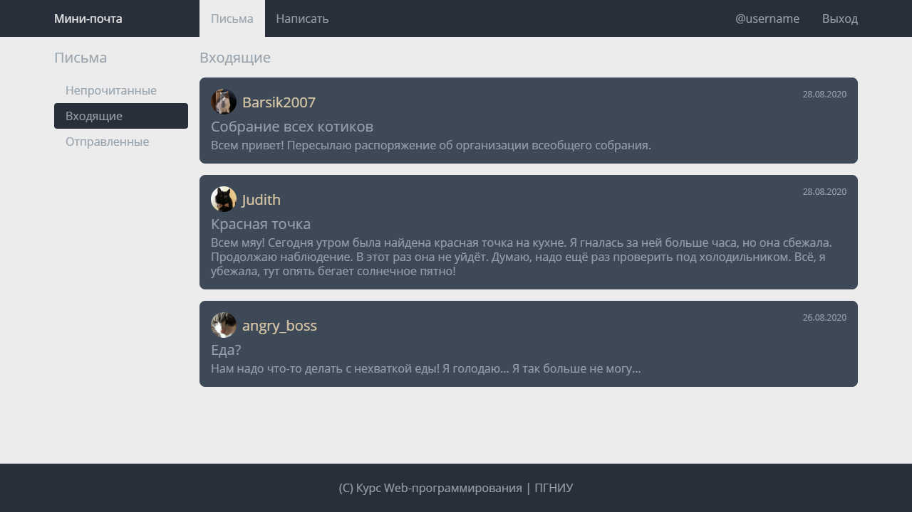
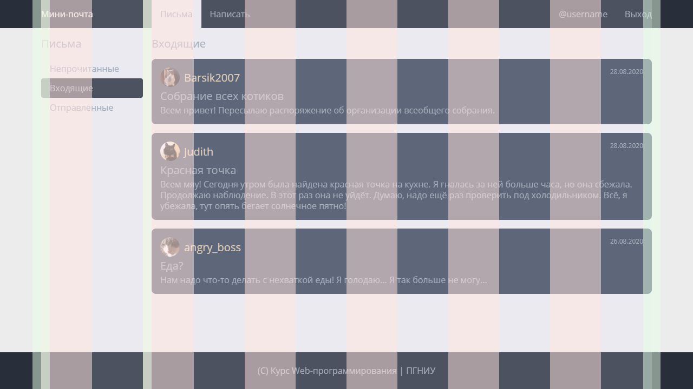
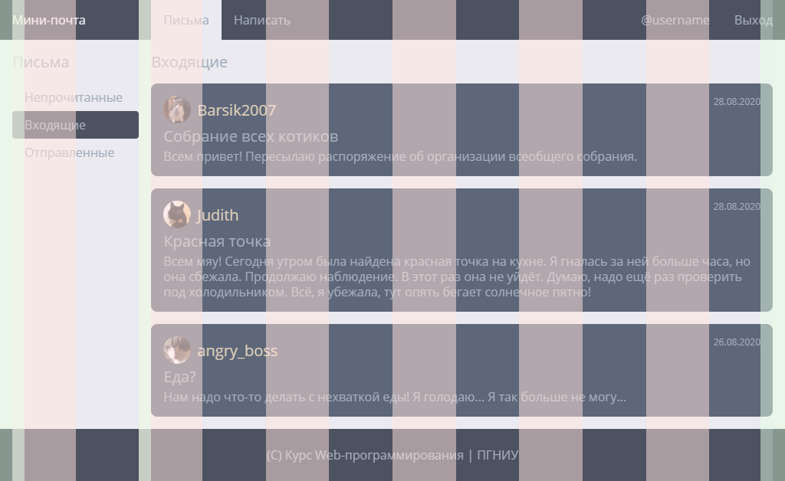

# Лабораторная работа №1: Вёрстка

> *Максимум 10 баллов. Часть Контрольной точки 2: HTML, CSS*

## Задача

Требуется реализовать вёрстку страницы по эскизу на основе заготовки в директории `solution`.

**Задачу требуется решить без использования дополнительных библиотек и систем сборки.**

#### Эскиз

#### Подсказки
- Используйте `flex`
- Установите `box-sizing: border` для всех элементов
- Вы можете использовать заготовку-сетку для отладки (включается добавлением модуля `grid.css` в файле `index.css`)
- Полезное расширение для Chrome: [PerfectPixel by WellDoneCode](https://chrome.google.com/webstore/detail/perfectpixel-by-welldonec/dkaagdgjmgdmbnecmcefdhjekcoceebi/)

#### Критерии
- (3б) Страница в целом соответствует эскизу на 1280x720 с точностью более 90%;
- (3б) Страница соответствует эскизу на 1280x720 с точностью более 99.98%;
- (2б) Страница соответствует эскизу на 1024x576 с точностью более 99.98%;
- (1б) Использованы семантические теги (`nav, main, footer, article, ul, h1, time`), отсутствует лишняя разметка,
использованы понятные имена классов, нет сложных селекторов, селекторов по ID;
- (1б) CSS разделён на модули, основные параметры заданы через CSS переменные.

## Формальное описание для автоматического тестирования

Автоматическое тестирование проводится в браузере, основанном на Chromium (Electron), с использованием фреймворка [Cypress](https://www.cypress.io/).

Во время тестирования результат будет сравниваться с эталоном попиксельно, а также проверяться, что использованы правильные семантические теги и ссылки.

### Сетка

##### 1280x720

##### 1024x576

### Основные параметры

- Межстрочный интервал: `1.25`
- Шрифт: `'Open Sans', sans-serif` (подключен в `_fonts.css`)
- Размеры шрифта:
    - Основной: `16px`
    - Большой: `1.25rem`
    - Маленький: `0.75rem`
- Цвета:
    - Серый (основной цвет текста): `#96A1AB`
    - Тёмный: `#282E3A`
    - Светло-серый: `#ECECEC`
    - Серо-голубой: `#3D4957`
    - Бежевый: `#DBC7A6`
- Максимальный размер основной части сайта: `1128px`
- Отступы:
    - Базовый: `1rem`
    - Большой: `1.5rem`
    - Маленький: `0.5rem`
    - Очень маленький: `0.25rem`
- Радиус скругления рамок:
    - Основной: `0.5rem`
    - Маленький: `0.25rem`
- Размер аватара: `2.25rem`

### Описание компонентов

#### Страница

- Основное содержимое страницы находится внутри контейнера
- Размер контейнера ограничен `максимальным значением`
- На маленьком экране контейнер растягивается во всю ширину, оставляя `базовые отступы` до границ экрана
- Страница имеет `светло-серый` фон и `серый` текст
- Ссылки также имеют `серый` текст
- Внизу страницы подвал, имеющий `большие отступы` по вертикали и `тёмный` фон
- Подвал прижат к нижней части страницы, даже если содержимое меньше экрана

#### Навигационная панель

- В верхней части сайта - навигационная панель
- Панель имеет `базовые внутренние отступы` по вертикали
- Содержимое находится внутри `контейнера`. Это `светло-серый` логотип и два меню со ссылками (слева и справа)
- Логотип занимает колонку в `1/6` и отделён от меню `базовым отступом`
- Ссылки в меню имеют `базовый внутренний отступ`
- Активная ссылка имеет `светло-серый` фон

#### Основная часть

- Основная часть отделена `базовым отступом` от навигационной панели
- Основная часть визуально на колонку в `1/6` с меню и основное содержимое, разделенных `базовым отступом` (см. сетку ниже)
- В начале каждой колонки заголовок `большого размера` с `базовым отступом` снизу

#### Меню

- Меню - список ссылок
- Каждая ссылка имеет `базовый внутренний отступ` по горизонтали и `маленький внутренний отступ` по вертикали
- Активная ссылка имеет фон `тёмного` цвета, `светло-серый` текст и `маленькое скругление` углов

#### Список сообщений

- Сообщения выводятся вертикальным списком сообщений, разделённых `базовым отступом`
- Каждое сообщение имеет `базовый внутренний отступ`, `серо-голубой` фон и `скруглённые` углы
- Сообщение содержит три параграфа, разделённых `очень маленьким отступом`
- Первый параграф содержит аватар и имя отправителя `бежевым цветом` `большого размера` шрифта
- Аватар - круг с изображением, который отделяется от имени `маленьким отступом`
- Изображение внутри блока с аватаром занимает всё доступное место, сохраняя исходные пропорции (используйте `background-size`)
- Имя автора находится по центру по вертикали
- Тема сообщения выводится `шрифтом большого размера`
- Справа сверху выводится дата сообщения `маленьким` шрифтом в элементе `<time>`

## Инструкция по автоматическому тестированию

*Примечание: первая установка может потребовать около 5 минут и ~50МБ интернет трафика.*

1. Склонируйте ваш репозиторий командой `git clone <ваш-репозиторий>`
2. Перейдите в директорию репозитория
3. Установите [Node.js](https://nodejs.org/) версии не ниже 12 LTS
4. Установите зависимости командой `npm install`
5. Решите задачу в директории `solution`
6. Запустите тестирование командой `npm test` (займёт около 60 секунд)
7. Если тестирование провалится: в директории `snapshots/lab-1.spec.js/__diff_output__` будут изображение со сравнением вашего результата и ожидаемого
8. Если тестирование будет выполнено успешно: делайте коммит `git commit -am "Сообщение"` и отправляйте решение `git push`

**Важно:** время тестирования ограничено. Пожалуйста, не отправляйте решение, пока не будете готовы его сдавать :)
