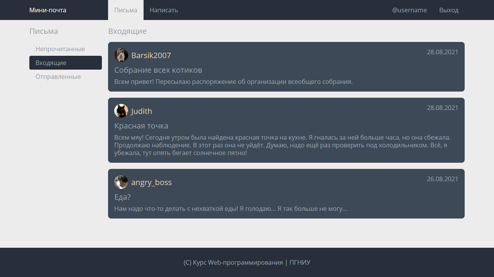

# Лабораторная работа №1: Вёрстка

> _Максимум 10 баллов. Часть Контрольной точки 2: HTML, CSS_

## Задача

Требуется реализовать вёрстку страницы по эскизу на основе заготовки в директории `solution`.

**Задачу требуется решить без использования дополнительных библиотек и систем сборки.**

#### Эскиз

#### Подсказки

- Установите `box-sizing: border` для всех элементов
- Используйте `flex` для колонок и выравнивания по центру
- Используйте автоматический `margin` для выравнивания пунктов навигации влево и вправо
- Используйте `object-fit` на изображениях аватарок, чтобы оставлять изображение квадратным по центру
- Используйте абсолютное позиционирование или `float` для размещения даты сообщения
- Полезное расширение для
  Chrome: [PerfectPixel by WellDoneCode](https://chrome.google.com/webstore/detail/perfectpixel-by-welldonec/dkaagdgjmgdmbnecmcefdhjekcoceebi/)

#### Критерии

- (3б) Страница в целом соответствует эскизу на 1280x720 с точностью более 90%;
- (1б) Страница соответствует эскизу на 1280x720 с точностью более 99.98%;
- (1б) Страница соответствует эскизу на 1200x700 с точностью более 99.98%;
- (2б) Страница соответствует эскизу на 1024x576 с точностью более 99.98% (адаптивность);
- (1б) Использованы семантические теги (`nav, main, footer, article, ul, h1, time`);
- (1б) Основные параметры заданы через CSS переменные (проверяется вручную);
- (1б) Вёрстка в целом соответствует BEM (проверяется вручную).

#### Макет

Для удобства используйте [макет в Figma](http://go.shgk.me/Web-2020-Lab-1-Figma), в него "вшиты" основные параметры,
описанные ниже, и есть возможность заимствовать некоторые стили для элементов.

### Основные значения

- Шрифт: `'Open Sans', sans-serif` (подключен в `_fonts.css`)
- Межстрочный интервал: `1.25`
- Размеры шрифта:
  - Основной: `16px`
  - Большой: `20px (1.25rem)`
- Цвета:
  - Серый (основной цвет текста): ■ `#96A1AB`
  - Тёмный: ■ `#282E3A`
  - Светло-серый: ■ `#ECECEC`
  - Серо-голубой: ■ `#3D4957`
  - Бежевый: ■ `#DBC7A6`
- Максимальный размер основной части сайта: `1128px`
- Отступы:
  - Базовый: `16px (1rem)`
  - Большой: `24px (1.5rem)`
  - Маленький: `8px (0.5rem)`
- Радиус скругления рамок:
  - Основной: `8px (0.5rem)`
  - Маленький: `4px (0.25rem)`
- Размер аватара: `36px (2.25rem)`

### Описание компонентов

#### Страница

- Основное содержимое страницы находится внутри контейнера
- Размер контейнера ограничен `максимальным значением`
- На маленьком экране контейнер растягивается во всю ширину, оставляя `базовые отступы` до границ экрана
- Страница имеет ■ `светло-серый` фон и ■ `серый` текст
- Ссылки также имеют ■ `серый` текст
- Внизу страницы подвал, имеющий `большие отступы` по вертикали и ■ `тёмный` фон
- Подвал прижат к нижней части страницы, даже если содержимое меньше экрана

#### Навигационная панель

- В верхней части сайта - навигационная панель
- Панель имеет `базовые внутренние отступы` по вертикали
- Содержимое находится внутри `контейнера`. Это ■ `светло-серый` логотип и два меню со ссылками (слева и справа)
- Логотип занимает колонку в `ширину колонки` и отделён от меню `базовым отступом`
- Ссылки в меню имеют `базовый внутренний отступ`
- Активная ссылка имеет ■ `светло-серый` фон

#### Основная часть

- Основная часть отделена `базовым отступом` от навигационной панели
- Основная часть визуально на колонку с `шириной колонки` с меню и основное содержимое, разделенных `базовым отступом`
- В начале каждой колонки заголовок `большого размера` с `базовым отступом` снизу

#### Меню

- Меню - список ссылок
- Каждая ссылка имеет `базовый внутренний отступ` по горизонтали и `маленький внутренний отступ` по вертикали
- Вторая ссылка "активная" и имеет фон ■ `тёмного` цвета, ■ `светло-серый` текст и `маленькое скругление` углов

#### Список сообщений

- Сообщения выводятся вертикальным списком сообщений, разделённых `базовым отступом`

#### Сообщение

- Каждое сообщение имеет `базовый внутренний отступ`, ■ `серо-голубой` фон и `скруглённые` углы
- Сообщение содержит три параграфа, разделённых `маленьким отступом`
- Первый параграф содержит аватар и имя отправителя ■ `бежевым цветом` `большого размера` шрифта
- Аватар - круг с изображением, который отделяется от имени `маленьким отступом`
- Изображение внутри блока с аватаром занимает всё доступное место, сохраняя исходные пропорции
- Имя автора находится по центру по вертикали
- Тема сообщения выводится `шрифтом большого размера`
- Справа сверху выводится дата сообщения в элементе `<time>`

## Инструкция по автоматическому тестированию

Автоматическое тестирование проводится в браузере, основанном на Chromium (Electron), с использованием
фреймворка [Cypress](https://www.cypress.io/).

Во время тестирования результат будет сравниваться с эталоном попиксельно, а также проверяться, что использованы
правильные семантические теги и ссылки.

_Примечание: первая установка может потребовать около 5 минут и ~50МБ интернет трафика._

1. Склонируйте ваш репозиторий командой `git clone <ваш-репозиторий>`
2. Перейдите в директорию репозитория
3. Установите [Node.js](https://nodejs.org/) версии не ниже 14 LTS
4. Установите зависимости командой `npm ci`
5. Решите задачу в директории `solution` (там уже есть заготовка)
6. Запустите тестирование командой `npm test` (займёт около 10-15 секунд)
7. Если тестирование провалится: в директории `snapshots/lab-1.spec.js/__diff_output__` будут изображение со сравнением
   вашего результата и ожидаемого
8. Если тестирование будет выполнено успешно: делайте коммит `git commit -am "Сообщение"` и отправляйте
   решение `git push`

**Важно:** время тестирования ограничено. Пожалуйста, не отправляйте решение, пока не будете готовы его сдавать :)
