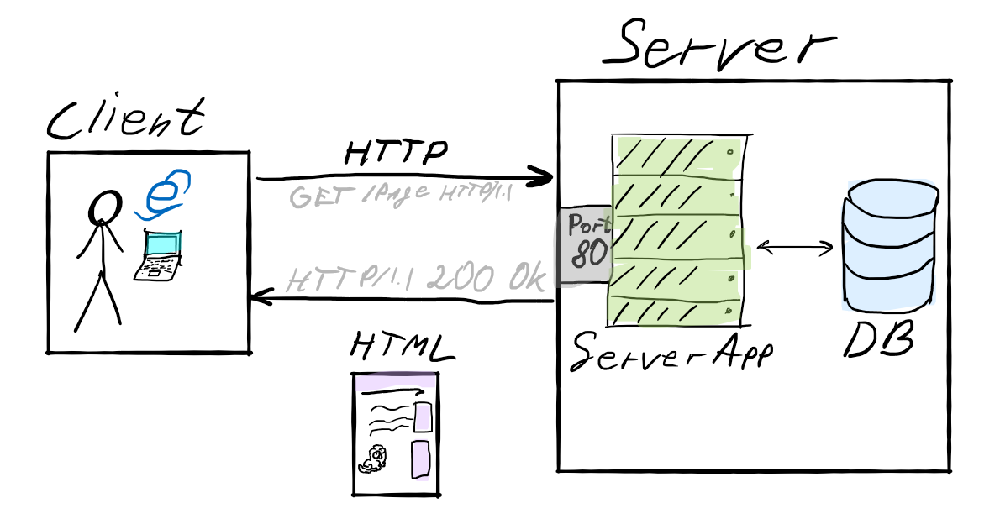
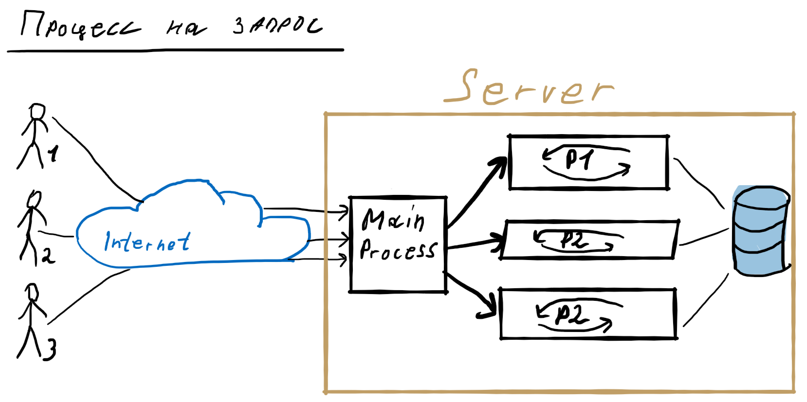
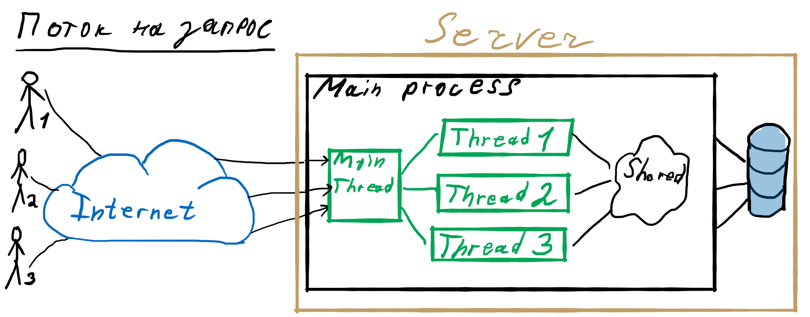
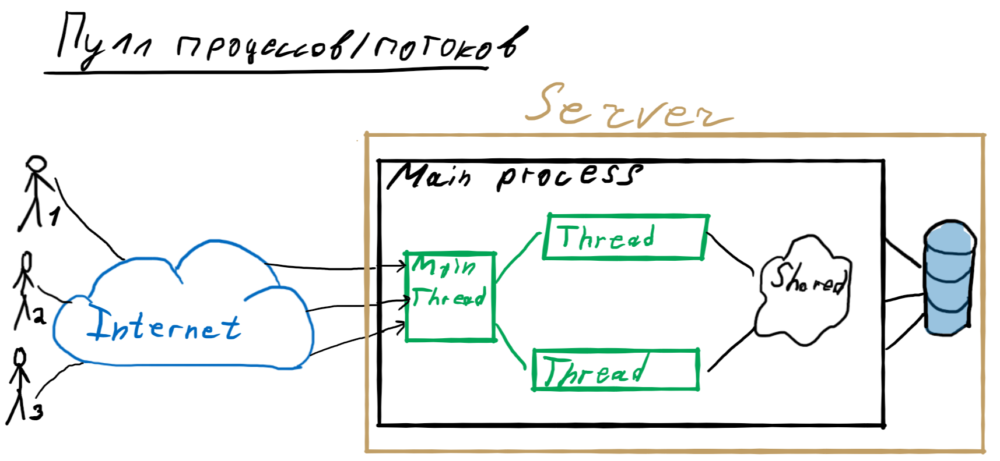

<!-- _class: lead -->


# **Лекция №4: Введение в серверную часть**

Web-программирование / ПГНИУ


---

# Общая архитектура 



---

# Общая архитектура 

На сервере запущено приложение, которое...

* Слушает порт и принимает запросы (TCP сокеты)
* Принимает HTTP запрос
* Обрабатывает запрос
* Формирует и отправляет HTTP ответ

---

# Основные задачи

* Разработка HTTP сервера (соединение, парсинг запроса, формирование ответа)
* Обработка запроса (основное приложение)
* Обработка запросов множества пользователей и масштабирование

---

# Как создать веб-приложение?

* С нуля на основе TCP сервера
* С нуля на основе HTTP сервера
* С микрофреймворком для веб-приложений (библиотека)
* С фреймворком для веб-приложений
* С использованием CMS или конструктора сайта

---

# С нуля

* HTTP сервер – это TCP сервер, работающий с HTTP
* HTTP – просто текст (нет) в определённом формате
* Слушаем порт, принимает TCP соединения, парсим HTTP запрос, формируем ответ, отвечаем и закрываем соединение
* Сложно, трудоёмко (особенно, если требуется HTTP/2, HTTP/3)

---

```python
import socket

def start_server(host, port, handler):
    """Implements a simple TCP Server"""

    # Create server socket
    server_socket = socket.socket(socket.AF_INET, socket.SOCK_STREAM)
    server_socket.setsockopt(socket.SOL_SOCKET, socket.SO_REUSEADDR, 1)
    server_socket.bind((host, port))
    server_socket.listen(1)
    print(f'Listening on port {port} ...')

    # Infinity loop for handling requests
    while True:
        # Wait for client connections
        client_connection, client_address = server_socket.accept()
        # Get the client request
        request = client_connection.recv(1024).decode()
        # Return an HTTP response and close the connection
        response = handler(request)
        client_connection.sendall(response.encode())
        client_connection.close()

    # Close server socket
    server_socket.close()
```

---

```python
def handle_http_request(request):
    """Handles the HTTP request."""
    print(request)

    # Get starting line, headers and body from request
    request_lines = request.split('\n')
    starting_line = request_lines[0]
    # Get path from starting line
    path = starting_line.split()[1]
    if path == '/':
        path = '/index.html'
    print(path)

    try:
        # Return file content
        starting_line = 'HTTP/1.0 200 OK'
        headers = ['Content-Type: text/html; charset=utf-8']
        with open('files' + path, 'r') as html_file:
            content = html_file.read()

        response = starting_line + '\n' + \
                   '\n'.join(headers) + '\n\n' + \
                   content
    except FileNotFoundError:
        # 404 - Not Found
        response = 'HTTP/1.0 404 NOT FOUND\n\nFile Not Found'

    return response

# START THE SERVER
start_server('0.0.0.0', 8080, handle_http_request)
```

---

# На основе HTTP сервера

* Во многих ЯП есть стандартный модуль для работы с HTTP
* Реализовано самое основное:
    * Создание и запуск сервера
    * Парсинг HTTP запросов и формирование HTTP ответов
    * Простой способ установить обработчик запроса
    * Работа с файлами

---

```python
from http.server import HTTPServer, BaseHTTPRequestHandler


class SimpleHTTPRequestHandler(BaseHTTPRequestHandler):

    def do_GET(self):
        path = self.path
        if path == '/':
            path = '/index.html'

        try:
            with open('files' + path, 'rb') as html_file:
                content = html_file.read()
            self.send_response(200)
            self.send_header('Content-Type', 'text/html; charset=utf-8')
            self.end_headers()
            self.wfile.write(content)
        except FileNotFoundError:
            # 404 - Not Found
            self.send_error(404, 'Page Not Found =(')


server = HTTPServer(('0.0.0.0', 8080), SimpleHTTPRequestHandler)
server.serve_forever()
```

---

# Микрофреймворк

* Включает модули для решения основных задач разработки веб-приложений
* Парсинг запросов и формирование ответов
* Маршрутизация (Роутинг, Rounting) 
* Шаблонизаторы
* Обработка ошибок
* Экосистема из библиотек для решения других задач

---

```python
from flask import Flask
app = Flask(__name__)

@app.route("/")
def hello():
    return "Hello World!"

app.run(host='0.0.0.0', port='8080')
```

---

# Фреймворк

- Включает модули для решения всех основных задач разработки веб-приложений;
- Объединяет модули в систему;
- Предоставляет готовую архитектуру;
- Разные фреймворки (и микрофреймворки) создают абстракции разной толщины для создания веб-приложения 
- Особое – Full-stack фреймворки, фреймворки, затрагивающие также клиентскую часть.

---

| Язык          | Микрофреймворк        | Фреймворк                            |
|---------------|-----------------------|--------------------------------------|
| C++           | ?                     | Wt, CppCMS, Poco                     |
| C#            | ?                     | ASP.NET Core, ASP.NET MVC            |
| Java (Kotlin) | ?                     | Spring, Play, Ktor                   |
| Python        | Flask                 | Django                               |
| Ruby          | Sinatra               | Ruby on Rails                        |
| JS (Node.js)  | Express, Koa, Fastify | Nest.JS, Loopback, Adonis            | 
| Go            | Gin, Revel, Echo      | Beego, Gorilla                       | 
| Elixir        | ?                     | Phoenix                              |
| PHP           | PHP itself, slim      | Laravel, Symphony, Yii2, CodeIgniter |

---

# CMS, конструкторы сайтов

* CMS – Content Management System, система управления контентом
* Многие сайты однотипны. Это некоторый контент, который можно смотреть, добавлять, изменять, удалять.
* Категории, пользователи с разными правами и т.д.
* Это блоги, сайты визитки, интернет-магазины, соц. сети
* CMS и конструкторы позволяют делать такие сайты быстро, акцентируясь на создании структуры и вёрстке
* Готов редактор, в котором не надо программировать
* Есть плагины (или можно разработать плагин)
* Wordpress, Joomla, OpenCart, InstantCMS и др.

---


---

# Шаблонизатор

* ПО, позволяющее использовать html-шаблоны для генерации конечных html-страниц
* Шаблоны + данные = HTML страница
* Простые – поиск с заменой в HTML файле на нужные данные
* Продвинутые позволяют делать условия, циклы, наследовать шаблоны, расширять их, создавать компоненты, макросы и т.д.

---


---


# Роутер

* **Router** – роутер / роутинг / маршрутизация 
* Модуль, который определяет маршруты (узлы URL, endpoints), их параметры и соответствующий обработчик маршрута

---

# Другие задачи веб-приложений

* Идентификация, аутентификация, авторизация
* Работа с БД (ORM, DTO, DAO, Repository и др)
* Работа с файлами
* Валидация запросов
* Обработка ошибок
* Конфигурирование
* Кэширование
* Логгирование, мониторинг
* Масштабирование

---

# Обработка параллельных запросов

* **Последовательная обработка** - (╯°□°）╯︵ ┻━┻
* **Процесс на запрос** - главный процесс создаёт процесс на обработку каждого запроса
* **Поток на запрос** - главный процесс создаёт поток на обработку каждого запроса
* **Пулл потоков/процессов** - фиксированное число заранее созданных потоков/процессов обрабатывают все запросы
* **Асинхронный** - однопоточное приложение обрабатывает асинхронно несколько запросов
* **Корутины (coroutines)** - "легковесные потоки", Half sync/half async

---



---

# Процесс на запрос

- Преимущества:
    - Изолированные процессы, не влияющие друг на друга
    - Ограничение прав процессов на уровне ОС
    - Лёгкое обновление
    - Эффективное использование параллельности на CPU
- Недостатки:
    - Процесс потребляет много ресурсов
    - Сложно, если процессам надо иметь что-то общее

---



---

# Поток на запрос

В целом, как с процессами, но:
- Появляется общая память (и хорошо, и плохо)
- Немного эффективнее создания процессов
- Нет такого простого обновления

---



---

# Пулл процессов/потоков

- Преимущества:
    - Эффективное использование ядер/процессоров
    - Нет издержек на управлении процессами/потоками
- Недостатки:
    - Тяжело масштабировать

---


---

# Асинхронность

- Преимущества:
    - Очень эффективно, если нагрузка на IO операции
    - Есть общая память
- Недостатки:
    - Очень неэффективно, если нагрузка на основной поток
    - Не использует параллельность на CPUs

---


---

# Кластер асинхронных приложений

Запросы обрабатывает не одно, а множество асинхронных приложений.

Теряется общая память, но появляется очень просто способ масштабировать приложение и эффективно использовать ядра/процессоры CPU.

---

# Формы

* HTML позволяет делать формы с помощью элемента `<form>`
* При сабмите формы запрашивается страница-обработчик формы, указанная в `action="URL"`
* Запрос страницы содержит данные формы
* Запрос отправляется одним из двух HTTP методов:
    - `method="GET"`, данные отправляются в URL в `query`
    - `method="POST"`, данные отправляются в теле запроса
* `<form action="/login" method="POST">`

---

# На самостоятельное изучение

- Найти и выбрать  фреймворк (или микрофреймворк) для своего любимого языка программирования
- Либо пройти краткий курс по Python, например, на Stepik
    - https://stepik.org/course/238 (English, JetBrains)
    - https://stepik.org/course/67 (Русский, Bioinformatics Institute)
- Посмотреть оглавление документации по Flask или другому фреймворку

---

# Ссылки

- MDN - Отправка и получение данных форм: https://developer.mozilla.org/ru/docs/Learn/HTML/Forms/Отправка_и_Получение_данных_формы
- Документация по Flask (Python): https://flask.palletsprojects.com
- Примеры из презентации:
    - TCP: https://repl.it/@ShGKme/Web-Server-basics-1
    - HTTP: https://repl.it/@ShGKme/Web-Server-basics-2
    - HTTP-2: https://repl.it/@ShGKme/Web-Server-basics-3
    - Flask: https://repl.it/@ShGKme/Web-Server-basics-4
    - Flask-2: https://repl.it/@ShGKme/Web-Server-basics-5   

---

<!-- _class: lead -->

# In the next episode

Идентификация, аутентификация, авторизация, сессия, безопасность
