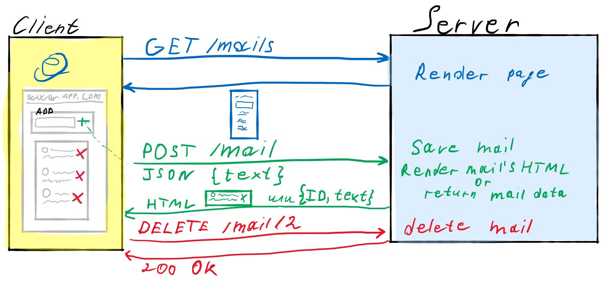

<!-- _class: lead -->

# **Лекция №6: AJAX**

Web-программирование / ПГНИУ

---


---

# Традиционный подход

* Каждый запрос – получение HTML документа
* Каждое действие пользователя – получение HTML
* Переход по ссылке или отправка HTML формы
* Аутентификация, фильтрация, поиск – обновление страницы
* Манипулирование данными – обновление страницы
* Время, трафик, нагрузка

---

# AJAX

* Asynchronous Javascript and XML
* Подход к построению интерактивных пользовательских интерфейсов веб-приложений, заключающийся в «фоновом» обмене данными браузера с сервером
* Данные – не только HTML, а любые сериализованные или бинарные
* Не обязательно XML 😀
* Официально термин появился в 2005 году
* Фактически технологии позволяли реализовывать в 1998

---

# Суть подхода

* Загружается основной HTML документ, включая скрипты и некоторые данные
* Некоторые действия приводят к загрузке новых данных на страницу или выполнении действий на сервере (асинхронно)
* Страница обновляется без перезагрузки
* Сама страница (URL) не меняется

---

 

---

# XHR

- XMLHttpRequest
- API браузера, который предоставляет клиенту функциональность для обмена данными между клиентом и сервером
- Не обязательно XML 😀
- Появился в 2000 г. (Microsoft)
- Также поддерживает file и ftp протоколы

---

```javascript
// Defined load event handler
function loaded() {
    console.log(this.status, this.statusText);
    console.log(this.responseType);
    console.log(this.responseText);
    console.log(this.response);
}

// Create Request Object
const xhr = new XMLHttpRequest();

// Set Success Load Event Handler
// xhr.onload = loaded;
xhr.addEventListener('load', loaded.bind(xhr));
// Other Events:
// abort, error, loadend, loadstart, progress, timeout

//      Method,  Url,                                           isAsync
xhr.open('get', 'https://jsonplaceholder.typicode.com/todos/1', true);

// Set Headers
xhr.setRequestHeader('header', 'value')

// Send the request
const data = null;
xhr.send(data);
```

---

# Fetch API

- Интерфейс для получения ресурсов
- Promise-based
- Не такой гибкий, как XHR
- Простой и удобный

---

```javascript
// Simple Promise
fetch('https://jsonplaceholder.typicode.com/todos/1')
  .then((response) => response.json())
  .then(data => console.log(data));

// With Async / Await
const response = await fetch('https://jsonplaceholder.typicode.com/todos/1');
const data = await response.json();

// More Params
await fetch(url, {
    method: 'POST',
    credentials: 'same-origin',
    headers: {
        'Content-Type': 'application/json',
    },
    body: JSON.stringify(data),
    // mode, cache, redirect, referrer...
});
```

---

# API

* На серверной части появляются endpoints, которые не возвращаются HTML документ, а обрабатывают запрос
* Данные могут быть любые, а не только GET/POST HTML Form
* Сервер может вернуть часть HTML, сериализованные данные, бинарные данные или информацию об успешном/неуспешном выполнении запроса

---

# Схема API

* Требуется определить схему, протокол общения с API
* Универсальной - не существует
* Определяется набор (и формат) конечных точек,
* схема запроса и ответа: структура, формат (в т.ч. сериализации)
* статус ответа (успешный, ошибка).
* Способ документирования?

---

# RESTFull API

* **Representational State Transfer**
* Архитектурный стиль взаимодействия компонентов распределённого приложения в сети
* Управление ресурсами в оптимальной и простой архитектуре
* Альтернатива RPC (Remote Procedure Calling)
* Стиль, а не стандарт

---

# Требования к REST API

1. Client-Server
2. Stateless - Отсутствие состояния
3. Cache - Кэширование
4. Uniform Interface - Единообразие интерфейса
5. Layered System - Слои 

---

# REST: Uniform Interface

* Resources and Resource Identifiers - Идентификация ресурсов (например, с URI)
* Representations - Манипуляция ресурсами через представление
* Self-descriptive messages - Самоописываемые сообщения, сообщения содержат описания о том, как работать с ресурсом
* HATEOAS - Hypermedia as the Engine of Application State, всё есть гипермедиа

---

# Популярное понимание REST

- Используем HTTP
    - URI, path для идентификации
    - Заголовки для описания сообщений
    - Методы определяют действие
    - HTTP ответ, код для описания типа ответа 

```http
GET    /users/1/posts
GET    /users/1/posts/1
POST   /users/1/posts
PUT    /users/1/posts/1
PATCH  /users/1/posts/1
DELETE /users/1/posts/1
```

---

# JSON-RPC

RPC с описанием вызываемого метода и его параметров в формате JSON.

```json
{"jsonrpc": "2.0", "method": "subtract", "params": [42, 23], "id": 1}
```

```json
{"jsonrpc": "2.0", "result": 19, "id": 1}
```

---

# JSON:API

Спецификация построения API

---

```json
{
  "links": {
    "self": "http://example.com/articles",
    "next": "http://example.com/articles?page[offset]=2",
    "last": "http://example.com/articles?page[offset]=10"
  },
  "data": [{
    "type": "articles",
    "id": "1",
    "attributes": {
      "title": "JSON:API paints my bikeshed!"
    },
    "relationships": {
      "author": {
        "links": {
          "self": "http://example.com/articles/1/relationships/author",
          "related": "http://example.com/articles/1/author"
        },
        "data": { "type": "people", "id": "9" }
      },
      "comments": {
        "links": {
          "self": "http://example.com/articles/1/relationships/comments",
          "related": "http://example.com/articles/1/comments"
        },
        "data": [
          { "type": "comments", "id": "5" }
        ]
      }
    },
    "links": {
      "self": "http://example.com/articles/1"
    }
  }],
  "included": [{
    "type": "people",
    "id": "9",
    "attributes": {
      "firstName": "Dan",
      "lastName": "Gebhardt",
      "twitter": "dgeb"
    },
    "links": {
      "self": "http://example.com/people/9"
    }
  }, {
    "type": "comments",
    "id": "5",
    "attributes": {
      "body": "First!"
    },
    "relationships": {
      "author": {
        "data": { "type": "people", "id": "2" }
      }
    },
    "links": {
      "self": "http://example.com/comments/5"
    }
  }]
}
```

---

# GraphQL

* Query Language for API - Язык запросов к API
* Позволяет описывать типы данных и связь между ними (граф)
* Позволяет делать запросы к этому графу, указывая, какие данные и их части нужны
* Разработан Facebook в 2012

---

```gql
{
    posts {
        id
        title
        text
        author {
            name
            avatar
        }
        comments {
            author {
                name
                avatar
            }   
            likes {
                totalCount
            }         
        }
    }
}
```


---

# Тестирование API

- Инструменты отладки в браузере
- Инструменты отладки запросов в IDE
- Insomnia (Desktop)
- Postman (Desktop)
- Postwomen (Web)

---

# Swagger

- OpenAPI Specification
- Описание API
- Документирование
- Генерация клиента или сервиса
- Тестирование
- Стандартизация

---

# CORS

- Cross-Origin Resource Sharing
- Кросс-доменные запросы
- Сервер в заголовках указывает набор источников, которым он доверяет

---

# Ссылки

- XHR:
    - https://learn.javascript.ru/xmlhttprequest 
    - https://developer.mozilla.org/ru/docs/Web/API/XMLHttpRequest 
- Fetch:
    - https://learn.javascript.ru/fetch 
    - https://developer.mozilla.org/ru/docs/Web/API/Fetch_API/Using_Fetch
    
---

# Ссылки

- REST (original): https://www.ics.uci.edu/~fielding/pubs/dissertation/rest_arch_style.htm
- https://www.jsonrpc.org
- https://jsonapi.org
- https://grpc.io/docs/languages/web/basics/
- https://graphql.org    

---

# Ссылки

- Инструменты:
    - https://www.getpostman.com
    - https://insomnia.rest
    - https://postwoman.io
- CORS: https://developer.mozilla.org/ru/docs/Web/HTTP/CORS
- https://swagger.io

---

<!-- _class: lead -->

# In the next episode

Современный Front-end
