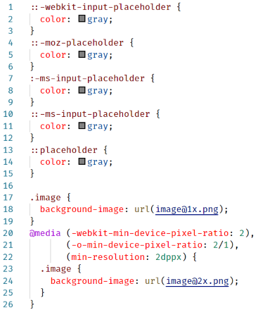
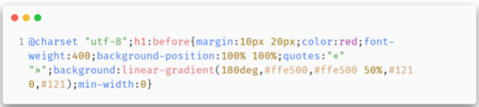
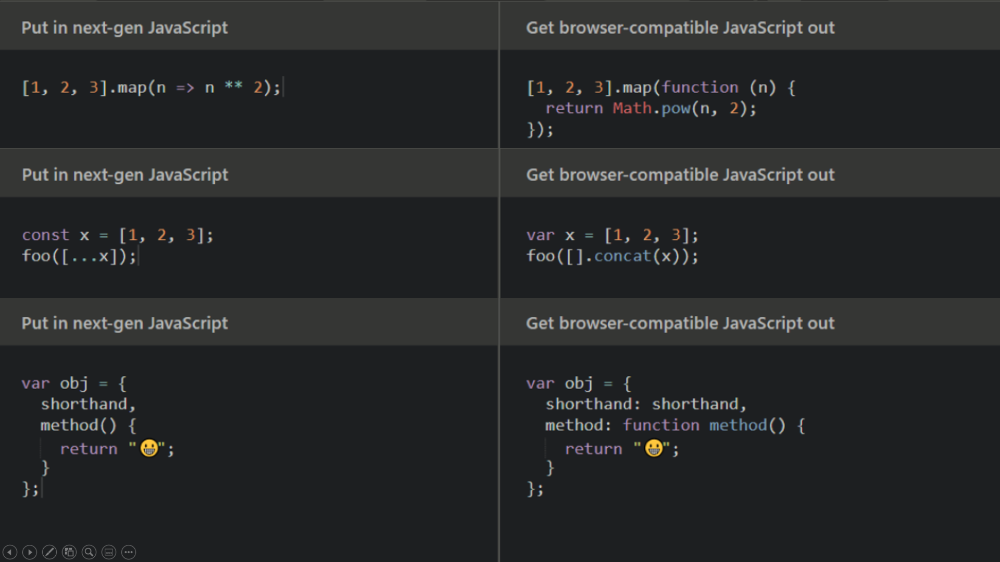
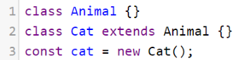
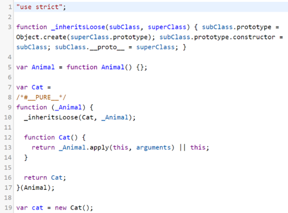
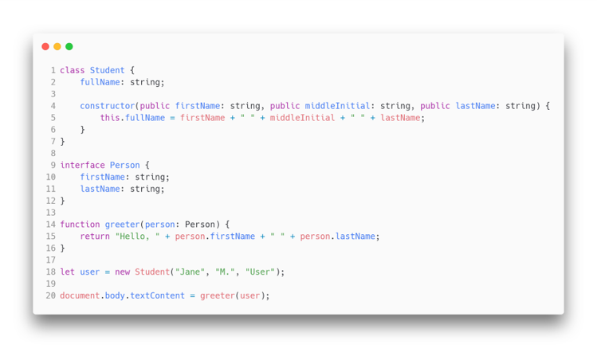
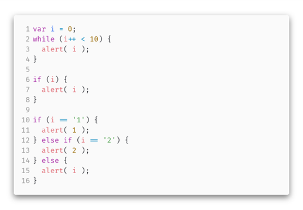
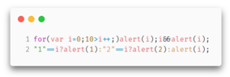
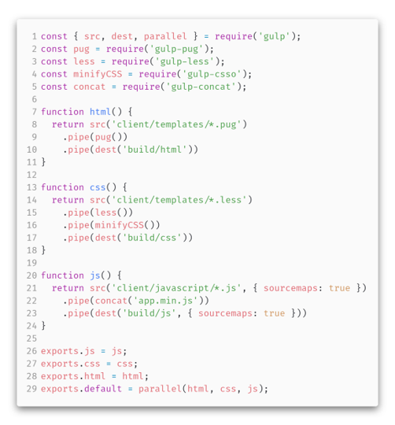

<!-- _class: lead -->

# **Лекция №8: Современный Front-End**

Web-программирование / ПГНИУ

---

## CSS-препроцессоры

- CSS препроцессоры – инструменты трансляции (пред-обработки) более высокоуровневых языков в CSS
- SASS (SCSS), LESS, Stylus
- Переменные, вычисления, переиспользование (миксины, модули), функции, условия, циклы и т.д.

 

---

# PostCSS 

- Программа, которая автоматизирует рутинные операции с CSS с помощью расширений, написанных на языке JavaScript.
- Конвейер для унифицированных плагинов, выполняющих некоторые операции с CSS
- **autoprefixer** – автоматически добавляет вендорные префиксы
- **postcss-preset-env** – позволяет писать на современном CSS
- **cssnano** – оптимизация и сжатие css

---




---




---

# PostHTML 

- Программа, которая автоматизирует рутинные операции с HTML с помощью расширений, написанных на языке JavaScript
- **posthtml-md**
- **posthtml-img-autosize**
- **posthtml-w3c**

---

# Babel 

- **JavaScript компилятор (транспайлер)**
- Toolchain для компиляции множеством плагинов
- **Транспайлер** — тип компилятора, который использует исходный код программы, написанной на одном языке программирования, в качестве исходных данных и производит эквивалентный исходный код на другом языке программирования
- Переводит современный JS в старый

---




---




---

# Другие языки

- TypeScript 
- Dart
- Elm
- Reason
- Kotlin.js
- Scala.js



---

# Другие задачи

- Минификация - уменьшение размера кода
- Обфускация - запутывание кода
- Оптимизация кода - замена конструкций на более эффективные эквивалентные 

---




---

# Browserslist 

- Как понять, в какую версию ES нам транспайлить код?
- Какие нужны полифилы? Префиксы в CSS?
- Нужно проверять всё на caniuse.com?


---

# Качество кода

**Линтер** – инструмент анализа кода, соблюдение стиля кода и поиска проблемных мест.
Самый популярный - **eslint**  

**Форматер** – инструмент, форматирующий код по определённым правилам.
Самый популярный - **prettier**  

---

# NodeJS

- Node или Node.js — программная платформа, основанная на движке V8, превращающая JavaScript из узкоспециализированного языка в язык общего назначения. (wikipedia)
- NodeJS – среда исполнения JavaScript и API для взаимодействия с ОС
- Позволяет писать на JS консольные утилиты, серверную часть, десктопные приложения, serverless и т.д.


---


---

# Проблема управлением зависимостями

- Есть куча библиотек, каждую надо найти на её сайте (вспомнив или найдя сайт) и скачать / подключить 
- Иногда надо проверять, а не вышла ли новая версия
- Обновили – всё сломалось, ведь какой-то другой библиотеке была нужна обязательно старая версия
- Решение - управление зависимостями через пакетный менеджер

---

#  npm
- **NodeJS Package Manager**
- Приложение = пакет. Его описание хранится в `package.json`
    - `scripts` - различные скрипты, команды, использующиеся при разработке пакета
    - `dependencies` - зависимости
    - `devDependencies` - зависимости для разработки
- `node_modules` - директория, в которой хранятся установленные зависимости

---

# Команды npm

```bash
# Основные команды
$ npm init`
$ npm install
$ npm install <package> [ <package>]
$ npm install --save-dev <package> [ <package>]
$ npm install --global <package>
$ npm uninstall <package> [ <package>]
$ npm run <script name>
$ npx <bin>

# Алиасы
npm i === npm install
npm i -D == npm install --save-dev
npm i -g == npm install --global
npm start === npm run start
```

---


---


---


---


---


---


---

# Запуск задач

- Системы автоматизации задач
- `$ gulp js`




---

# Webpack 

- Сборщик модулей JavaScript приложения
- Не только js модулей, но и других зависимостей приложения
- Исследование графа зависимостей, разделение бандла на части (chunks), TreeShaking
- webpack-dev-server
    - Локальный сервер с хостингом файлов
    - Прокси к API
    - Hot Module Replacement

---


---

# Правила (rules)

Правило определяется файлами, на которые оно действует (test) и списком загрузчиков (use), которые обрабатывают файлы


---

# Загрузчики (loaders)

- style-loader, css-loader
- less-loader, sass-loader, postcss-loader
- babel-loader, ts-loader
- json-loader, file-loader, csv-loader
- posthtml-loader
- eslint-loader

---

# Плагины

Переиспользуемые модули, имеющие ту же систему конфигурации, что и сам webpack

- clean-webpack-plugin
- mini-css-extract-plugin
- hot-module-replacement-plugin
- uglifyjs-webpack-plugin

---

```jsx
/* JSX */

class TodoApp extends React.Component {
  //...
  render() {
    return (
      <div>
        <h3>Список дел</h3>
        <TodoList items={this.state.items} />
        <form onSubmit={this.handleSubmit}>
          <label htmlFor="new-todo"> Что нужно сделать? </label>
          <input id="new-todo" onChange={this.handleChange} value={this.state.text} />
          <button> Добавить #{this.state.items.length + 1}</button>
        </form>
      </div>
    );
  }
}

class TodoList extends React.Component {
  render() {
    return (
      <ul>
        {this.props.items.map(item => (
          <li key={item.id}>{item.text}</li>
        ))}
      </ul>
    );
  }
}
```

---


---

# Source Map

Специальные файлы, которые позволяют в процессе разработки и отладки соотносить исполняемый код и исходный код.

---

# Ссылки: интересные статьи

- Каково оно учить JavaScript в 2016:  
[https://habr.com/ru/post/312022/](https://habr.com/ru/post/312022/)
- Объясняем современный JavaScript динозавру:  
[https://habr.com/ru/company/mailru/blog/340922/](https://habr.com/ru/company/mailru/blog/340922/)

---

# Ссылки: доклады

- HolyJS 2017 Moscow | Михаил Башуров – Yarn, npm v5 или pnpm — кто круче?  
[https://www.youtube.com/watch?v=hq-gIihAs5A](https://www.youtube.com/watch?v=hq-gIihAs5A)
- HolyJS 2017 Moscow | Модульный CSS — Андрей Оконечников:  
[https://www.youtube.com/watch?v=vYmSYsj-s5w](https://www.youtube.com/watch?v=vYmSYsj-s5w) 
- HolyJS 2018 Moscow | Стас Курилов — Глубокое погружение в webpack:  
[https://www.youtube.com/watch?v=aiYkJOPD9v8](https://www.youtube.com/watch?v=aiYkJOPD9v8)
- HolyJS 2019 Moscow | Nicolò Ribaudo — @babel/how-to:  
[https://www.youtube.com/watch?v=UeVq_U5obnE](https://www.youtube.com/watch?v=UeVq_U5obnE)

---

# Ссылки: инструменты

- NodeJS: [https://nodejs.org/](https://nodejs.org/)
- NPM: [https://www.npmjs.com/](https://www.npmjs.com/)
    - Документация по package.json: [https://docs.npmjs.com/configuring-npm/package-json.html](https://docs.npmjs.com/configuring-npm/package-json.html)
    - Документация по CLI: [https://docs.npmjs.com/cli-documentation/cli](https://docs.npmjs.com/cli-documentation/cli)
- LESS, SASS: [http://lesscss.org/](http://lesscss.org/), [https://sass-lang.com/](https://sass-lang.com/)
- PostCSS: [https://postcss.org/](https://postcss.org/), [https://github.com/postcss/postcss](https://github.com/postcss/postcss)
- Babel: [https://babeljs.io/](https://babeljs.io/)

---

# Ссылки: инструменты

- Browserslist: [https://github.com/browserslist/browserslist](https://github.com/browserslist/browserslist), [https://browserl.ist/](https://browserl.ist/)
- Webpack: [https://webpack.js.org/](https://webpack.js.org/)
- Webpack DevServer: [https://webpack.js.org/configuration/dev-server/](https://webpack.js.org/configuration/dev-server/)
- ESLint: [https://eslint.org/](https://eslint.org/)
- Prettier: [https://prettier.io/](https://prettier.io/)
- core-js: [https://www.npmjs.com/package/core-js](https://www.npmjs.com/package/core-js)
