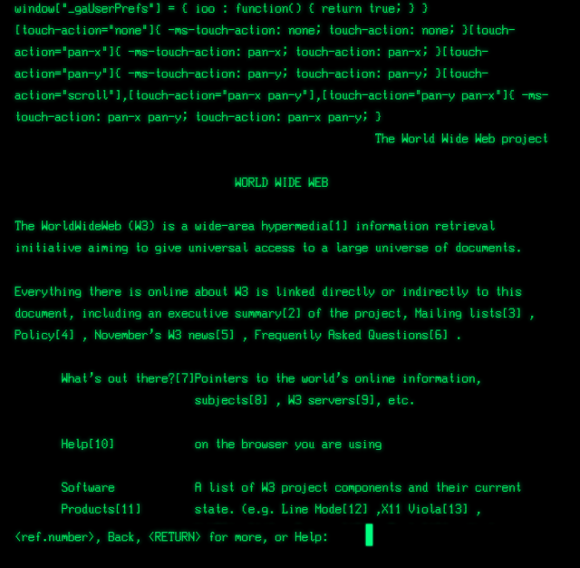
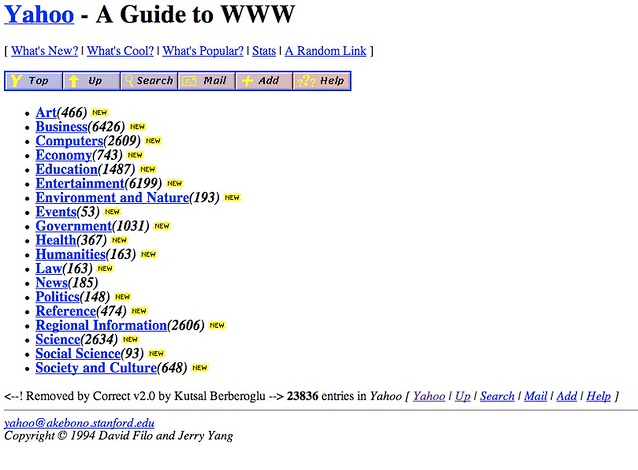
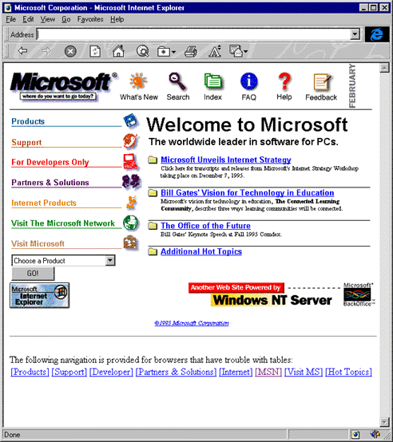
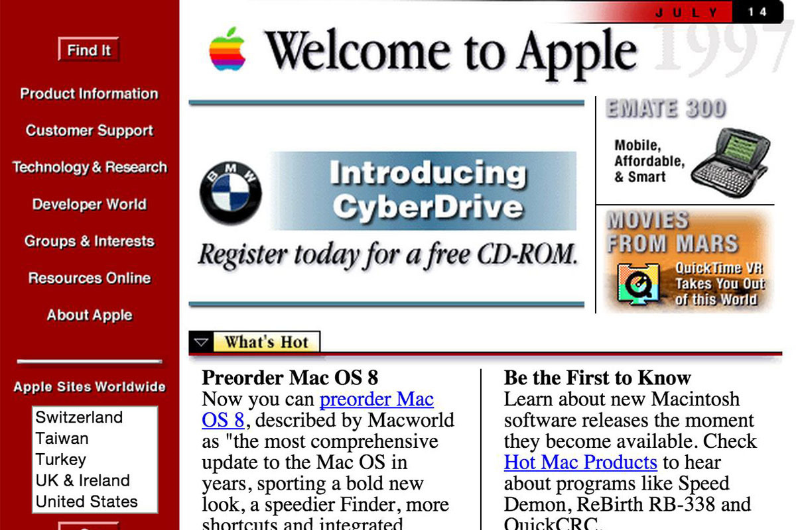
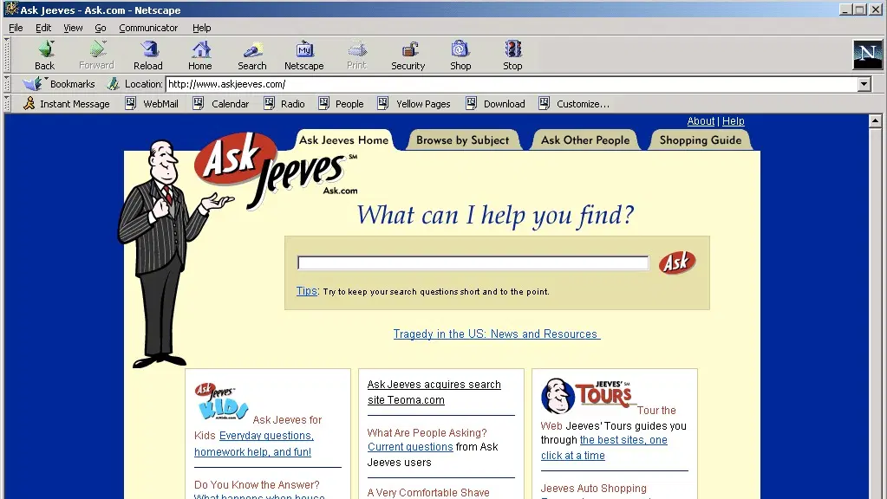
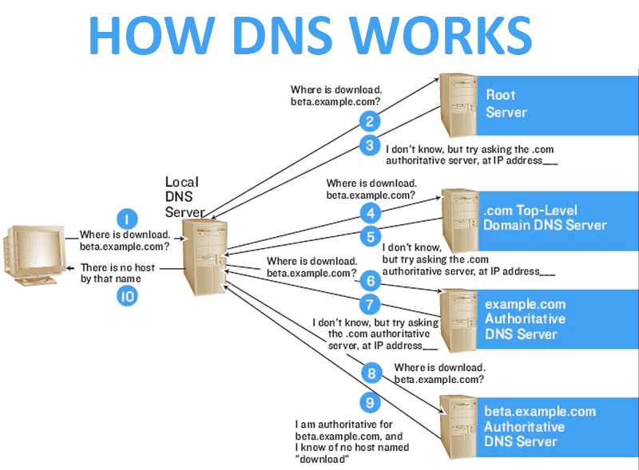
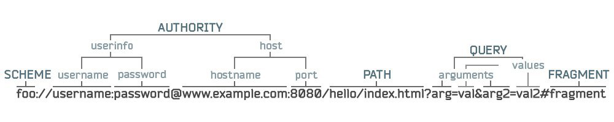

<!-- _class: lead -->

# **🕸 Лекция №1: Введение в курс**

Web-программирование / ПГНИУ
_Grigorii K. Shartsev_

---

# Контакты

- Лектор: **Шарцев Григорий Константинович**
  -  [@shgkme](https://t.me/shgkme)
  - 📧 me@shgk.me
- Оф. лектор: **Данилова Екатерина Юрьевна**
  - 📧 keteref@gmail.com
  -  [keteref](https://vk.com/keteref)
    
---

<!-- _class: lead -->

# **Краткая история веба**

---

* **1969** – Закрытая сеть ARPANET по заказу мин. об. США
* **1972** – Протокол TCP/IP – стандартный сетевой протокол
* **1984** – Открытая сеть NSFNET между университетами и вычислительными центрами
* **1989** – Первый интернет провайдер
* **1990** – Уже есть интернет, email, сообщения, по адресу info.cern.ch появляется текст, доступный через интернет (первый веб-сайт)
* ***Web 1.0 – веб для получения информации***

---




---




---

* **1993** – Появляется HTML (изображения, таблицы), сайты уже не просто текст
* **1995** – Появляется Javascript и PHP, сайты становятся не просто документами, а чем-то динамическим
* **1996** – Появляется CSS, дизайн переходит на следующий уровень. Война Netscape Navigator и Internet Explorer
* *Первый этап войны браузеров*

---





---



---

* **1997–1999** – Выходит HTML4, CSS2, веб-страницы всё сложнее, в интернете 100 миллионов человек
* **1999–2002** – Выходит MS IE5, всё больше контента, сайтов
* **2003** – Появляются "приложения": Myspace, Facebook, WordPress
* **2004** - Подход AJAX, почтовый клиент Gmail
* **2005** – Google Maps, YouTube, Mozilla Firefox Browser
* *Второй этап войны браузеров*
* ***Web 2.0 – теперь пользователи создают контент***

---

* **2007** – Мобильные устройства, iPhone, Safari
* **2008** – Google Chrome, быстрый и удобный браузер
* **2009** – Node.js - начало активного применение JS вне браузера
* **2010–2013** – Адаптивный дизайн, массовое использование мобильных устройств
* **2014** – HTML5, CSS3 в массы – ещё больше возможностей
* **2014-2015** – ES2015+, Babel.js
* **2020** - Microsoft Edge переходит на Chromium
* *Третий этап войны браузеров*

---

# Web 3.0 ?

- Semantic Web
    - От информации к знаниям
    - RDF, DAML, OIL, OWL (онтологии!)
- Децентрализованный веб, блокчейн
- Что-то другое?

---

<!-- _class: lead -->

# **Основные понятия**

---

* **Распределённое приложение** — это набор взаимодействующих программных компонент, выглядящий с точки зрения пользователя, как единое целое.
* **Клиент-серверное приложение** — вычислительная или сетевая архитектура, в которой задания или сетевая нагрузка распределены между поставщиками услуг, называемыми **серверами**, и заказчиками услуг, называемыми **клиентами**.
* **Веб-приложение** — клиент-серверное приложение, в котором клиент взаимодействует с сервером посредством **веб-браузера**.

---

* **Всемирная паутина (далее веб)** — распределённая система, предоставляющая доступ к связанным между собой документам, расположенным на различных компьютерах, подключённых к сети Интернет.
* **Веб-страница** — документ или информационный ресурс Всемирной паутины, доступ к которому осуществляется с помощью веб-браузера (обычно HTML документ).
* **Веб-сайт** (буквально «место в сети») — одна или несколько логически связанных между собой веб-страниц.

---

* **IP-адрес** (Internet Protocol Address) — уникальный сетевой адрес узла в компьютерной сети, построенной на основе стека протоколов TCP/IP
* **Доменное имя** — символьное имя, служащее для идентификации областей, которые являются единицами административной автономии в сети Интернет, в составе вышестоящей по иерархии такой области. Каждая из таких областей называется доменом
* **Доменная зона** — совокупность доменных имён определённого уровня, входящих в конкретный домен
* **DNS** (Domain Name System) — компьютерная распределённая система для получения информации о доменах

---



---

* **HTML** (HyperText Markup Language) — стандартизированный язык разметки документов во Всемирной паутине (_историческое определение_)
* **HTTP** (HyperText Transfer Protocol) — протокол прикладного уровня передачи данных изначально — в виде гипертекстовых документов в формате «HTML», в настоящий момент используется для передачи произвольных данных. **Протокол веб-приложений**

---

# HTTP протокол

- Основным объектом манипуляции в HTTP является ресурс, на который указывает URI 
- Запрос-ответ, не имеет состояния
- Текстовый формат

---

# Структура HTTP

```
<starting line> \n
*(<header_field>: [ <header_value> ] \n)
\n
[ <Message Body> ]
```

---

# Стартовая строка

- Запрос
    - `METHOD PATH HTTP_Version` 
    - `GET /users/5 HTTP/1.0`
- Ответ
    - `HTTP_Version STATUS_CODE REASON_PHRASE`
    - `HTTP/1.1 200 OK`
    - `HTTP/1.1 404 Not found`
    
---

# HTTP методы

- `OPTIONS` - получение информации о возможностях сервера
- `GET` - получение ресурса
- `HEAD` - получение ресурса без содержимого
- `POST` - передача данных ресурсу (создание, выполнение процедуры)
- `PUT` - обновление ресурса
- `PATCH` - обновление части ресурса
- `DELETE` - удаление ресурса
- `TRACE` - получение ресурса с трассировкой
- `CONNECT` - установка соединения

---

# Коды состояний

- `1xx` - информационные
- `2xx` - успешные
- `3xx` - перенаправление
- `4xx` - ошибка клиента
- `5xx` - ошибка сервера

---

# Заголовки

- Техническая информация о запросе (или ответе), информация о клиенте или сервере, любая другая информация
- `Host: example.com`
- `Accept: text/html`
- `Content-Type: text/plain; charset=windows-1251`
- `Content-Language: ru`
- `X-Best-animal`: `Cat`

---

# Содержимое

- Текст (plain, html...)
- Сериализованные данные (xml, json...)
- Бинарные данные
- Множественное содержимое (multipart/*)

---

# Запрос

```http request
GET /materials/lectures/01-Web-basics/01-Web-basics.html HTTP/1.1
Host: web.shgk.me
User-Agent: Mozilla/5.0 (Windows NT 10.0; Win64; x64)
Accept: text/html
```

```http request
POST /pls/stu_cus_et/stu.login HTTP/1.1
Host: student.psu.ru
Content-Length: 545
Origin: https://student.psu.ru
Content-Type: application/x-www-form-urlencoded
Accept: text/html

p_username=%D8%E0%F0%F6%E5%E2&p_password=...&p_recaptcha_response=...
```

---

# Ответ

```http
HTTP/1.1 200 OK
Server: nginx
Content-Type: text/html; charset=utf-8
Content-Length: 17712
Last-Modified: Tue, 08 Dec 2020 13:25:58 GMT

<!DOCTYPE HTML>
<html>
  <head>
  ...
```

---

# URL



---

# Другие версии HTTP

- `HTTPS` - безопасный
- `HTTP/2` - бинарный, с поддержкой мультиплексирования запросов
- `HTTP/3` - на основе UDP вместо TCP

---
<!-- _class: lead -->
# Архитектура веб-приложения


---
<!-- _class: lead -->


---

# 📃 Что будет в этом курсе?

- Раздел 1: введение
- Раздел 2: основы Web-программирования на клиентской части
- Раздел 3: основы web-программирования на серверной части
- Раздел 4: современное Web-программирование
- Раздел 5: развёртывание
- Раздел 6: обзор других технологий

---

# ❌ Чего НЕ будет в этом курсе?

- Как работает интернет, сети, протоколы, маршрутизация
- Клиент-серверные приложения, сокеты, и др. из курса ТРРП
- Web 3.0, RDF, OWL, онтологий
- Углубления в изучение вёрстки веб-страниц, UI и UX
- Углубления в работу с серверами, UNIX, IIS
- Serverless, облачных сервисов, микросервисов
- Углубления в SEO, a11y, i18n

---

# 💬 Познакомимся

* Кто уже знаком с веб-разработкой?
* Кто хочет углублённо изучить современные веб-технологии?
* Кто знает HTML, JavaScript?
* Кто знаком с React, Vue, Angular, Ember ?
* Кто знаком с PHP или другим языком серверной части?
* Кто уже работает в этой сфере?
* Кто планирует работать?
* Что вы ждёте от курса?

---

# На самостоятельное изучение

- Отличие URL от URI и URN
- HTTP 
- HTTPS
- HTTP/2, HTTP/3

---

# Ссылки

- Спецификация по HTTP/1.1: https://tools.ietf.org/html/rfc2616
- Wikipedia - HTTP: https://ru.wikipedia.org/wiki/HTTP
- Habr - URI — сложно о простом (Часть 1): https://habr.com/ru/post/232385/
- [History of the Web: Part 1, @MatthewGerstman | 01 Jun 2021](https://www.matthewgerstman.com/tech/history-of-the-web/)
- [HTTP/3 From A To Z: Core Concepts (Part 1) - Smash Magazine, Robin Marx, 9 Aug 2021](https://www.smashingmagazine.com/2021/08/http3-core-concepts-part1/)
- [What Is Web 2.0 — O’Reilly Media, Tim O'Reilly, 30 Sep 2005](https://www.oreilly.com/pub/a/web2/archive/what-is-web-20.html)
- [Web 3.0, the “official” definition - Jason Calacanis, October 3, 2007](https://calacanis.com/2007/10/03/web-3-0-the-official-definition/)

---

# Входной контроль

- Зарегистрироваться на GitHub
- https://classroom.github.com/a/Jh5po0tZ
- Выбрать себя из списка
- `clone` → решить → `commit` → `push`
- Смотреть за `PR#1 Feedback` 
- Дедлайн - неделя

---

<!-- _class: lead -->

# Ссылки курса

- 📄 Презентации, лабораторные, материалы (WIP): [web.shgk.me](http://web.shgk.me)
-  Чат курса: http://go.shgk.me/web-movs-chat
- 💻 Позже: общая онлайн-консультация раз в неделю

---
<!-- _class: lead -->
# In the next episode

Лекция: JavaScript

Практики: HTML, CSS, вёрстка
