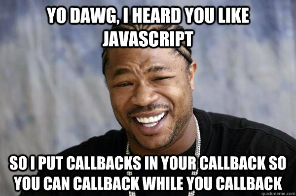
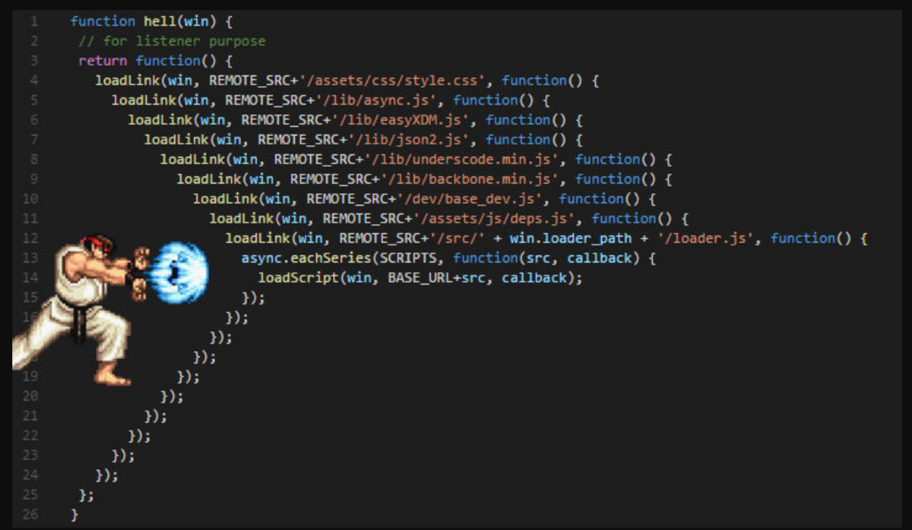

<!-- _class: lead -->

# **Лекция №2: JavaScript**

Web-программирование / ПГНИУ


---

# JavaScript (JS)

* Реализация стандарта **ECMAScript (ECMA-262)**
* Исторически - язык сценариев веб-страниц
* Мульти-парадигменный язык программирования (объектно-ориентированный, императивный, функциональный)
* Интерпретируемый ЯП (или JIT-компилируемый)
* Прототипно-ориентированный
* Событийно-ориентированный
* Автоматическое управление памятью
* C-подобный синтаксис

---

# ECMAScript

- Старый JS: ES3
- Долго основная версия (~2012): ES5
- Большие изменения в ES6 = ES2015
- С 2015 года - ежегодный цикл
- Текущая версия ES2021
- Другие реализации стандарта:\
  `ActionScript`, `QtScript`, `ExtendScript`, `UnityScript` (dead)

---

# Типизация

* Динамическая типизация
* Слабая типизация
* Утиная типизация
* Основные стандартные типы:
  *Number*, *String*, *Boolean*, Array, Object, Function
  *Symbol*, Set, Map, WeakSet, WeakMap, *BigInt*
* Значения типов делятся на:
  * _иммутабельные_ (примитивы)
  * _мутабельные_ (объекты)

---

# Значения 

```javascript
1, 1.0, 15n                     // Number, BigInt

'hello', "world", `Hello, ${x}` // String

true, false                     // Boolean

[1, 2, 'c', [3, 4]]             // Array

obj = { a: 1, b: 2 }            // Object

undefined, null, NaN, Infinity  // Special
```

---

# Особенность вычисления значения

* Для веб-страницы "упасть" хуже "некорректного" значения
* Много разрешённых неявных приведений типов
* Несуществующие поля объекта - `undefined`
* Несуществующие элементы массива - `undefined`
* `1 + '2' === 12`
* `'22' - 1 === 21` 
* `[] + {} == '[object Object]'`
* `{} + [] == '[object Object]'`
* Многое допустимо

---


---

# Объявление переменных

```javascript
variable = 'value'; // Устаревший
var x, y, z = 0;    // Устаревший

{
    let b = '2'; // Объявлено только в этой области
}
{
    const c = 3;    // Объявлено только в этой области
    const d = [1, 2, 3];
    d.push(4);      // Мутация
    d = ['a', 'b']; // Изменение - ошибка
}

// Деструктуризация
const [a, b] = [1, 2];
  
const { a, b } = { a: 1, b: 2 };
```

---

# Операторы

* Арифметические: `+`, `-`, `*`, `/`, `%`, `**`
* Логические: `!`, `&&`, `||`
* Сравнения: `>`, `>=`, `<`, `<=`, `==`, `===`, `!=`, `!==`
* Бинарные: `~`, `|`, `&`, `^`
* Тернарный: `condition ? val1 : val2`
* `++`, `--`, `+=`, `-=`, `/=` …
* Optional Chaining: `mayBeNull?.property?.method?.()`
* Nullish Coasting: `mayBeNull ?? defaultValue`
* Перечисления: `,`

---

# Ветвление (условие)

```javascript
if (condition) action;

if (condition) {
    action;
    action;
} else {
    action;
    action;
}
```

---

# Циклы

```javascript
while (condition) action;

while (condition) { action; }

do { action; } while (condition);

for (let i = 0; i < arr.length; i++) { console.log(arr[i]); }

for (let key in obj) { console.log(obj[key]); }

for (let val of obj) { console.log(val); }
```

---

# Функции

```javascript
// Именованная функция
function f1(a, b, c = 1) {
    return action(a, b, c);
}

// Анонимная функция
const f2 = function() {
    return action();
};
```

---

# Функции

```javascript
// Функции могут быть вложенными

function f1() {
  
    function f2() {
      
        function f3() {
            return 1;
        }

        return f3();
    }

    return f2();
}
```

---

# Объекты

```javascript
const x = 1;
const obj = {
    shortName: 1,
    'long name': 2,
    ['Hello, ' + 'World']: 3,
    f1() { },
    x,
};
obj.x // 1
obj.y // undefiend
obj.shortName = 1;
obj['long name'] = 2;
obj['Hello, ' + 'World'] = 3;
obj.f1();
obj['New Value'] = 4;
```

---

# `this` и контекст

* Функции **выполняются** в некотором **"контексте"**
* `this` - объект контекста
* Можно понимать `this`, как ещё один аргумент функции
* Правила определения:
  * Вызывается самостоятельно, контекст - глобальный/`undefined`
  * Вызывается, как метод объекта, контекст - этот объект
  * Вызывается с `new` - `this = {}`
  * Контекст можно устанавливать явно методами: `call`, `apply`, `bind`

---

```javascript
function getNameGlobal() { return this.name; }

const Person = {
    name: 'Bob',
    getName1() {
      return this.name;
    },
    getName2() {
        function printName() { return this.name; }
        printName();
    },
    getName3: getNameGlobal,
};
const Person2 = { name: 'Alice' };

Person.getName1();                   
Person.getName2();                   
Person.getName3();                   
Person2.getName = Person.getName1;
Person2.getName();                     
```

---
```javascript
function getNameGlobal() { return this.name; }

const Person = {
    name: 'Bob',
    getName1() {
      return this.name;
    },
    getName2() {
        function printName() { return this.name; }
        printName();
    },
    getName3: getNameGlobal,
};
const Person2 = { name: 'Alice' };

Person.getName1();                   // Bob, this === Person
Person.getName2();                   
Person.getName3();                   
Person2.getName = Person.getName1;
Person2.getName();                     
```

---

```javascript
function getNameGlobal() { return this.name; }

const Person = {
    name: 'Bob',
    getName1() {
      return this.name;
    },
    getName2() {
        function printName() { return this.name; }
        printName();
    },
    getName3: getNameGlobal,
};
const Person2 = { name: 'Alice' };

Person.getName1();                   // Bob, this === Person
Person.getName2();                   // error, this === undefined
Person.getName3();                   
Person2.getName = Person.getName1;
Person2.getName();                   
```

---

```javascript
function getNameGlobal() { return this.name; }

const Person = {
    name: 'Bob',
    getName1() {
      return this.name;
    },
    getName2() {
        function printName() { return this.name; }
        printName();
    },
    getName3: getNameGlobal,
};
const Person2 = { name: 'Alice' };

Person.getName1();                   // Bob, this === Person
Person.getName2();                   // error, this === undefined
Person.getName3();                   // Bob, this === Person
Person2.getName = Person.getName1;
Person2.getName();                   
```

---

```javascript
function getNameGlobal() { return this.name; }

const Person = {
    name: 'Bob',
    getName1() {
      return this.name;
    },
    getName2() {
        function printName() { return this.name; }
        printName();
    },
    getName3: getNameGlobal,
};
const Person2 = { name: 'Alice' };

Person.getName1();                   // Bob, this === Person
Person.getName2();                   // error, this === undefined
Person.getName3();                   // Bob, this === Person
Person2.getName = Person.getName1;
Person2.getName();                   // Alice, this === Person2
```

---

```javascript
const Person = { 
    name: 'Bob' 
};

function getName(prefix) { 
    return prefix + this.name; 
}

getName.call(Person, 'Mr. ');           // Mr. Bob
getName.apply(Person, ['Mr. ']);        // Mr. Bob
getPersonName = getName.bind(Person);
getPersonName('Mr. ');                  // Mr. Bob
```

---

# Стрелочная функция (arrow function)

- Короткая форма для анонимных и lambda-функций
- **Не имеет своего контекста**

```javascript
const square = x => x ** 2;

const sum = (a, b) => a + b;

const print = (...args) => {
  console.log(...args);
};
```

---

# Стрелочная функция (arrow function)

```javascript
// this == obj
function foo(arg) {
    return this;
}

foo(); // undefined

const bar = (arg) => {
    return this;
};

bar(); // obj
```

---

# Rest оператор `...`

```javascript
function foo(a, b, ...rest) {
  // rest - массив с остальными аргументами
}

// С деструктуризацией
const [a, b, ...rest] = [1, 2, 3, 4, 5];
// a = 1
// b = 2
// rest = 3, 4, 5
```

---

# Spread оператор `...`

```javascript
const args = [1, 2, 3];
foo(...args); 
// Эквивалент foo(1, 2, 3);

/* Инициализация массива */
const X = [1, 2, 3];
const Y = [...X, 4, 5];
// Y = [1, 2, 3, 4, 5]

/* Инициализация объекта с деструктуризацией */
const obj = { a: 1, b: 1 };
const obj2 = {
  a: 0,
  ...obj, // эквивалент a: 1, b: 1
  b: 2,
} // { a: 1, b: 2 }
```

---

# Методы массива

- Мутирующие массив: `push`, `pop`, `shift`, `unshift`, `splice`, `sort`, `reverse`
- Создающие новый массив: `filter`, `map`
- Перебор массива: `forEach`, `reduce`
- Проверка значений: `some`, `every`
- Поиск: `indexOf`, `find`, `findIndex`

```javascript
const numbers = [1, 2, 3, 4]
const result = numbers.map(x => x ** 3).filter(x => x > 10).reduce((acc, x) => acc + x, 0);
// 1, 2, 3, 4 => 1, 8, 27, 64 => 27, 64 => 91
```

---

# Геттеры и сеттеры

```javascript
const Person = {
    firstName: 'Ivan',
    lastName: 'Ivanov',
    get fullName() {
        return `${this.firstName} ${this.lastName}`;
    },
    set fullName(value) {
        const parts = value.split();
        this.firstName = parts[0];
        this.lastName = parts[1];
    }
}
```

---

# `new`

- Функцию можно вызвать с `new`
    - Выполняется код функции в новом контексте
    - Вернётся значение `this`
- aka конструктор

---

```javascript
function User(name) {
    this.name = name;
    this.getName = function() {
        return this.name;
    }
    function _upperCase(s) {
        return s.toUpperCase();
    }
    this.getUpperCaseName = () => _upperCase(this.name);
}

const bob = new User('Bob');
bob.name               // Bob
bob.getName()          // Bob
bob.getUpperCaseName() // BOB
```

---

# Прототипное наследование

- Мощный инструмент наследования
- Каждый объект имеет внутреннюю ссылку на другой объект, называемый его прототипом
- На самом верху объект с прототипом `null`
- При обращении к свойству объекта, оно будет искаться у самого объекта, затем прототипа, его прототипа и т.д.
- Прототип устанавливается через свойство `prototype`
- Объект прототипа находится в `__proto__`

---

```javascript
const obj = { a: 1 };
// obj.__proto__ === Object.prototype -> null

const arr = [1, 2, 3];
// arr.__proto__ === Array.prototype -> Object.prototype -> null

function func() { }
// func.__proto__ === Function.prototype -> Object.prototype -> null
 
function User(name) {
  this.name = name;
}
User.prototype = {
  getName() {
    return this.name;
  }
}

const bob = new User('Bob');
// bob.__proto__ === User.prototype -> Object.prototype -> null
```

---

# Классы

"Синтаксический сахар" над прототипами.

_На самом деле нет._

---

# Классы

```javascript
class Admin extends User {
  static role = 'Admin';   
  static staticMethod() { }
 
  name = 'Noname';
  #createdAt = null;

  constructor(name) {
    super(name);
    this.#createdAt = new Date();
  }
  
  #privateMethod() {
    return [this.name, this.#createdAt];
  }
};
```

--- 

# Исключения

```javascript

function test(x) {
  if (x % 2 === 0) {
    throw new Error('X must be odd');
  }
}

try {
  test(10);
} catch (e) {
  console.log(e.message); // X must be odd 
} finally {
  console.log('Done');
}
```

---

# Асинхронность

- Событийно-ориентированный язык
- Однопоточное, асинхронное выполнение
- Реализация асинхронности не определяется спецификацией, а определяется средой выполнения
- Вместо блокировки процесса на выполнение "внешней" операции процесс продолжается
- По завершении (событии) асинхронной операции будет выполнена функция обработчик события (**callback**)

---
```javascript
function workWithImage(image) { /* ... */ }

/* Синхронный код */

const image = new Image('image.jpeg');
// ...процесс заблокирован на время загрузки...
workWithImage(image);
anotherWork();

/* Асинхронный код */
const image = new Image('image.jpeg');
image.onload = () => workWithImage(image);
image.onerror = (error) => console.log(error);
anotherWork(); // Вызывается сразу после НАЧАЛА ЗАГРУЗКИ

/* Классический callback */
setTimeout(callback, 5000);
```

---




---




---

# Promise

* **Promise** - обещание, объект для выполнения асинхронных операций
* Может быть в состояниях: ожидание `pending`, исполнено `fulfilled`, отклонено `rejected`
* Через метод `then` устанавливается `callback` успешного выполнения
* Через метод `catch` устанавливается `callback` отклонения
* Через метод `finally` устанавливается `callback` завершения
* Все методы возвращают `Promise`, что позволяет делать цепочки
* Можно создать через `new Promise(executor)`
* `executor` - функция вида `(resolve, reject) => { ... }`

---

```javascript
const sleep = (ms) => new Promise((resolve) => {
  setTimeout(resolve, ms);
});

function uploadImage(link) {
  return new Promise((resolve, reject) => {
    const image = new Image(link);
    image.onload = () => resolve(image);
    image.onerror = (error) => reject(error);
  });
}

sleep(5000).then(() => {
  return uploadImage('link');
}).then((image) => {
  return workWithImage(image);
}).catch((error) => {
  console.error(error);
})
```

---

```javascript
getUserCountry(user, (error, country) => {
  getCountryCurrency(country, (error, currency) => {
    getCurrencyCode(currency, (error, code) => {
      // workWithCode
    });
  });
});

getUserCountry(user)
  .then(getCountryCurrency)
  .then(getCurrencyCode)
  .then(code => {
    // workWithCode
   })
  .catch(catchAllErrors)
```

---

# async / await

* Синтаксический сахар для промисов, который делает код "выглядящим как синхронный"
* `async` перед функцией делает её асинхронной 
  (результат оборачивается в `Promise`)
* `await` перед вызовом асинхронной функции возвращает результат успешного выполнения промиса 

---

# async / await

```javascript
async function getUserCode() {
  const country = await getUserCountry(user);
  const currency = await getCountryCurrency(country);
  const code = await getCurrencyCode(currency);
  return code;
}

try {
  const code = await getUserCode(user);
} catch(err) {
  catchAllErrors(err);
}
```

---

# Event Loop (концепция)

* За асинхронность обычно отвечает **Цикл Событий** (**Event Loop**)
* Есть классический **стек** вызова функций (**call stack**)
* Есть **очередь задач** (список задач, **queued sub-tasks**)
* Выполняется основной стек, запускающий асинхронные задачи
* Когда **асинхронная** функция выполнена, в конец **очереди задач** добавляются функции-обработчики её завершения
* Когда основной стек пуст - извлекается **первая** задача из **очереди задач**
* Создаётся новый контекст выполнения, заносится в стек вызовов

---

```javascript
sync1();

runAsync1(() => {
  syncA();
});

sync2();

sync3();

runAsync2(() => {
  runAsync3(() => { ... });
});

sync4();
```

---


# Модули

- Классический JS в браузере выполнялся в глобальной области видимости
- В ES2015 появились **модули** с закрытой областью видимости
- Модуль может экспортировать значения
- Модуль может импортировать значения из других модулей
- Модули кэшируются (aka `singletone`)
- Импорты работают до выполнения кода модуля

---

```javascript
// Каждый модуль может экспортировать именованные значения и значение по умолчанию
export const x = 0;
export class User { };
export default function foo() {};
```

```javascript
// Просто выполняем код другого модуля
import 'path/to/module.js';
// Импортируем именованные значения
import { x, User } from 'path/to/module.js';
// Импортируем значение по умолчанию
import functionName from 'path/to/module.js'

// Динамический импорт позволяет импортировать асинхронно
const promise = import('path/to/module.js');
```

---

<!-- _class: lead -->

# На самостоятельное изучение

**JSON**

---

# Ссылки

- Спецификация по Javascript (ECMAScript-262): https://tc39.es/ecma262/ 
- TC 39: https://github.com/tc39/proposals 
- MDN: https://developer.mozilla.org/ru/docs/Web/JavaScript  
- Учебник по JavaScript: http://learn.javascript.ru
- Sergey Ufocoder, "Насколько JavaScript сильный?": https://medium.com/devschacht/javascript-coercions-9a36505c1370

---

<!-- _class: lead -->

# In the next episode

JavaScript в браузере: DOM, BOM. Event Loop в браузере.
