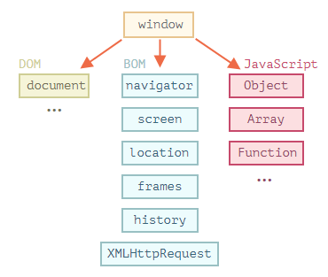
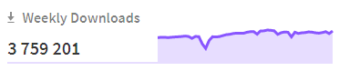

<!-- _class: lead -->

# **Лекция №3: JavaScript в Web-браузере**

Web-программирование / ПГНИУ

---

# JS в Web-браузере



- В браузере есть JS движок: V8 – в Chromimum, SpiderMonkey – в Firefox
- Есть различные API для взаимодействия с браузером
- Подключается элементом `<script>`
- Взаимодействие с **DOM** и **BOM**

---

# DOM: поиск элемента

```javascript
element = document.getElementById('id');
elements = document.getElementsByTagName('p');
elements = document.getElementsByClassName('my-button');
element = document.querySelector('input[type="text"].hidden');
elements = document.querySelectorAll('input[type="text"].hidden');

elements = element.childNodes;
element = element.firstChild;
element = element.lastChild;
element = element.nextSibling;
element = element.previousSibling;
```

---

# DOM: манипулирование узлами

```javascript
const div = document.createElement('div');
const div2 = document.createElement('div');
div.append(div2);
document.body.append(div);

const divClone = div.cloneNode();
div2.remove();
```

---

# DOM: взаимодействие с узлами

```javascript
input = document.getElementsByTagName('input')[0];

// Параметры
input.id = '#FirstInput';
input.type; // text
// Аттрибуты
input.getAttribute('data-val');
input.setAttribute('max', 10);

input.style.backgroundColor = 'green';
```

---

# DOM: события

```javascript
const button = document.querySelector('button');

function clickHandler(event) {
  // event.target
  // this ? 
}
button.onclick = clickHandler;
button.addEventListener('click', clickHandler)
button.addEventListener('click', clickHandler.bind(button));
button.removeEventListener('click', clickHandler);
```

---

# Всплытие и перехват событий

* Сначала событие погружается от самого верхнего элемента (`<HTML>`), на котором произошло событие, до непосредственно цели события (**Event Capturing**)
* Затем событие всплывает обратно (**Event Bubbling**)
* По умолчанию обработчики событий срабатывают по порядку на этапе всплытия, но можно настроить обработку события на перехват на этапе погружения
* И всплытие, и погружение можно остановить в обработчике

---

# BOM: Web Storage API

- Хранилище данных на клиенте с доступом из JavaScript
- Хранилище типа ключ-значение
- Постоянное (localStorage) или сессионное (sessionStorage)
- 2МБ+
- Привязаны к источнику (домен/протокол/порт)
- `localStorage.setItem(key, value);`
- `value = localStorage.getItem(key);`

---

# BOM: IndexedDB

- Транзакционная индексируемая система базы данных
- Состоит из хранилищ объектов
- Хранилище – коллекция объектов с некоторым ключом или пар ключ-значение
- Доступны несколько типов ключей
- Поддерживает запросы в диапазоне ключей и индексы
- Асинхронная
- 10 MB - 2 GB

---

# BOM: alert, confirm, prompt

- `alert` - показывает модальное окно с сообщением
- `confirm` - показывает модальное окно с подтверждением
- `prompt` - показывает модальное окно с полем ввода
- все функции блокируют основной поток

---

# setInterval, setTimeout

- `setInterval(func, interval)` - запускает функцию с повторением с заданным интервалом
- `setTimeout(func, timeout)` - запускает функцию с заданной задержкой

---

# Функции, полезные при разработке

- `console.log()`, `console.warn()`, `console.error()`, `console.table()`
- `debugger` 

---

# 

* Библиотека JavaScript для простого взаимодействия с DOM, ajax API и других типовых задач
* Выпущена в 2006 году
* Самая обширная библиотека плагинов
* Используется на 73% сайтов (из топ 10 миллионов самых популярных на май 2019 )
* «Уже не нужна»
* 

---

# Конструктор jQuery

- `$ === jQuery`
- `$(selector)` - возвращает один или список DOM-based элементов страницы (узлы с jQuery обёрткой)
- `selector` - как в css, но ещё больше возможностей 
- `$(domElement)` - элемент с jQuery обёрткой
- `$(htmlCode)` - создаёт новый элемент

---

# jQuery: получение элемента

```javascript
$elements = $("div")
$elements = $("input:file")
$elements = $("li:even")
$elements = $("div:visible")
$elements = $("div.myClass:not(.class)")
$elements = $("<div class='myclass'></div>")
$element = $(document.getElementById('id'))
```

---

# jQuery: поиск связных элементов

```javascript
// Перемещение
$element.children('selector');
$element.closest('selector');
$element.next('selector');
$elements.find('selector');
// Фильтрация
$elements.first();
$element.has('selector');
$element.not('selector');
// Обход
$elements.each((idx, domElement) => {});
$elements.map((idx, domElement) => {});
```

---

# jQuery: манипулирование

```javascript
// Атрибуты
attrValue = $element.attr('attr');
$element.attr('attr', 'new value');
$element.addClass('class'); // remove, toggle
value = $input.val();
// Стили и параметры
$element.css();
$element.height();
$element.position();
// Содержимое
html = $element.html();
$element.html('<new-html>');
$element.text();
$element.append(otherElement);
$element.appendTo(otherElement);
$element.remove();
```

---

# jQuery: события

```javascript
$elements.click();
$elements.click(handler);
$elements.keypress(handler);
$(document).ready(handler);
$image.load(handler)
$elements.on('click', '.class', data, handler);
$elements.once('click', handler);
$element.resize(handler);
$element.scroll(handler);
```

---

# jQuery: анимации

```javascript
$element.hide() // .show() .toggle()
$element.fadeIn() // fadeOut(), fadeToggle()
$element.queue() // .clearQueue()
$element.animate({
  opacity: 'toggle',
  height: 'toggle',
}, {
  duration: 5000,
  specialEasing: {
    opacity: 'liner',
    height: 'swing',
  },
});
```

---

# jQuery: утилиты

```javascript
$.browser
$.ajax()
$.getScript()
$.extend()
$.grep()
$.inArray()
$.isArray()
$.isEmptyObject()
$.isFunction()
$.isPlainObject()
$.trim()
$.type()
$.unique()
```

---

# jQuery dead? 


* Есть современный API браузеров и инструменты разработки
* Есть мощные библиотеки разработки UI виджетов

---

# Ссылки

- https://learn.javascript.ru (часть 2)
- https://developer.mozilla.org/ru/docs/DOM/DOM_Reference/Введение
- https://developer.mozilla.org/en-US/docs/Web/API
- jQuery: https://jquery.com 
- Русская документация с удобной картой функций: http://jquery.page2page.ru

---

<!-- _class: lead -->

# In the next episode

Введение в серверную часть
