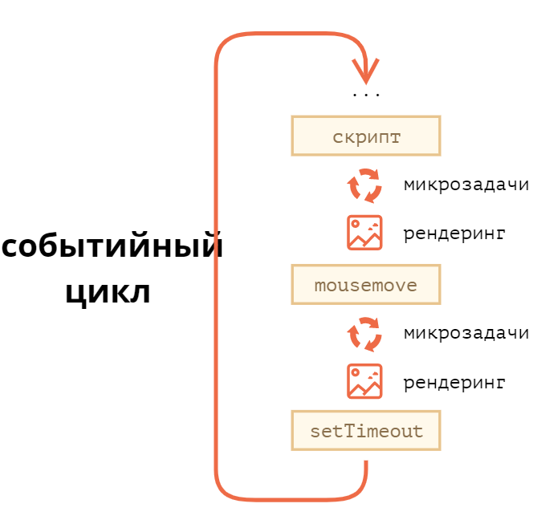

<!-- _class: lead -->

# **Лекция №3:**
# **JavaScript в Web-браузере**

Web-программирование / ПГНИУ

---

# JavaScript в Web-браузере

- В браузере есть JS движок, отвечающий за парсинг и выполнение JS:
  - Chromium: **V8**
  - Mozilla Firefox: **SpiderMonkey**
  - Safari: **JavaScriptCore**
- Браузер предоставляет среду исполнения JS и Web API:
  - **DOM API** для манипулирования документом
  - **BOM API** для взаимодействия с браузером
- Подключается элементом `<script>`
  - Глобальный объект браузера - `window`
  - Глобальный объект HTML документа - `document`

---


---

# DOM API

- Поиск узлов
- Манипулирование узлами
- Взаимодействие с узлами
- Работа с событиями

---

# DOM: поиск элемента

```javascript
const element = document.getElementById('id');
const elements = document.getElementsByTagName('p');
const elements = document.getElementsByClassName('my-button');
const element = document.querySelector('input[type="text"].hidden');
const elements = document.querySelectorAll('input[type="text"].hidden');

const elements = element.childNodes;
const element = element.firstChild;
const element = element.lastChild;
const element = element.nextSibling;
const element = element.previousSibling;
```

---

# DOM: манипулирование узлами

```javascript
const div = document.createElement('div');
const div2 = document.createElement('div');
div.append(div2);
document.body.append(div);

const divClone = div.cloneNode();
div2.remove();
```

---

# DOM: взаимодействие с узлами

```javascript
const input = document.querySelector('input');

// Свойства узла
input.type; // text
input.value = 'New Value';

// Аттрибуты
input.getAttribute('data-val');
input.setAttribute('max', 10);

// Стили
input.style.backgroundColor = 'green';
```

---

# DOM: события

```javascript
const button = document.querySelector('button');

function clickHandler(event) {
  // event.target
  // this ? 
}
button.onclick = clickHandler;
button.addEventListener('click', clickHandler, options)
button.addEventListener('click', clickHandler.bind(button), options);
button.removeEventListener('click', clickHandler);
```

---

# Всплытие и перехват событий

* Сначала событие погружается от самого верхнего элемента (`<HTML>`), на котором произошло событие, до непосредственно цели события (**Event Capturing**)
* Затем событие всплывает обратно (**Event Bubbling**)
* По умолчанию обработчики событий срабатывают по порядку на этапе всплытия, но можно настроить обработку события на перехват на этапе погружения
* И всплытие, и погружение можно остановить в обработчике

---

# BOM

- HTTP запросы (+ Server-sent Events, Web Sockets, WebRTC)
- Устройство: камера, микрофон, ориентация, геолокация, NFC, Bluetooth, Gamepad, вибрация, буфер обмена
- Хранилища данных: Web Storage, IndexedDB
- WebGL, WebGPU
- File API
- Оплата (Google Pay, Apple Pay ect), Share API
- Воркеры
- И многое другое...

---

# BOM: Web Storage API

- Хранилище данных на клиенте с доступом из JavaScript
- Хранилище типа ключ-значение
- Постоянное (localStorage) или сессионное (sessionStorage)
- 2МБ+
- Привязаны к источнику (домен/протокол/порт)
- `localStorage.setItem(key, value);`
- `value = localStorage.getItem(key);`

---

# BOM: IndexedDB

- Транзакционная индексируемая система базы данных
- Состоит из хранилищ объектов
- Хранилище – коллекция объектов с некоторым ключом или пар ключ-значение
- Доступны несколько типов ключей
- Поддерживает запросы в диапазоне ключей и индексы
- Асинхронная
- 10 MB - 2 GB

---

# BOM: alert, confirm, prompt

- `alert` - показывает модальное окно с сообщением
- `confirm` - показывает модальное окно с подтверждением
- `prompt` - показывает модальное окно с полем ввода
- все функции блокируют основной поток
---

# Функции, полезные при разработке

- `console.log()`, `console.warn()`, `console.error()`, `console.table()`
- `debugger`

---

# setInterval, setTimeout

- `setInterval(func, interval)` - запускает функцию с повторением с заданным интервалом
- `setTimeout(func, timeout)` - запускает функцию с заданной задержкой

---

# Цикл событий в браузере

- Цикл событий браузера делится на этапы:
  1. **Макротаска** - синхронный JS код из очереди задач
  2. Очередь **микротасков** - обработчиков завершения `Promise`-ов
  3. **Рендеринг** страницы
- Макротаски - задачи в очереди задач (обработчики асинхронных операций) и обработчики событий
- Микротаску можно создать через `Promise` или `queueMicrotask(func)`
- Выполнить перед рендерингом можно функцией `requestAnimationFame(func)`

---



---

# 

* Библиотека JavaScript для простого взаимодействия с DOM, ajax API и других типовых задач
* Выпущена в 2006 году
* Самая обширная библиотека плагинов
* Используется на 73% сайтов (из топ 10 миллионов самых популярных на май 2019 )
* «Уже не нужна»
* 

---

# jQuery dead? 


* Есть современный API браузеров и инструменты разработки
* Есть мощные библиотеки разработки UI виджетов

---

# Ссылки

- https://learn.javascript.ru (часть 2)
- https://developer.mozilla.org/ru/docs/DOM/DOM_Reference/Введение
- https://developer.mozilla.org/en-US/docs/Web/API
- jQuery: https://jquery.com

---

<!-- _class: lead -->

# In the next episode

Введение в серверную часть
