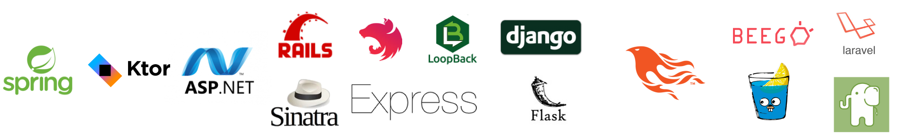
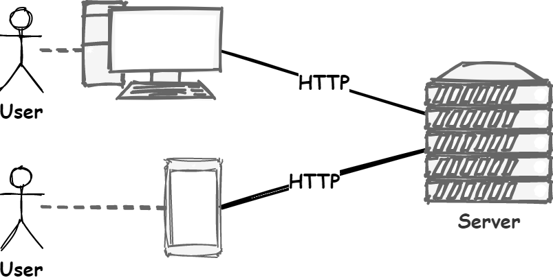
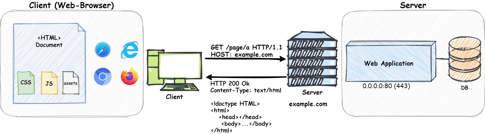
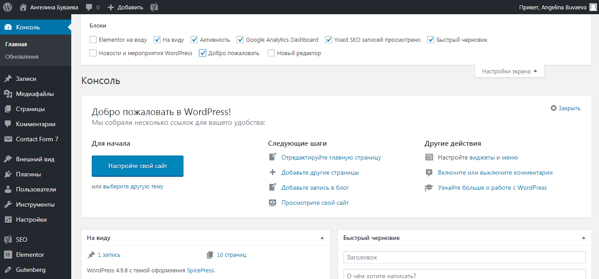
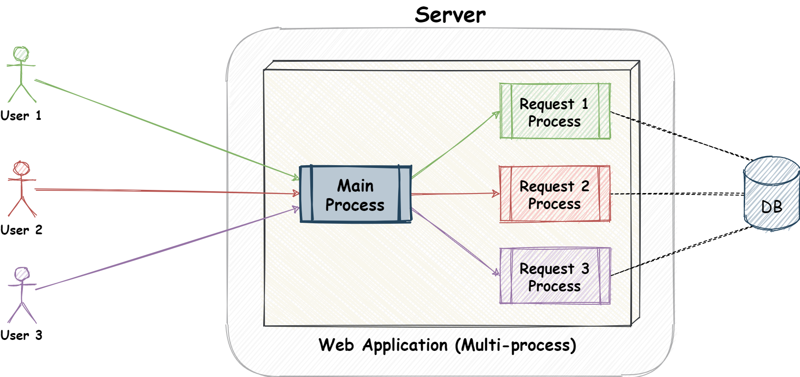
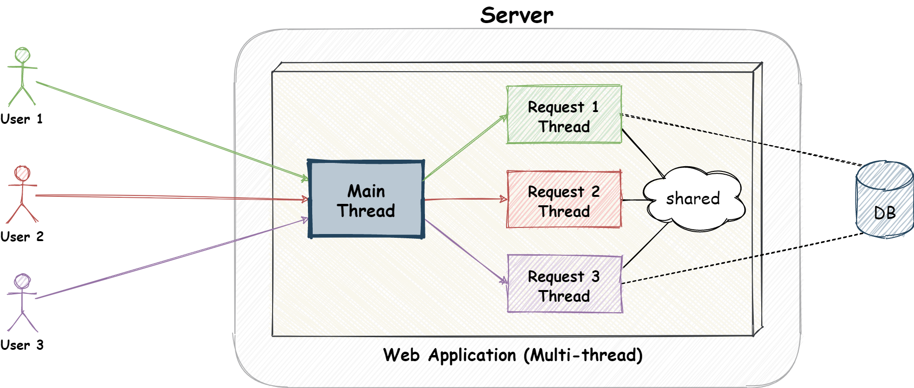
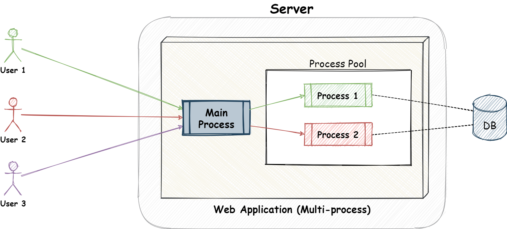
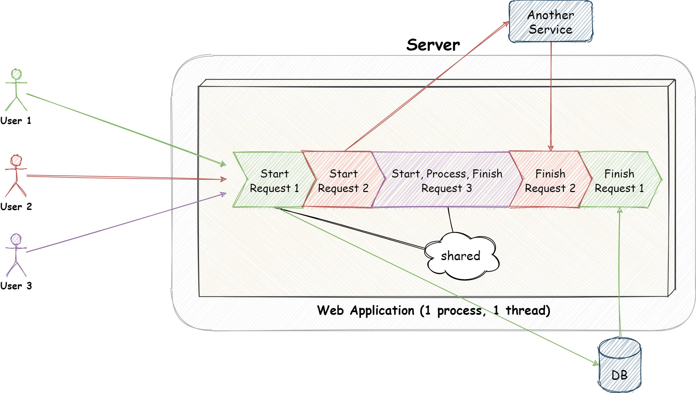

<!-- _class: lead -->


# **Лекция №4: Основы серверной части**

Web-программирование / ПГНИУ



---

<!-- _class: lead -->

# Общая архитектура

---



---



---

# Общая архитектура 

На сервере запущено приложение, которое...

* Слушает порт и принимает соединение по TCP
* Принимает HTTP запрос
* Обрабатывает запрос
* Формирует ответ
* Возвращает HTTP ответ
* Закрывает соединение

---

# Разработка серверной части

* Разработка HTTP сервера с TCP сервером\
  (соединение, парсинг запроса, формирование ответа)
* Разработка приложения обработки запросов\
  (собственно приложение)
* Многопользовательский режим + масштабирование

---

# Как создать веб-приложение?

1) С нуля на основе TCP сервера
2) С нуля на основе HTTP сервера
3) С микрофреймворком для веб-приложений (библиотека)
4) С фреймворком для веб-приложений
5) С использованием CMS или конструктора сайта

---

# С нуля

* HTTP сервер – это TCP сервер, работающий с HTTP
* HTTP – просто текст _(нет)_ в определённом формате
* Слушаем порт, принимает TCP соединения, парсим HTTP запрос, формируем ответ, отвечаем и закрываем соединение
* Сложно, трудоёмко (особенно, если требуется HTTP/2, HTTP/3)

---

```python
import socket

# TCP сервер
def start_server(host, port, handler):
    """Реализует простейший TCP Сервер"""

    # Создаём Socket-сервер
    server_socket = socket.socket(socket.AF_INET, socket.SOCK_STREAM)
    server_socket.setsockopt(socket.SOL_SOCKET, socket.SO_REUSEADDR, 1)
    server_socket.bind((host, port))
    server_socket.listen(1)
    print(f'Listening on port {port} ...')

    # Бесконечный цикл обработки запросов
    while True:
        # Ждём соединения
        client_connection, client_address = server_socket.accept()
        # Получаем содержимое запроса
        request = client_connection.recv(1024).decode()
        # Обрабатываем запрос обработчиком
        response = handler(request)
        # Возвращаем ответ
        client_connection.sendall(response.encode())
        # Закрываем соединение
        client_connection.close()

    # Закрываем сервер
    server_socket.close()
```

---

```python
def handle_http_request(request):
    """Обрабатывает HTTP запрос"""

    # Делим содержимое запроса на основные части
    request_lines = request.split('\n')
    starting_line = request_lines[0]
    # Получаем PATH из стартовой строки
    path = starting_line.split()[1]
    if path == '/':
        path = '/index.html'
    try:
        # Возвращаем содержимое файла
        starting_line = 'HTTP/1.1 200 OK'
        # Считаем, что все файлы - HTML
        headers = ['Content-Type: text/html; charset=utf-8']
        # Читаем содержимое файла
        with open(f'files{path}', 'r') as html_file:
            content = html_file.read()
        # Возвращаем ответ
        response = starting_line + '\n' + \
                   '\n'.join(headers) + '\n' + \
                   '\n' + \
                   content
    except FileNotFoundError:
        # 404 - Not Found
        starting_line = 'HTTP/1.1 404 Not Found'
        headers = ['Content-Type: text/html; charset=utf-8']
        content = 'File not found :('
        response = starting_line + '\n' + \
                   '\n'.join(headers) + '\n' + \
                   '\n' + \
                   content
    return response
```

---

# На основе HTTP сервера

* Во многих ЯП есть стандартный модуль для создания HTTP сервера
* Реализовано самое основное:
  * Создание и запуск сервера
  * Парсинг HTTP запросов и формирование HTTP ответов
  * Установка обработки запроса
  * Работа с файлами

---

```python
from http.server import HTTPServer, BaseHTTPRequestHandler


class SimpleHTTPRequestHandler(BaseHTTPRequestHandler):

    def do_GET(self):
        path = self.path
        if path == '/':
            path = '/index.html'

        try:
            with open('files' + path, 'rb') as html_file:
                content = html_file.read()
            self.send_response(200)
            self.send_header('Content-Type', 'text/html; charset=utf-8')
            self.end_headers()
            self.wfile.write(content)
        except FileNotFoundError:
            # 404 - Not Found
            self.send_error(404, 'Page Not Found =(')


server = HTTPServer(('0.0.0.0', 8080), SimpleHTTPRequestHandler)
server.serve_forever()
```

---

# Микрофреймворк

* Библиотека для разработки серверной части
* Включает модули для решения основных задач
  * Парсинг запросов и формирование ответов
  * Маршрутизация (Роутинг, Rounting) 
  * Шаблонизаторы
  * Обработка ошибок
  * И т.д.
* Экосистема из библиотек для решения других задач

---

```python
from flask import Flask, send_from_directory
app = Flask(__name__)


@app.route('/')
@app.route('/<path>')
def html_files(path=''):
    if path == '':
      return send_from_directory('files', 'index.html')
    return send_from_directory('files', path)


app.run(host='0.0.0.0', port='8080', debug=True)
```

---

# Фреймворк

* Программная платформа для разработки серверной части
* Включает модули для решения широкого спектра основных задач
* Объединяет модули в единую систему
* Предоставляет готовую архитектуру организации этой системы
* Разные (микро)фреймворки - абстракции разной толщины 
* Особое – **Full-stack фреймворки**, затрагивающие клиентскую часть

---

| Язык          | Микрофреймворк        | Фреймворк                            |
|---------------|-----------------------|--------------------------------------|
| C++           | ?                     | ? Wt, Poco                           |
| C#            | ?                     | ASP.NET Core, ASP.NET MVC            |
| Java (Kotlin) | Play                  | Spring, Ktor                         |
| Python        | Flask                 | Django                               |
| Ruby          | Sinatra               | Ruby on Rails                        |
| JS (Node.js)  | Express, Koa, Fastify | Nest, Loopback, Adonis               | 
| Go            | Gin, Revel, Echo      | Beego, Gorilla                       | 
| Elixir        | ?                     | Phoenix                              |
| PHP           | PHP itself, slim      | Laravel, Symphony, Yii2, CodeIgniter |

---

# CMS и конструкторы сайтов

* CMS – Content Management System, система управления контентом
* Многие сайты однотипны: контент и CRUD
  * Категории, пользователи с разными правами
  * Блоги, сайты визитки, интернет-магазины, соц. сети
* CMS и конструкторы позволяют делать такие сайты быстро, занимаясь структурой и вёрсткой
* Готов редактор, в котором не надо программировать
* Есть плагины (или можно разработать плагин)
* WordPress, Joomla, OpenCart, Wix, Tilda и др.

---




---

# Маршрутизатор

- **Router** – роутер / маршрутизатор
- Модуль, который определяет:
  - маршруты (узлы URL, endpoints)
  - их параметры 
  - и соответствующий обработчик маршрута

---

# Шаблонизатор

* Шаблон - текст со специальным синтаксисом (часто HTML подобным)
* Шаблонизатор - модуль рендерига HTML по шаблону и данным
* Шаблон + данные = HTML страница
* Простейший – `Find and Replace` в HTML файле
* Продвинутые:
  * условия, циклы
  * наследование (расширение) шаблонов
  * компоненты, макросы и т.д.
* Альтернатива - **DSL**

---


---

# Другие задачи на серверной части

* Валидация запросов
* Обработка ошибок
* Конфигурирование
* Идентификация, аутентификация, авторизация
* Работа с БД (ORM, DataAccess, Serialization)
* Работа с файлами
* Кэширование
* Логирование, мониторинг
* Масштабирование

---

<!-- _class: lead -->

# **Веб-приложение всегда _многопользовательское_**

---

# Обработка параллельных запросов

* Последовательная обработка - (ಥ _ ಥ)
* Процесс на запрос
* Поток на запрос
* Пулл потоков/процессов
* Асинхронная обработка
* Корутины (coroutines)

---



---

# Процесс на запрос

- Сильные стороны:
    - Изолированные процессы, ограничения прав
    - Нет общего состояния между процессами
    - Лёгкое обновление
    - Эффективное использование параллельности на CPU
- Слабые стороны:
    - Много ресурсов на управление процессами
    - Нет смысла делать больше много процессов
    - Нет общего состояния между процессами

---



---

# Поток на запрос

В целом, как с процессами, но:
- Появляется общая память (и хорошо, и плохо)
- Немного эффективнее создания процессов
- Нет такого простого обновления

---



---

# Пулл процессов/потоков

- Имеем фиксированный пулл процессов или потоков
- Новые сильные стороны:
  - Эффективное использование ядер/процессоров
  - Нет издержек на управлении процессами/потоками

---



---

# Асинхронность

- Сильные стороны:
  - Очень эффективно, если нагрузка на I/O операции
  - Самая простая общая память
- Слабые стороны:
    - Очень неэффективно, если нагрузка на основной поток
    - Не использует параллельность на CPUs
    - Полное отсутствие изоляции

---


---

# Кластер асинхронных процессов

- Запросы обрабатывает не одно, а множество асинхронных приложений.
- Теряется общая память, но
  - просто масштабировать и обновлять приложение 
  - максимально эффективно используются ядра/процессоры CPU
- Аналогично - корутины


---

# HTML Формы

* HTML позволяет делать формы с помощью элемента `<form>`
* При сабмите формы запрашивается страница-обработчик формы, указанная в `action="URL"`
* Запрос страницы содержит данные формы
* Запрос отправляется одним из двух HTTP методов:
    - `method="GET"`, данные отправляются в URL в `query`
    - `method="POST"`, данные отправляются в теле запроса
* `<form action="/login" method="POST">`

---

# На самостоятельное изучение

- Найти и выбрать фреймворк (или микрофреймворк) для своего любимого языка программирования
- Либо пройти краткий курс по Python, например, на Stepik
    - https://stepik.org/course/238 (English, JetBrains)
    - https://stepik.org/course/67 (Русский, Bioinformatics Institute)
- Посмотреть оглавление документации по Flask или другому фреймворку

---

# Ссылки

- MDN - Отправка и получение данных форм: https://developer.mozilla.org/ru/docs/Learn/HTML/Forms/Отправка_и_Получение_данных_формы
- Документация по Flask (Python): https://flask.palletsprojects.com
- Примеры из презентации:
    - TCP: https://replit.com/@ShGKme/Web-Server-basics-1
    - HTTP: https://replit.com/@ShGKme/Web-Server-basics-2
    - HTTP-2: https://replit.com/@ShGKme/Web-Server-basics-3
    - Flask: https://replit.com/@ShGKme/Web-Server-basics-4
    - Flask-2: https://replit.com/@ShGKme/Web-Server-basics-5

---

<!-- _class: lead -->

# In the next episode

Идентификация, аутентификация, авторизация, сессия, безопасность
