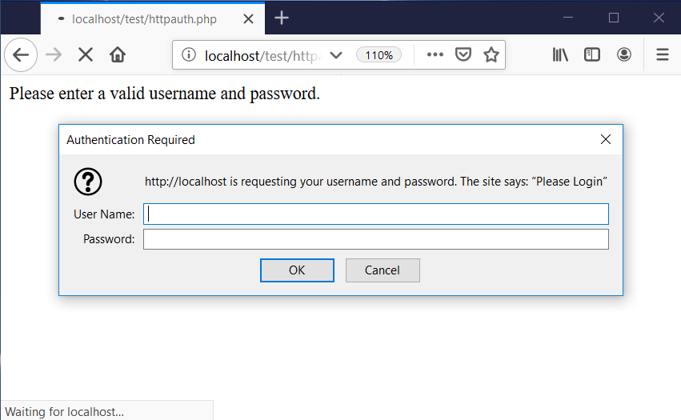
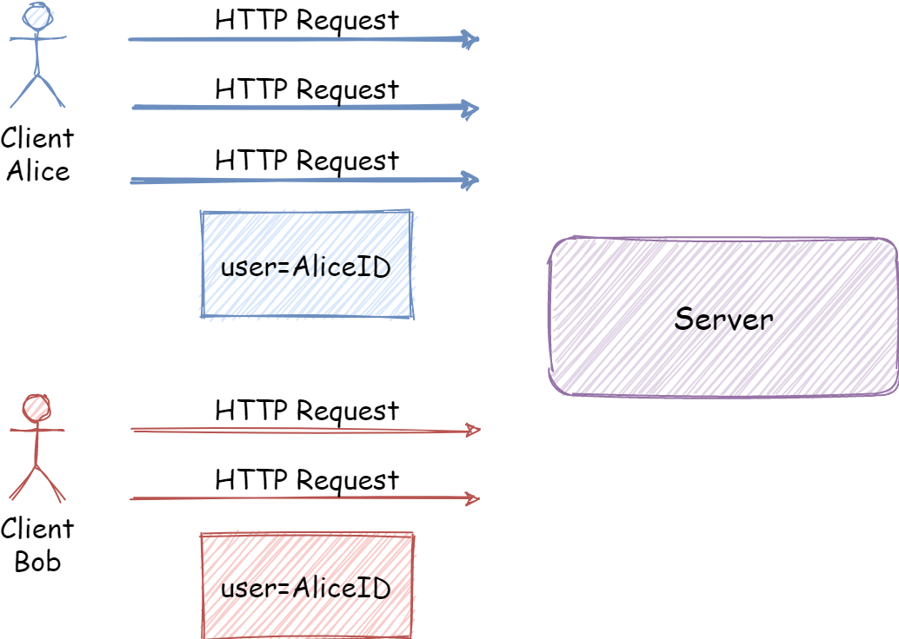
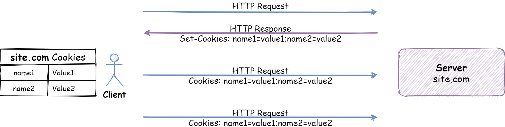
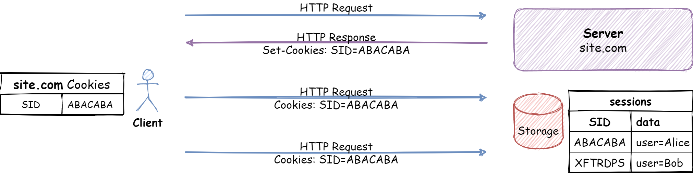
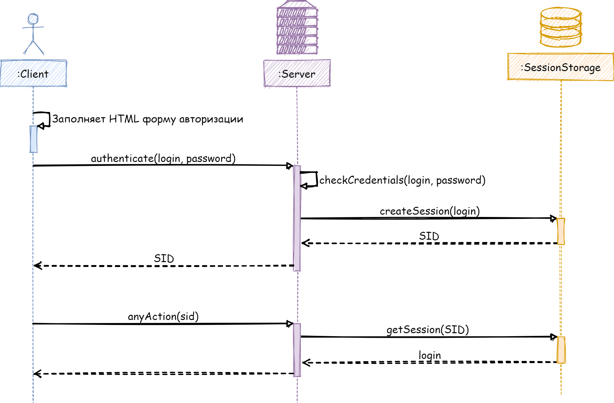

<!-- _class: lead -->

# **🍪 Лекция №5: Аутентификация и безопасность 🔒**

Web-программирование / ПГНИУ

---

# Основные понятия 

* **Идентификация:**
  * процедура распознавания пользователя
* **Аутентификация:**
  * процедура проверки подлинности пользователя
* **Авторизация:**
  * предоставление прав на выполнение операции или процедура проверки прав пользователя на выполнение операции

<!--
Мы будем в первую очередь рассматривать именно идентификацию и аутентификацию.

Авторизация, работа с ролями, правами, политиками - не связана с web-разработкой. 
-->

---

# Основные способы аутентификации

- **По паролю**
- По сертификату
- По ключам доступа, токенам
- Web Authentication (WebAuthN)  

---

# Аутентификация по паролю

* Где передать пароль?
    * ❌ URL (query параметры)
    * ✔ Тело запроса
    * ✔ Заголовок запроса
* Традиционные подходы:
    * HTTP Authentication
    * Своё решение на HTML Forms

---

# HTTP Authentication

1) При запросе к защищённому ресурсу сервер отправляет `401 Unauthorized` с заголовком `WWW-Authenticate`
2) Браузер предоставляет пользователю форму ввода логина/пароля
3) В последующих запросах браузер будет прикреплять данные авторизации к запросу:
    - Basic: `Authorization: Basic <base64 of login+pass>`
    - Digest: `Authorization: Digest ... hash with secret ...`

---

<!-- TODO: нарисовать схему -->

https://developer.mozilla.org/en-US/docs/Web/HTTP/Authentication/http-auth-sequence-diagram.png

---

---

# HTML Forms

1) На клиенте форма ввода логина/пароля
2) Форма отправляет на сервер логин/пароль
3) На сервере проверяем данные
4) _Как-то помним об этом в дальнейшей работе..._
5) **Как?**

---

# Как запомнить аутентификацию?

* Не хотим спрашивать логин/пароль при каждом действии
* Нужно _что-то_, что позволяет не проводить аутентификацию повторно
* Это _что-то_ нужно как-то **запомнить на клиенте**
* И отправлять это _что-то_ с **каждым запросом**

---

# Сессия

* **Сессия – повторяющееся мероприятие**
* **Сессия (сеанс) - ограниченный во времени период деятельности**
* _Сеанс использования приложения пользователем приложения_
* HTTP не имеет сессий в самом протоколе, каждый запрос независим
* Совокупность связных запросов, ограниченных периодом времени
* Технически, сессия - данные, связывающие запросы
    * например, данные о пользователе этой сессии
* _Требуется как-то **достоверно** хранить эти данные_

---

---

# Как передавать _сессию_?

* Хотим объединить множество запросов в одну **"сессию"**
* Нужно _что-то_ для получения информации о сессии в запросе
* Это _что-то_ нужно как-то **запомнить на клиенте**
* И отправлять это _что-то_ с **каждым запросом**
* **Каждым**:
  * HTML Формы (можно передавать с данными формы)
  * Переходы по ссылкам
  * Загрузка ресурсов (картинки и тп.)

---

# 🍪 🍪 🍪 Cookies 🍪 🍪 🍪

* **Небольшой фрагмент данных, отправленный веб-сервером и хранимый на компьютере пользователя (ключ=значение)**
* _Общие данные клиента и сервера, хранящиеся на клиенте_
* Устанавливаются на клиенте с **HTTP заголовком ответа**
  * `Set-Cookie: <name>=<value>[;<параметры>]`
* Отправляются на сервер с **HTTP заголовком запроса**
  * `Cookie: <name>=<value>{;<name>=<value>}`
* Могут быть доступны из JavaScript
  * `document.cookie; // <name>=<value>{;<name>=<value>}`

---

---

# Основные параметры Cookie

- `Expires`, `Max-Age` – время жизни
- `httpOnly` – недоступность из JavaScript
- `Secure` - только HTTPS
- Область видимости: `Domain`, `Path`, `SameSite`

---

# Область видимости Cookie

- `Cookie` устанавливается с `Domain` сервера, который её устанавливает
- Дополнительно можно указать `Path`
- При запросе на одном домене отправляются **Cookie**, попадающие в область видимости
- При запросе с другого домена зависит от `SameSite`
    - `none` - всегда отправляются
    - `Lax` - отправляются только при "навигации высокого уровня, которая использует "безопасные" HTTP методы": GET, HEAD, OPTIONS и TRACE в переходах и формах
    - `Strict` - не отправляются

---

# Как будет представлена сессия?

* Может хранить в **Cookie** просто `user=Alice`?
  * ❌ Нет. Даёт идентификацию, но не аутентификацию
* Может хранить в **Cookie** `user=Alice` и `password=qwerty`?
  * ❌ Нет. Большой риск утечки пароля + его подбор
* Может хранить в **Cookie** `user=Alice` и `password=hash(qwerty)`?
  * ❌ Нет. Всё ещё риск утечки пароля + его подбор
* Нужно подтверждение подлинности и без чувствительных данных

---

# Client-side Session

* Все данные сессии хранится на клиенте в Cookie
* Для подлинности подписываем или шифруем данные
* `session = 'user: Alice' + hash('user: Alice' + SecretSalt)`
* `session = encrypt('user: Alice', SecretKey)`
* Сильные и слабые стороны?
  * ✔ Простая реализация, нет хранения на сервере
  * ❌ Есть ограничения на объём данных
  * ❌ Нельзя инвалидировать
  * ❌ Возможно, хотим приватные данные сессии

---

# Server-side session

* Все данные сессий хранятся в хранилище на сервере:\
  БД, файл, память приложения
* На клиенте в Cookie хранится только идентификатор этой сессии
* Сильные и слабые стороны?
  * ✔ Храним любой объём данных
  * ✔ Данные недоступны клиенту
  * ✔ Можно инвалидировать
  * ❌ Требуется хранилище на сервере (stateful сервер)

---

---

# Form Authentication

1) Пользователь отправляет форму аутентификации
2) На сервер приходят учётные данные
   1) Данные проверяются
   2) Создаётся сессия (если не было гостевой)
   3) Пользователь сохраняется в сессии
   4) Возвращается сессия
3) С каждым запросом приходят Cookie с сессией с данными пользователя (`UserID`)

---

---

# Основные угрозы безопасности

* Угрозы серверной части: исполнение данных от пользователя, SQL-инъекции, доступ к файлам и т.д.
  * Нельзя доверять данным от пользователя
* Cross-Site Scripting, **XSS** - внедрение кода на клиент
 * Прямой вывод данных, полученных от пользователя (включая cookie, url и т.д.)
 * Ненадёжные источники
 * Браузерные расширения
* Межсайтовая подделка запроса (Cross-Site Request Forgery, **CSRF**)

---

# CSRF

1. На сайте злоумышленника создаётся запрос (например, форма) на сайт, где жертва прошла аутентификацию
2. При отправке запроса отправляются Cookie с данными аутентификации жертвы
3. Выполняется действие от имени жертвы

---

# Защита от CSRF

* Современны вариант - `Cookie` с `SameSite`
* Старый вариант (+ кросс-доменный) - `CSRF-token`:
  1) Создаём секретный токен (**CSRF-token**)
  2) Сохраняем CSRF-token в сессии
  3) Добавляем CSRF-token в форму (подтверждает подлинность)
  4) Вместе с запросами (формой) отправляется CSRF-token
  5) На сервере сравниваем CSRF-token в данных формы и в сессии

---

# Авторизация

- При большом количестве разных видов операций, субъектов, объектов, правил может быть очень нетривиальной задачей определить, есть ли у пользователя права на выполнение операции. Существует несколько подходов, таких как:
- **ACL** (Access Control List) - список "кто, что, с чем" может делать
- **RBAC** (Role Based Access Control) - управление доступом на основе ролей
- **ABAC** (Attribute-Based Access Control) - разграничение доступа на основе атрибутов

---

# Ссылки

- https://developer.mozilla.org/ru/docs/Web/HTTP/Куки
- https://developer.mozilla.org/ru/docs/Web/HTTP/Авторизация
- https://developer.mozilla.org/ru/docs/Learn/Server-side/First_steps/Веб_Безопасность
- Подходы к контролю доступа: RBAC vs. ABAC: [Habr](https://habr.com/ru/company/custis/blog/248649/)
- Никто (почти) не знает, что такое авторизация: [Habr](https://habr.com/ru/company/avanpost/blog/480576/)

---

<!-- _class: lead -->

# In the next episode

AJAX, API

К теме аутентификации и безопасности мы вернёмся во второй половине курса
