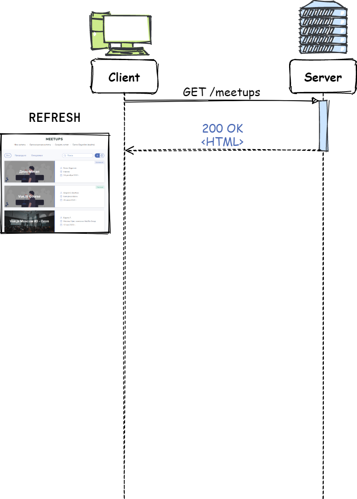
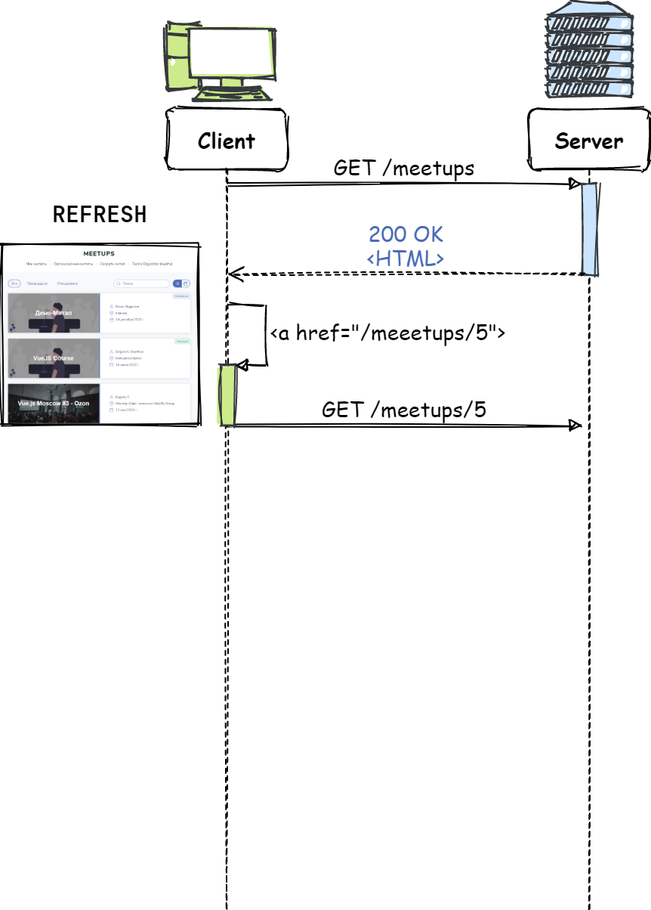
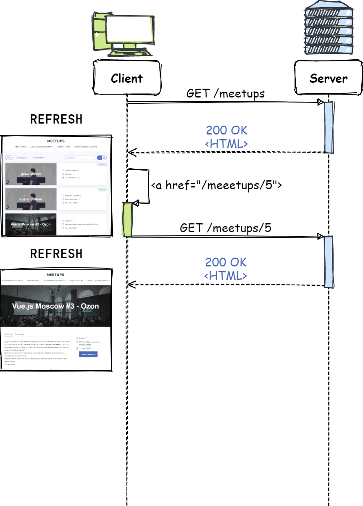
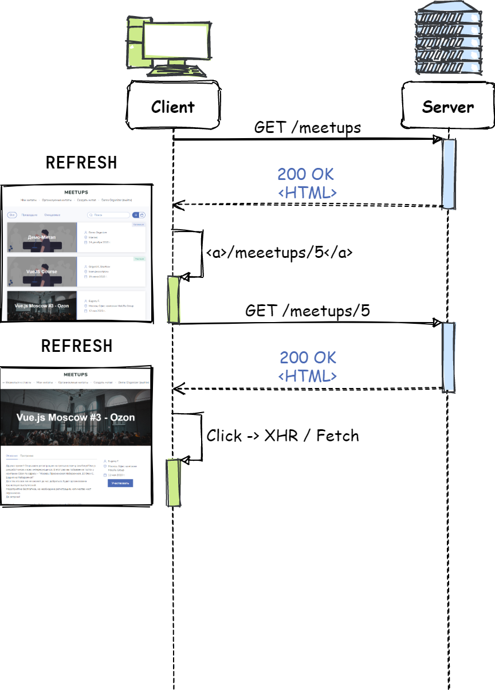
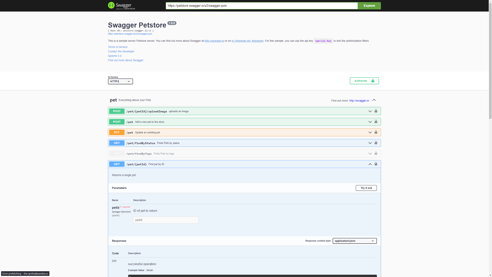

<!-- _class: lead -->

# **Лекция №6: AJAX**

Web-программирование / ПГНИУ

---


---


---



---



---



---


---


---

# Традиционный подход

* Каждое действие с операцией на сервере = получение HTML документа:
  * Переход на новую страницу
  * Отправка HTML формы
* Получение HTML документа - это:
  * Заново генерируем страницу (включая получение данных)
  * Заново получаем и загружаем страницу
  * Заново инициализируем JS приложение
* **Не отзывчивый UI**

---


---

# AJAX

* **Asynchronous Javascript and XML**
* > Подход к построению интерактивных пользовательских интерфейсов веб-приложений, заключающийся в «фоновом» обмене данными браузера с сервером
* Необязательно XML 😀
* Официально термин появился в 2005 году
* Фактически технологии позволяли реализовывать в 1998

---

# Суть подхода

* Традиционно загружается HTML документ
* Со страницы **через JS** отправляется запрос на сервер
* В результате запроса **через JS обновляется страница**
* В итоге:
  * была выполнена операция на сервере
  * страница обновилась без перезагрузки

---



---


---

# Результат запроса

* Ответом может быть:
  * Факт успешности/не успешности выполнения операции
  * Новый фрагмент данный для отображения
* Формат ответа могут быть:
  * Сериализованные данные: **JSON**, XML и т.д.
  * Бинарные данные
  * Фрагменты HTML страницы
* В любом случае требуется обновить страницу

---

# Какой формат лучше?

* Фрагменты HTML
  * ✅ Нет двойной работы, генерируется как основная страница 
  * ❌ Применимо только для Web-приложений
* Сериализованные или бинарные данные:
  * ✅ Универсальный HTTP API
  * ❌ Двойная работа, требуется рендерить результат на JavaScript

---

<!-- _class: lead -->

# **Отправка запроса из JavaScript**

---

# XHR

- **XMLHttpRequest**
- API браузера, который предоставляет клиенту функциональность для обмена данными между клиентом и сервером
- Необязательно XML 😀
- Появился в 2000 г. (Microsoft)
- Также поддерживает `file` и `ftp` протоколы

---

```javascript
// Создаём объект запроса
const httpRequest = new XMLHttpRequest();

// Устанавливаем обработчик успешного завершения загрузки 
httpRequest.onload = function handleLoad() {
  console.log(this.status, this.statusText);
  console.log(this.responseText);
  console.log(this.response);
}
// Другие события:
// abort, error, loadend, loadstart, progress, timeout, readystatechange 

// Готовим запрос: Method,URL,                                         isAsync
httpRequest.open('post', 'https://jsonplaceholder.typicode.com/todos/', true);

// Устанавливаем заголовки
httpRequest.setRequestHeader('Content-Type', 'application/json');

// Отправляем запрос с данными
const data = JSON.stringify({ title: 'new todo' });
httpRequest.send(data);
```

---

# Fetch API

- Интерфейс для получения ресурсов
- Promise-based
- Не такой гибкий, как XHR
- Простой и удобный

---

```javascript
// Simple Promise
fetch('https://jsonplaceholder.typicode.com/todos/1')
  .then((response) => response.json())
  .then(data => console.log(data));

// With Async / Await
const response = await fetch('https://jsonplaceholder.typicode.com/todos/1');
const data = await response.json();

// More Params
await fetch(url, {
    method: 'POST',
    credentials: 'same-origin',
    headers: {
        'Content-Type': 'application/json',
    },
    body: JSON.stringify(data),
    // mode, cache, redirect, referrer...
});
```

---

<!-- _class: lead -->

# **HTTP API**

---

# HTTP API

* Теперь HTTP сервер не только отдаёт HTML документы и обрабатывает HTML формы
* Универсальный API выполнения операций и манипулирования данными
* Не только GET/POST методы
* Не только для HTML

---

# Схема HTTP API

* Требуется определить схему API
* Универсальной - не существует 🥲
* Куда слать запросы (формат URL, endpoints)?
* Какие HTTP методы использовать?
* В каком формате отправлять и получать данные?
  * Сериализация
  * Структура
* Как возвращать ошибки?
* Как использовать заголовки?

---

# RESTFull API

* **Representational State Transfer**
* Архитектурный **_стиль_** взаимодействия компонентов распределённого приложения в сети
* **Управление ресурсами** в оптимальной и простой архитектуре
* Альтернатива RPC (Remote Procedure Calling)
* **Стиль, а не стандарт**

---

# Требования к REST API

1. **Client-Server** - Разделение на клиент и сервер
2. **Stateless** - Отсутствие состояния
3. **Cache** - Кэширование
4. **Uniform Interface** - Единообразие интерфейса
5. **Layered System** - Слои

---

# REST: Uniform Interface

* **Resources and Resource Identifiers** - Идентификация ресурсов (например, с URI)
* **Representations** - Манипуляция ресурсами через представление
* **Self-descriptive messages** - Самоописываемые сообщения, сообщения содержат описания о том, как работать с ресурсом
* **HATEOAS** - Hypermedia as the Engine of Application State, всё есть гипермедиа

---

# REST + HTTP = ❤️

* Клиент-серверный протокол
* Отсутствует состояние
* Кэширование из коробки
* Запрос к ресурсу по URI
* Методы определяют тип манипуляции ресурсом
* Заголовки описывают запрос/ответ
* Не хватает только HATEOAS

---

# Популярное понимание REST

- Используем `HTTP`
- `URI` и `path` - идентификации ресурса
- `query` - запрос к ресурсам
- Заголовки для описания сообщений
- Методы определяют действие
- `HTTP Status` - результат 
  
---

# URI и REST

- `/ENTITY` - сущность (ресурс)
- `/COLLECTION` - коллекция ресурсов
- `/COLLECTION/ID` - элемент коллекции
- `/COLLECTION/ID/COLLECTION` - вложенные ресурсы
- `?query` - запрос на подмножество ресурсов

---

```http
GET /users
GET /users/1
GET /users/1/posts
GET /posts?user_id=1
GET /users/1/posts/1
GET /posts/1
GET /users/1/posts/1/comments
GET /comments?post_id=1&page=1
```

---

# HTTP Методы в REST

- `GET` - получение ресурса
- `POST` - создание ресурса
- `PUT` - замена ресурса
- `PATCH` - изменение ресурса
- `DELETE` - удаление ресурса
- `???` - выполнение операции? (post)

---

```http
GET    /users/1/posts
GET    /users/1/posts/1
POST   /users/1/posts
PUT    /users/1/posts/1
PATCH  /users/1/posts/1
DELETE /users/1/posts/1
```

---

# JSON-RPC

* Не зависит от транспортного протокола
* Спецификация RPC с методом и аргументами в формате JSON
* ```json
  // Запрос
  {"jsonrpc": "2.0", "method": "subtract", "params": [42, 23], "id": 1}
  // Ответ:
  {"jsonrpc": "2.0", "result": 19, "id": 1}
  ```
* ```json
  // Batch запрос 
  [{"jsonrpc": "2.0", "method": "sum", "params": [42, 23], "id": 1},
   {"jsonrpc": "2.0", "method": "subtract", "params": [42, 23], "id": 2}]
  // Ответ
  [{"jsonrpc": "2.0", "result": 65, "id": 1},
   {"jsonrpc": "2.0", "result": 19, "id": 2}]
  ```

---

# JSON:API

Спецификация построения API в соответствии с REST

---

```json
{
  "links": {
    "self": "http://example.com/articles",
    "next": "http://example.com/articles?page[offset]=2",
    "last": "http://example.com/articles?page[offset]=10"
  },
  "data": [{
    "type": "articles",
    "id": "1",
    "attributes": {
      "title": "JSON:API paints my bikeshed!"
    },
    "relationships": {
      "author": {
        "links": {
          "self": "http://example.com/articles/1/relationships/author",
          "related": "http://example.com/articles/1/author"
        },
        "data": { "type": "people", "id": "9" }
      },
      "comments": {
        "links": {
          "self": "http://example.com/articles/1/relationships/comments",
          "related": "http://example.com/articles/1/comments"
        },
        "data": [
          { "type": "comments", "id": "5" }
        ]
      }
    },
    "links": {
      "self": "http://example.com/articles/1"
    }
  }],
  "included": [{
    "type": "people",
    "id": "9",
    "attributes": {
      "firstName": "Dan",
      "lastName": "Gebhardt",
      "twitter": "dgeb"
    },
    "links": {
      "self": "http://example.com/people/9"
    }
  }, {
    "type": "comments",
    "id": "5",
    "attributes": {
      "body": "First!"
    },
    "relationships": {
      "author": {
        "data": { "type": "people", "id": "2" }
      }
    },
    "links": {
      "self": "http://example.com/comments/5"
    }
  }]
}
```

---

# GraphQL

* **Query Language for API** - Язык запросов к API
* Позволяет описывать типы данных и связь между ними (граф)
* Позволяет делать запросы к этому графу
* Разработан Facebook в 2012
* Не зависит от транспортного протокола

---

```graphql
{
    posts {
        id
        title
        text
        author {
            name
            avatar
        }
        comments {
            author {
                name
                avatar
            }   
            likes {
                totalCount
            }         
        }
    }
}
```

---

# Документирование HTTP API

- **OpenAPI Specification** - спецификация описания HTTP API
- **Swagger** - набор инструментов для работы с OpenAPI
  - **Swagger UI** - генератор страниц документации с ручным тестированием
  - **Swagger Codegen** - генерация клиента, заглушек сервера
  - И многое другое...

---

<!-- _class: lead -->

# https://petstore.swagger.io/

---



---


# Тестирование API

- Инструменты отладки в браузере
- Инструменты отладки запросов в IDE
- Insomnia (Desktop)
- Postman (Desktop)
- Hoppscotch (Web)

---

# Ссылки

- XHR:
    - https://learn.javascript.ru/xmlhttprequest 
    - https://developer.mozilla.org/ru/docs/Web/API/XMLHttpRequest 
- Fetch:
    - https://learn.javascript.ru/fetch 
    - https://developer.mozilla.org/ru/docs/Web/API/Fetch_API/Using_Fetch
    
---

# Ссылки

- REST (original): https://www.ics.uci.edu/~fielding/pubs/dissertation/rest_arch_style.htm
- https://www.jsonrpc.org
- https://jsonapi.org
- https://grpc.io/docs/languages/web/basics/
- https://graphql.org

---

# Ссылки

- Инструменты:
    - https://www.getpostman.com
    - https://insomnia.rest
    - https://hoppscotch.io/
- https://swagger.io

---

# На самостоятельное изучение

CORS - Cross-Origin-Resource-Sharing

- MDN: https://developer.mozilla.org/ru/docs/Web/HTTP/CORS
- How to win a CORS: https://jakearchibald.com/2021/cors/
- CORS Visualized: https://dev.to/lydiahallie/cs-visualized-cors-5b8h

---

<!-- _class: lead -->

# In the next episode

Современный Front-end
