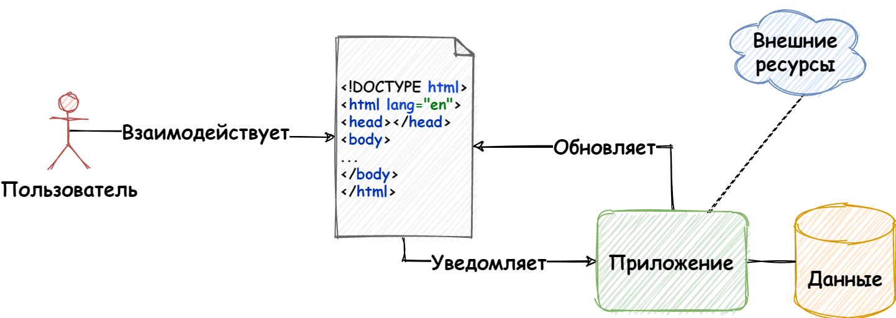

<!-- _class: lead -->

# **Лекция №8: JavaScript-фреймворки**

Web-программирование / ПГНИУ

---

# А зачем нам JavaScript?

* "Простые веб-страницы":
  * Небольшая интерактивность:
    * Анимации
    * Слайдеры, аккордеоны, модальные окна...
* Сложнее: AJAX
* Веб-приложения: **разработка GUI**, отображать данные приложения

---

```javascript
// Псевдокод!

const data = await fetch('/api/data').then((res) => res.json());

const ul = document.createElement('ul');
for (const item of data) {
 const li = document.createElement('li');

 const img = document.createElement('img');
 img.src = data.image;
 li.appendChild(img);

 ul.appendChild(li);
}

document.querySelector('#app').appendChild(ul);
```

---

# Шаблонизаторы, DSL

```javascript
// Псевдокод!

const data = await fetch('/api/data').then((res) => res.json());

const list = (items) =>
 html`<ul>
   ${items.map((item) => 
     html`<li></li>`)
   }
 </ul>`;

render(list(data), document.body);
```

---

# Современные приложения - GUI

* Веб-страница - **клиент** веб-приложения
* Веб-страница - интерактивный **графически пользовательский интерфейс**
* Требуется не только выводить данные, но и реагировать на действия пользователя, нередко приводящие к изменению этих данных
* Нужна архитектура

---



---

# Архитектура - организация системы

- Гибкость (расширяемость)
- Поддерживаемость
- Масштабируемость процесса разработки на множество разработчиков (команд)
- Тестируемость
- Переиспользование

---

# Модули

- Сложно работать с системой как с большим монолитным целым
- Система декомпозируется на структурные единицы
- Декомпозиция иерархическая
- Пакеты, модули, компоненты

---

# MV*

У нас есть:
- Данные
- Графический интерфейс - представление (с которым взаимодействует пользователь!)
- Какая-то "логика", которая может менять представление и данные

Требуется как-то всё это связать. 
С этим помогают паттерны: **MVC, MVP, MVVM**

---

# Компоненты

* Стандартизированный взаимозаменяемый блок UI (componentdriven.org)
* Функционально независимый компонент страницы, который может быть повторно использован (блок в БЕМ)
* Основная структурная единица front-end приложения
* Переиспользуемые UI виджеты
* "Детальки лего, из которых собирается страница"

---


---

# Глупые компоненты (Dummy)

* "Маленькие", независимые, максимально переиспользуемые

* Простые, статичные,	stateless (без состояния):\
  Avatar, Logo, Footer, Layout (row, grid), Icon, Button (simple)
* Сложные, интерактивные, stateful:\
  Button, Input, Data Picker, File Loader…

* Композиция глупых компонентов

---

# Умные компоненты (Smart)

* Управление данными приложения и его компонентами
* Stateful компоненты
  - Конкретные формы, большие части страниц
* Могут вообще не быть напрямую связанными с UI
  - Провайдеры данных, функций, конфигурации
  - "Всё есть компонент"
  
---

# “Сложные” глупые компоненты

* Простые компоненты со сложной реализацией
* “Контейнеры” для компонентов или представления данных
  - Список (с пагинацией, с бесконечным скроллингом)
  - Таблицы (с фильтрами, сортировкой и т.д.)
  - Модальные окна, Уведомления, Drawer
  - “Универсальные формы”, генераторы форм
 
---

# Всё приложение - компонент

- Целая страница - компонент
- Всё целиком приложение - компонент приложения

---

# JavaScript фреймворки

- Современные JS фреймворки — это инструменты разработки динамических веб-страниц
- Минимум - разработка компонентов GUI 
- Максимум - определяют архитектуру всего приложения
- React, Vue, Angular, Ember, Svelte, Blazor...

---

```jsx
/* React */

class Counter extends React.Component {
  state = {
    count: 0
  };

  increment = () => {
    this.setState(prev => ({ count: prev.count + 1 }));
  };

  render() {
    return (
      <button onClick={this.increment}>
        {this.state.count}
      </button>
    );
  }
}
```

---

```html
<!-- Vue -->

<template>
  <button @click="increment">{{ count }}</button>
</template>

<script>
export default {
  data() {
    return {
      count: 0,
    };
  },
    
  methods: {
    increment() {
      this.count += 1;
    },
  },
};
</script>
```

---

# Ссылки: теория

- Contemporary Front-end Architectures: https://blog.webf.zone/contemporary-front-end-architectures-fb5b500b0231
- Component Driven Design: https://www.componentdriven.org
- https://ru.wikipedia.org/wiki/Model-View-Controller
- https://ru.wikipedia.org/wiki/Model-View-Presenter
- https://ru.wikipedia.org/wiki/Model-View-ViewModel

---

# Ссылки: фреймворки

- https://reactjs.org
- https://angular.io
- https://v3.vuejs.org
- https://emberjs.com 

---

<!--

# MVP

- Model-View-Presenter
- Модель - бизнес-логика, слой данных
- Представление - отображение данных и предоставление функций и событий для взаимодействия с пользователем (реализация UI)
- Презентёр - абстракция представления
- Презентёр: взаимодействует с UI, подписывается на события UI, взаимодействует с моделью в обе стороны.

---

# MVC

- Model-View-Controller
- Модель - бизнес-логика, слой данных
- Представление - отображение данных (+БЛ для этого отображения)
- Контроллер - связь пользователя с системой, определяет, какое сейчас используется представление
- Модель сообщает об изменениях представлению (представление запрашивает данные или подписывается на них)
- Представление использует контроллер для изменения состояния (вызывает методы контроллера, или контроллер подписывается на события представления) 

---

# MVVM

- Model-ViewModel-View
- Модель - бизнес-логика, слой данных
- Представление - отображение данных
- ViewModel - связывание представление и модели, абстракция представления + обёртка над моделью
- Изменение ViewModel **автоматически** изменяет представление
- ViewModel получает данные от модели, обновляет данные в модели и может подписываться на их изменение

---
-->