<!-- _class: lead -->

# **Лекция №9: SPA**

Web-программирование / ПГНИУ

---


---


---


---


---


---

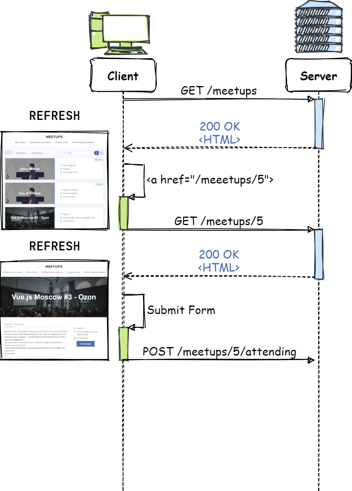

---

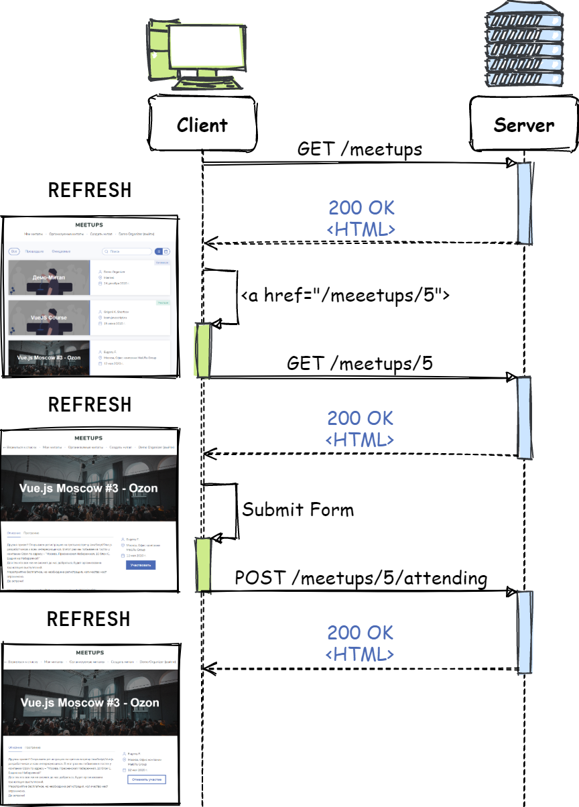

---

# Традиционный подход

* Каждое действие с операцией на сервере = получение HTML документа:
    * Переход на новую страницу
    * Отправка HTML формы
* Получение HTML документа - это:
    * Заново генерируем страницу (включая получение данных)
    * Заново получаем и загружаем страницу
    * Заново инициализируем JS приложение
* **Не отзывчивый UI**

---


---

# AJAX

* **Asynchronous Javascript and XML**
* > Подход к построению интерактивных пользовательских интерфейсов веб-приложений, заключающийся в «фоновом» обмене данными браузера с сервером
* Необязательно XML 😀
* Официально термин появился в 2005 году
* Фактически технологии позволяли реализовывать в 1998

---

# Суть подхода

* Традиционно загружается HTML документ
* Со страницы **через JS** отправляется запрос на сервер
* В результате запроса **через JS обновляется страница**
* В итоге:
    * была выполнена операция на сервере
    * страница обновилась без перезагрузки

---


---

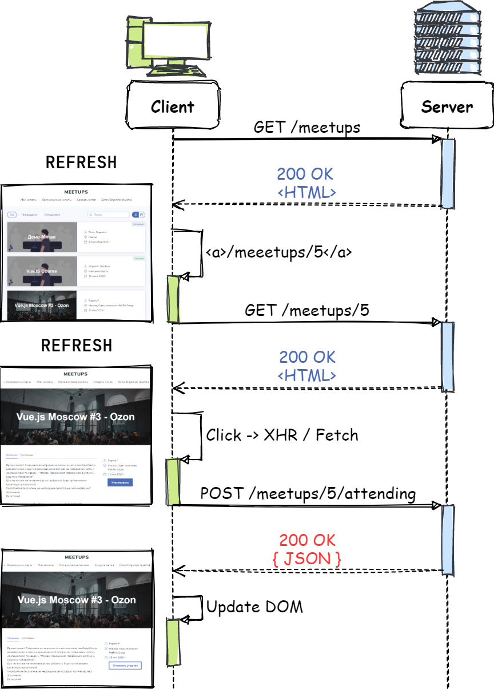

---

# Проблемы традиционного + AJAX

* Клиент – словно не полноценное приложение.
  * Неотъемлемая часть "веб-приложения"
  * Разрабатывается технологиями серверной части
  * Клиентская и серверная части сильно связаны
* Каждый переход – загрузка новой страницы
  * Потеря состояния при переходе (объекты в памяти, соединения, процессы)
  * Трафик, время, нагрузка

---

# Сайт с одной страницей!

* А может сделать сайт с всего одной страницей?
* Зачем нужны страницы?
* Страница (со своим URL) - идентификатор состояния веб-сайта

---

# SPA

* **Single-Page Application** – одностраничное приложение
* Клиентская часть из ~~одной страницы~~ одного HTML документа
* Клиентская часть – одно JS приложение
  * Client-Side Routing
  * Client-Side Rendering (необязательно)

---


---

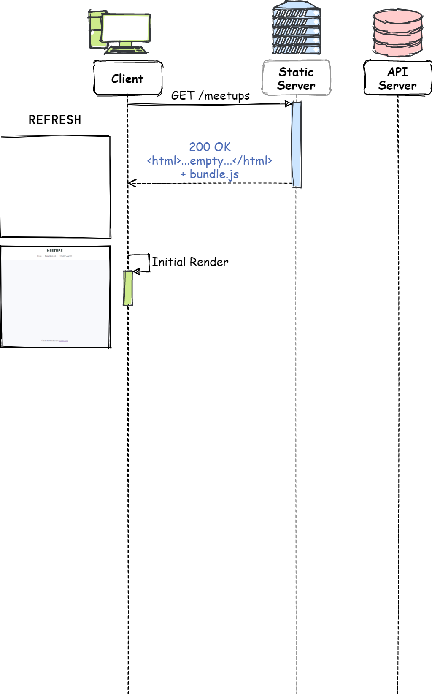

---

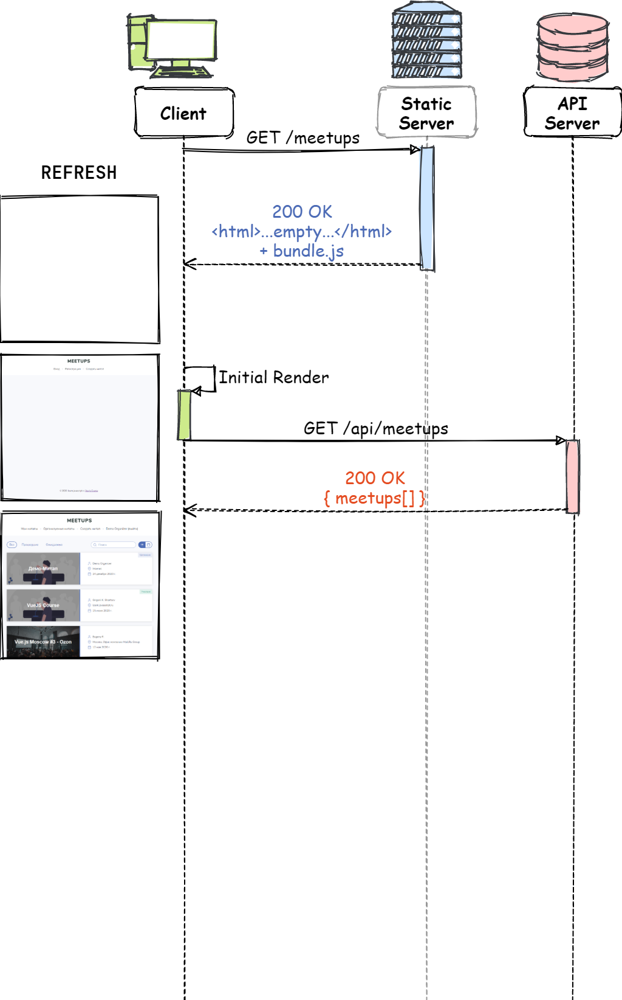

---

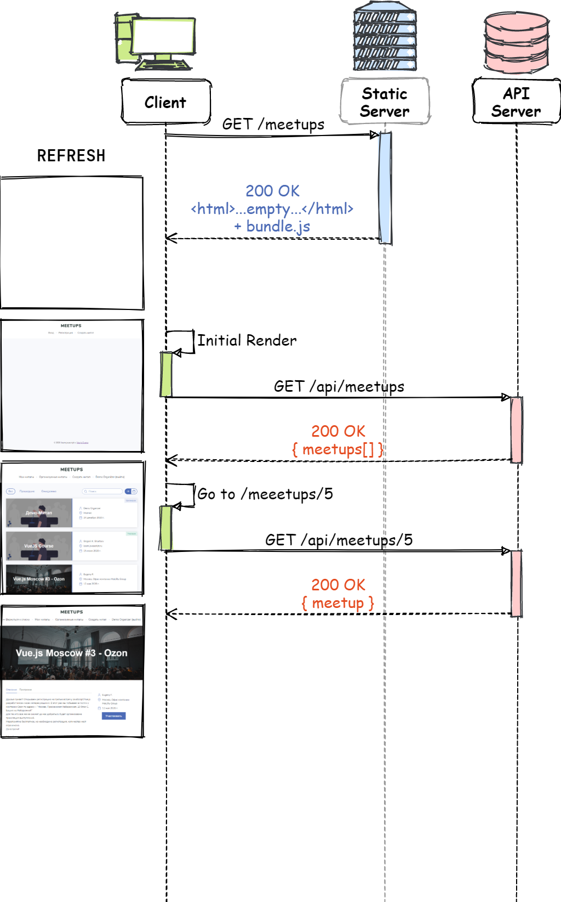

---

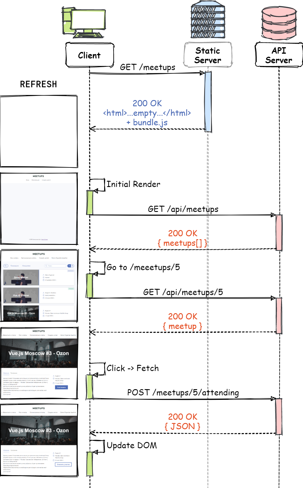

---

# SPA клиент + сервера

- Сервер делится на 2 части:
    - Отдача статики, отдаёт собственно приложение клиента и файлы
    - API для работы с данными и выполнении процедур
- Клиент – самостоятельное приложение, взаимодействующее с сервером посредством API
- API – некоторый универсальный интерфейс

---

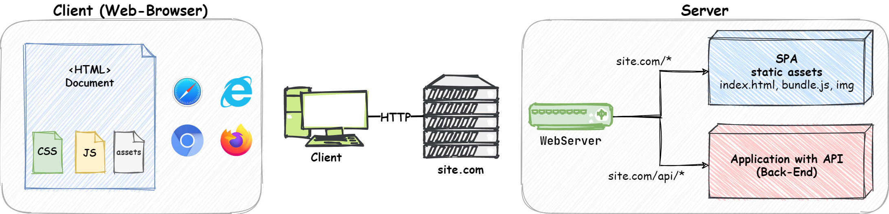

---

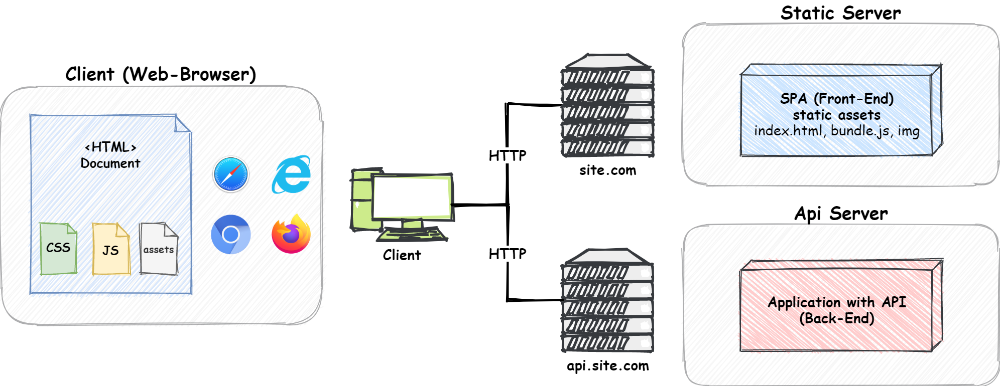

---

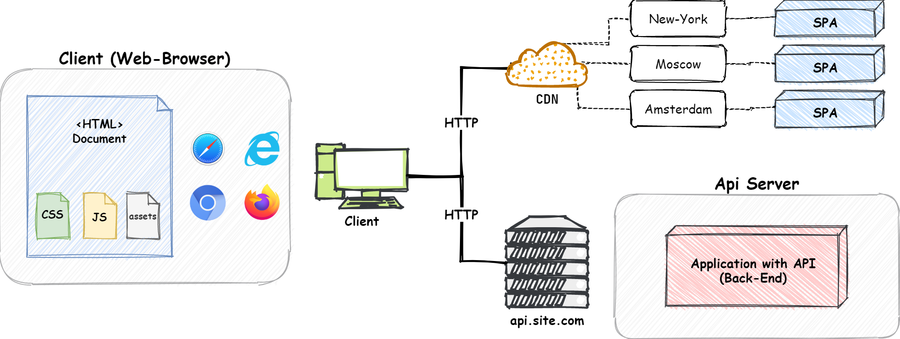

---

# Реализация SPA

* **Client-Side Rendering**
  * Решается JavaScript Frontend фреймворками
* **Client-Side Routing** (маршрутизация):
  * Определение содержимого, в зависимости от маршрута (URL)
  * Программное изменение текущего маршрута (URL)

---

# #hash 

* Один HTML документ на одной странице
* Состояние определяет hash (fragment)
  `http://site.com/#/users/1`
* Преимущества
  * Простая реализация
  * Фактически - одна страница, простой деплой
* Недостатки
  * Фактически - одна страница: навигация (back-forward), SEO и т.д.
  
---

# History API

- Доступ к истории (стеку) сессии
- Добавление записей в историю
- Перемещение по истории
- Отслеживание перехода назад-вперёд
- Полное управление маршрутизацией

---

# History API

```javascript
history.pushState({ }, '', '/users/1');
history.replaceState({ }, '', '/users/1');

history.state;

history.go(-2);
history.back();
history.forward();

window.addEventListener('popstate', () => {});
```

---

# Пример

<https://repl.it/@ShGKme/Web-HTML5-HistoryAPI>

---

# Роутер (Маршрутизатор, router)

- History API даёт только работу с историей и текущей страницей
- Компонент "роутер":
  - Определение маршрута и его представления
  - Переход между маршрутами
  - Формирование и разбор URL (ждём URL Pattern API)

---

# Преимущества SPA

* Большее разделение клиент и сервер
  * Клиент - JS приложение
  * Сервер - HTTP API
* Состояние клиента сохраняется при переходах
* Снижение нагрузки на сервер (теоретически)
  * Не нужно формировать HTML, делая одно и тоже при переходах
* Ускорение приложение (теоретически)
  * Получаем только нужные данные и обновляем часть страницы
* **Отзывчивый UI**

---

<!-- _class: lead -->

# **Недостатки?**

---

# Недостатки SPA

* Не работает без JS
* **SEO - Search Engine Optimisation** и другие роботы.
  Умеют ли роботы анализировать SPA?
* Обработка ошибок и HTTP Status
* Пользователь загружает страницу, загружающую страницу
* Увеличение нагрузки на клиент
* Увеличение сложности приложения

---

# Недостатки SPA

- Проблемы с SEO и роботами - поисковик получает пустую страницу без контента с HTTP статусом 200
- Проблемы с UX - пользователь получает приложение, которое после запрашивает данные

---

# Примечание

- Бывают самые разные решения
  - ajax + html
  - pjax
- Традиционный сайт с client-side rendering
- Новое не значит лучше
  - Традиционный сайт может быть быстрым
  - Нет проблем с SEO
  - SPA может быть медленнее и хуже традиционного

---

# Решение проблем с роботами

1. Отказаться от SPA/ajax _(back again)_ 
2. Создание HTML версий страниц традиционным способом _(please, no)_
3. **Prerendering**
4. **SSR** - Server-Side Rendering

---

# Prerendering - идея

* Как получить HTML страницы, как у пользователя? Срендерить её в браузере!
* Рендерим страницу на сервере в **headless браузере**
* Отдаём роботу **HTML**
* Можно добавить кэширование

---

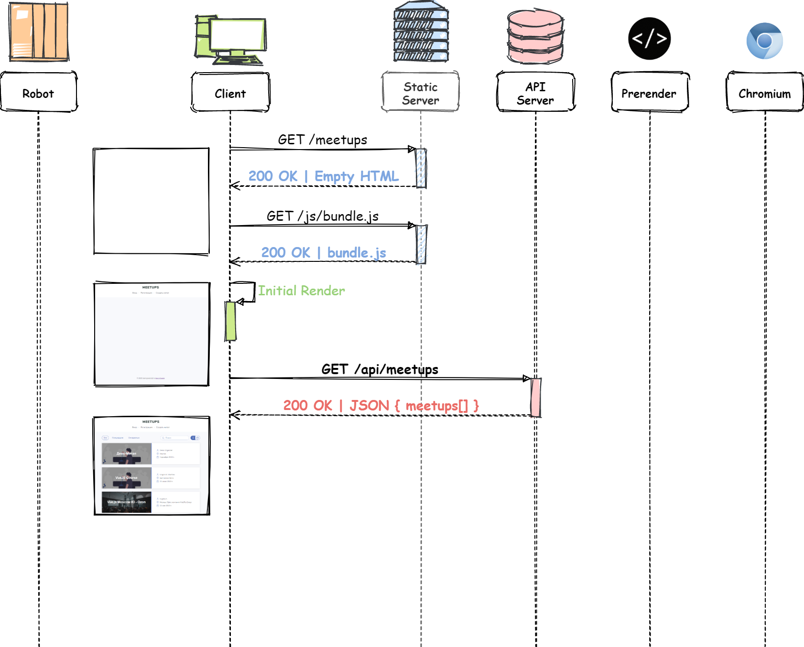

---

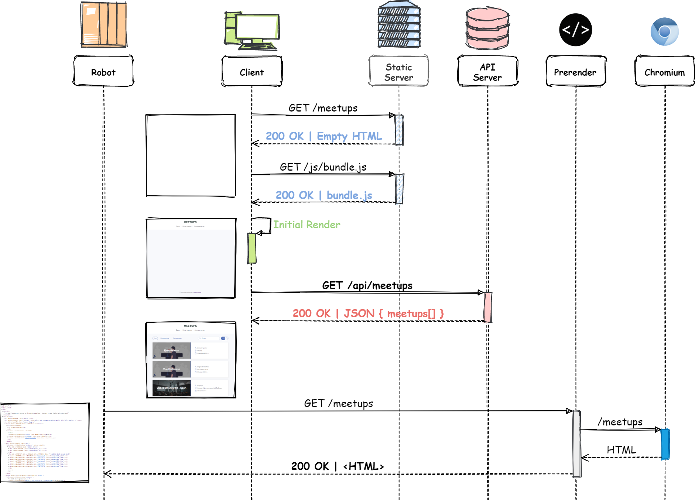

---

# Prerendering - варианты

- **prerender** - сервер с Headless Chrome + посредник запроса сервера
- **prerender.io** и другие облачные решения
- **Prerender SPA Plugin** - генерирует страницы при сборке

---

# Prerendering - применение

- Простое решение, просто работает
- Дорого, если страниц много
- Дорого, если страницы часто меняются
  (инвалидируется кэш)

---

# SSR

- **SSR - Server-Side-Rendering**
- Традиционный SSR - сервер рендерит содержимое
- Традиционно - инструментами серверной части (шаблонизаторы)
- Можно ли рендерить JavaScript приложение на JS вне браузера?
- А что делать с HTML дальше в браузере?

---

# SSR с клиентским рендерингом

- Изначально страница рендерится на сервере на JavaScript
- На клиенте приложение работает дальше, как SPA
- Решает все проблемы 👏🏻

---

# Простой SSR

1) JS-приложение рендерится на сервере
2) В браузер приходит срендеренный HTML
3) Выполняется **гидрация**, при которой срендеренное приложение превращается в js приложение на клиенте
   **(разметка должна совпадать!)**
4) Далее приложение работает, как SPA
5) Работает?

---

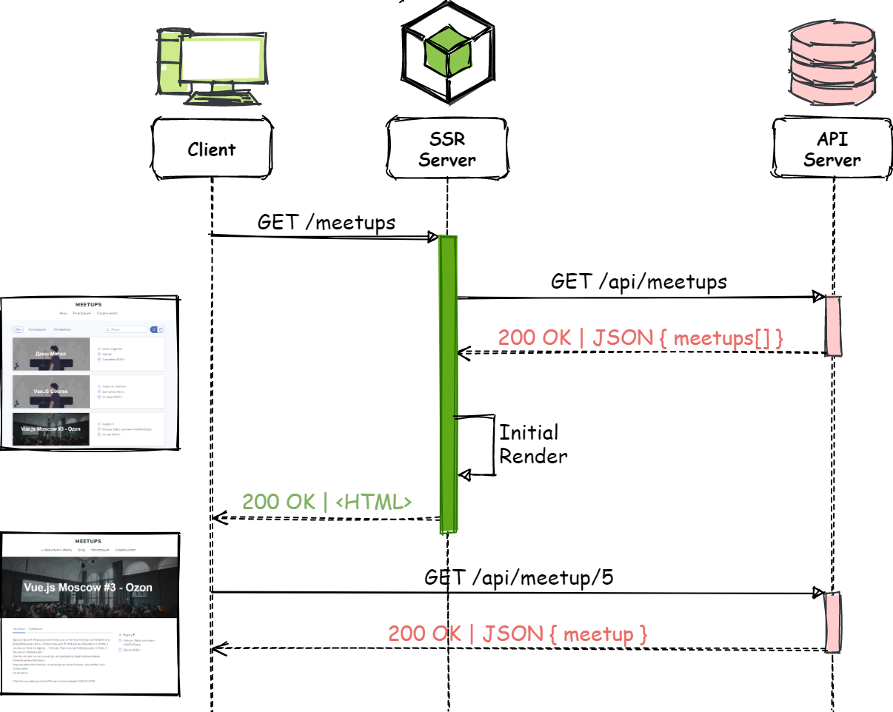

---

## SSR с данными

1) Приложение рендерится на сервере
2) Все необходимые данные запрашиваются на сервере
3) В браузер приходит срендеренный HTML **вместе с данными в некотором контейнере**
   (например, в `window.__INITIAL_STATE__ = data`)
4) Выполняется гидрация. **До и во время гидрации при инициализации компонентов приложения, если им нужны данные, они берутся из этого контейнера**
5) Далее приложение работает, как SPA

---

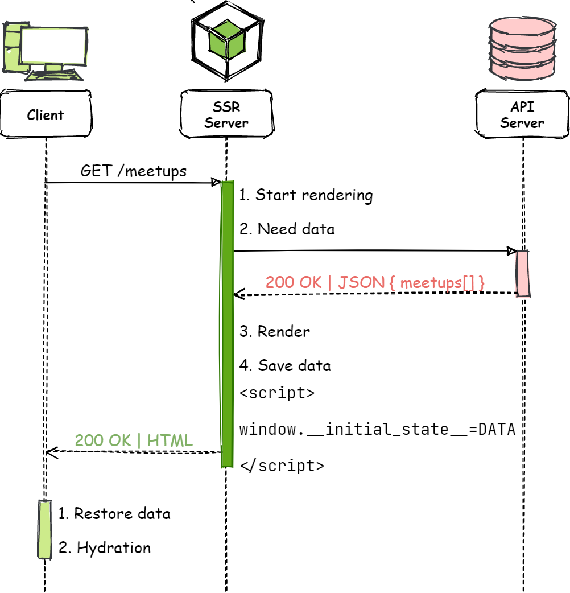

---

# Изоморфное приложение

> Приложение, в котором код может исполняться как на серверной, так и на клиентской части

---

# Реализация SSR

- Рендеринг на сервере - в меньшей или большей степени возможностями фреймворка
- Гидрация на клиенте - возможностями фреймворка
- Сохранение состояния - зависит от фреймворка
- Часто универсальные и простые решения - медленные и ресурсозатратные

---

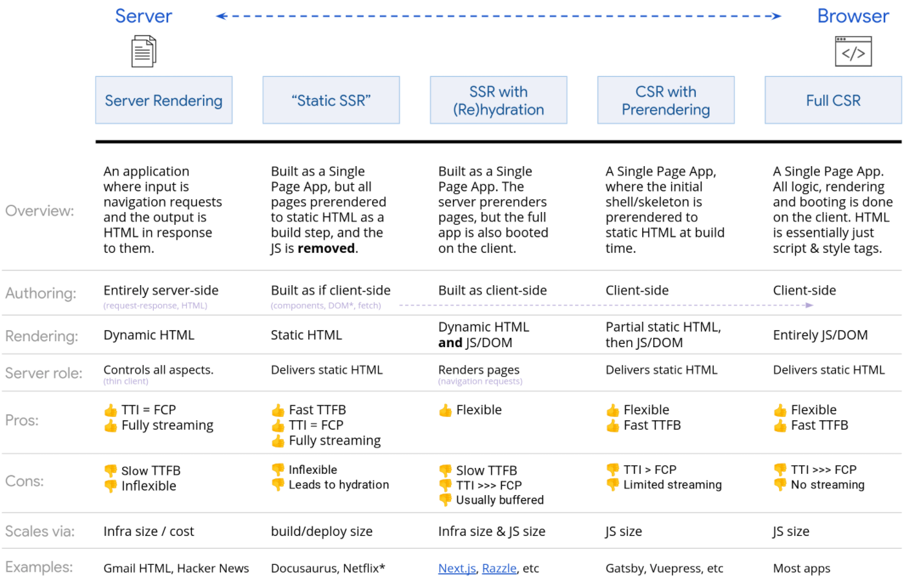

---

# Ссылки

- History API
    - Гайд: [https://developer.mozilla.org/ru/docs/Web/API/History_API](https://developer.mozilla.org/ru/docs/Web/API/History_API)
    - Документация: [https://developer.mozilla.org/ru/docs/Web/API/History](https://developer.mozilla.org/ru/docs/Web/API/History)
- [HolyJS 2019 Moscow | Guillermo Rauch — Client rendering, server rendering, pre rendering](https://www.youtube.com/watch?v=impcGrPD0xQ)
- <https://repl.it/@ShGKme/Web-HTML5-HistoryAPI>
