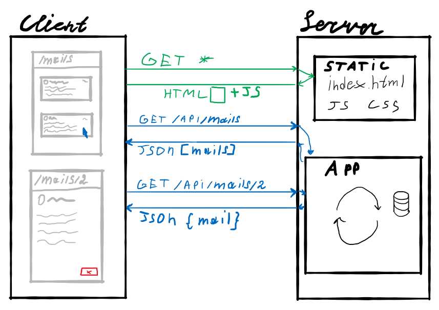

<!-- _class: lead -->

# **Лекция №9: SPA**

Web-программирование / ПГНИУ

---

# Традиционный подход

- Каждый запрос – получение HTML документа
- Каждое действие пользователя – получение HTML
- Переход по ссылке или отправка HTML формы
- Аутентификация, фильтрация, поиск – обновление страницы
- Манипулирование данными – обновление страницы
- Время, трафик, нагрузка

---


---

# AJAX

- Asynchronous Javascript and XML
- Подход к построению интерактивных пользовательских интерфейсов веб-приложений, заключающийся в «фоновом» обмене данными браузера с сервером
- Данные – не только HTML, а любые сериализованные или бинарные
- Не обязательно XML
- Официально термин появился в 2005 году
- Фактически технологии позволяли реализовывать в 1998

---

# AJAX

- Загружается основной HTML документ, включая скрипты и некоторые данные
- Некоторые действия приводят к загрузке новых данных на страницу или выполнении действий на сервере (асинхронно)
- Страница обновляется без перезагрузки
- Сама страница (URL) не меняется

---

 

---

# Проблемы традиционных подходов

- Клиентская и серверная часть сильно связаны
    - клиентская часть генерируется технологиями серверной части
- Каждый переход – загрузка новой страницы
    - трафик (на целый HTML документ)
    - время
    - нагрузка
- Клиент – не полноценное приложение, состояние теряется после каждого перехода на новую страницу
    - Действия, меняющие адрес страницы, работают через сервер

---

# SPA

* **Single-page application** – одностраничное приложение
* Не значит, что есть только одна страница
* Но есть только один HTML документ
* Клиентская часть – одно JS приложения
* Роутинг теперь на стороне клиента
* Генерация страницы теперь на стороне клиента

---

# SPA

- Сервер делится на 2 части:
    - Отдача статики, отдаёт собственно приложение клиента и файлы
    - API для работы с данными и выполнении процедур
- Клиент – самостоятельное приложение, взаимодействующее с сервером посредством API
- API – некоторый универсальный интерфейс

---



---

# Реализация SPA

* Генерация содержимого страницы на клиенте
    - (полный контроль над содержимым клиента)
* Маршрутизация на клиенте:
    - Определение содержимого, в зависимости от текущего маршрута (URL)
    - Программное изменение текущего маршрута (URL)

---

# HTML5 History API

- Есть стек адресов страниц, между которыми переходил пользователь
- Для браузера переход на новую страницу = добавить адрес в стек адресов и получить страницу
- HTML5 History API позволяет манипулировать этим процессом
- Теперь мы можем знать текущую страницу и изменять адрес текущей страницы (с учётом истории!) в браузере на стороне клиента

---

```javascript
history.pushState({}, 'User #1', '/users/1')
history.replaceState({}, 'User #1', '/users/1')
history.state
history.go(-2)
history.back()
history.forward()
```

---

# Пример

https://repl.it/@ShGKme/Web-HTML5-HistoryAPI

---

# Роутер (Маршрутизатор, router)

- HTML5 History API даёт только работу с историей и текущей страницей
- Нужен роутер, для формирования путей, обработки параметров и т.д.

---

# Преимущества SPA

* Разделение веб-приложения на раздельные клиент и сервер, как в клиент-серверных приложениях
* Клиент имеет полный контроль над собой, постоянное состояние
* Снижение нагрузки на сервер (теоретически)
* Ускорение приложение (теоретически)
* Отзывчивый UI

---

# Недостатки SPA

* Не работает без JS
* **SEO - Search Engine Optimisation**. Умеют ли поисковые системы анализировать SPA?
* Пользователь загружает страницу, загружающую страницу
* Увеличение нагрузки на клиент
* Обработка ошибок и HTTP Status

---

# Недостатки SPA

- Проблемы с SEO - поисковик получает пустую страницу без контента с HTTP статусом 200
- Проблемы с UX - пользователь получает приложение, которое после запрашивает данные
  (time-to-content)

---

# Решение проблем с SEO

1. Создание HTML версий страниц традиционным способом
2. Prerendering
3. SSR - Server-Side Rendering

---

# Prerendering

* Рендерим страницу на сервере, и отдаём её HTML (в headless браузере или jsdom).
* Варианты решения:
    - Prerender SPA Plugin - плагин для Webpack, генерирующий страницы при сборке
    - prerender - сервер с Headless Chrome + посредник запроса для nodejs, nginx и т.д.
    - prerender.io и другие облачные решения
* Простое решение, просто работает
* Очень дорого, если страниц очень много или они часто меняются

---

# SSR

* **SSR - Server-Side-Rendering**
* Изначально рендерим сайт на сервере, используя возможности фреймворка на Node.js, и встраиваем данные при необходимости
* Далее сайт работает, как SPA
* **Изоморфное приложение** - приложение, в котором код может исполняться как на серверной, так и на клиентской части
* Решает и проблему SEO, и time-to-content
* Значительно усложняет разработку

---

# Простой SSR

1) Приложение рендерится на сервере с помощью Node.js или аналога и возможностей JS  фреймворка
2) В браузер приходит срендеренный HTML
3) JS фреймворк выполняет **гидрацию**, при которой срендеренное приложение превращается в приложение JS фреймворка (разметка должна совпадать)
4) Далее приложение работает, как SPA
5) Работает?

---

## SSR с данными

1) Приложение рендерится на сервере
2) Все необходимые данные запрашиваются на сервере
3) В браузер приходит срендеренный HTML **вместе с данными в некотором контейнере**
   (например, в `window.__INIT_DATA__ = data`)
4) Выполняется гидрация. **До и во время гидрации при инициализации компонентов приложения, если им нужны данные, они берутся из этого контейнера**
5) Далее приложение работает, как SPA

---

# Ссылки

- HTML5 History API
    - Гайд: [https://developer.mozilla.org/ru/docs/Web/API/History_API](https://developer.mozilla.org/ru/docs/Web/API/History_API)
    - Документация: [https://developer.mozilla.org/ru/docs/Web/API/History](https://developer.mozilla.org/ru/docs/Web/API/History)
- [HolyJS 2019 Moscow | Guillermo Rauch — Client rendering, server rendering, pre rendering](https://www.youtube.com/watch?v=impcGrPD0xQ)
- Vue Router: [https://router.vuejs.org/](https://router.vuejs.org/)
- https://repl.it/@ShGKme/Web-HTML5-HistoryAPI
- https://repl.it/@ShGKme/Web-Simple-Routing-in-Vue
