<!-- _class: lead -->

# **Лекция №11: Современный Back-end**

Web-программирование / ПГНИУ

---

# Традиционная инфраструктура

- Есть веб-приложение (клиент-серверной приложение?)
- Это приложение на сервере, принимающее запросы, и отдающее HTML страницы веб-сайта
- Страницы отображаются у пользователя в веб-браузере (возможно, с использованием JavaScript)

---

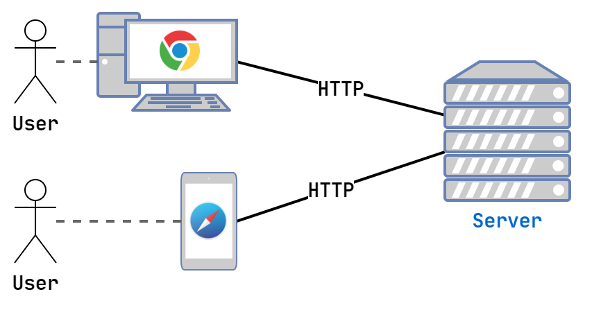

---

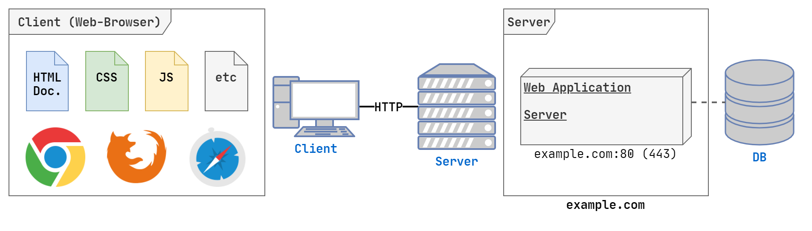

---

# Веб-сервер

- HTTP-сервер
- Маршрутизация
- Хостинг статики (html, js, css, и т.п. файлов)
- Обратный прокси (reverse proxy) к другим приложениям
- Балансировка нагрузки
- HTTPS и работа с SSL, HTTP/2 и т.д.
- Кэширование, сжатие
- Ограничение нагрузки (трафик, запросы в секунду)
- Nginx, Apache, IIS, Traefik

---

---

# AJAX SPA

- Веб-приложение - честно клиент-серверное приложение
- Клиент - JavaScript приложение, работающее в браузере
- Сервер - простой веб-сервер, отдающий статику
- Сервер - API

---

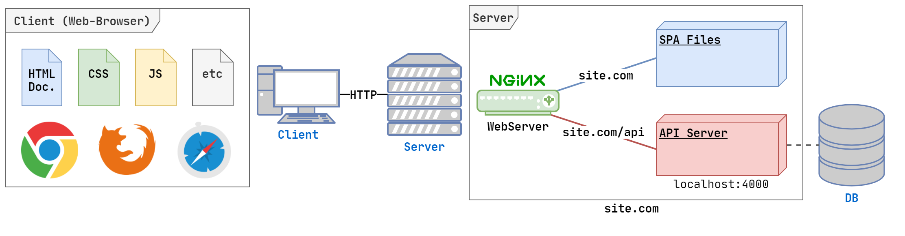

---

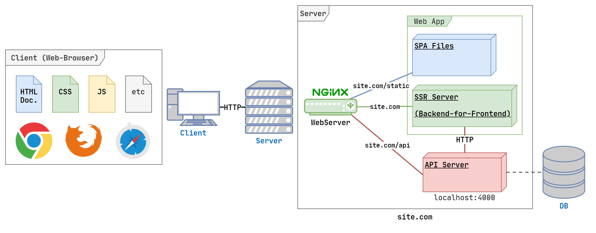

---

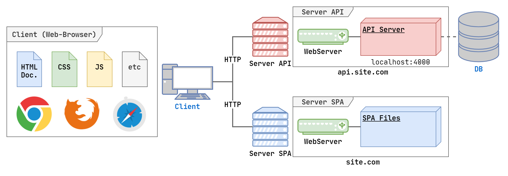

---

# CDN

- Проблема - чем дальше клиент от сервера, тем больше времени идёт запрос (количество посредников в сети + ограничения скорости света)
- Статичные файлы - статичны. Их не требуется часто изменять или синхронизировать. Именно они первые загружаются SPA
- Решение - **Content Delivery Network** (система доставки контента)
- Имеем множество серверов со статикой по всему миру, клиент получает содержимое с ближайшего

---

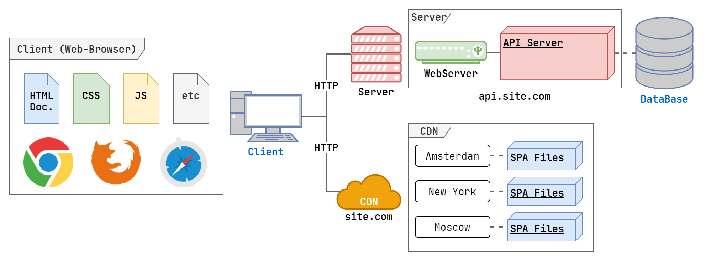

---

# Масштабирование

- Вертикальное масштабирование - увеличение вычислительных ресурсов
- Горизонтальное масштабирование - увеличение вычислительных узлов
- Запрос-за-процесс, запрос-на-поток, запрос-на-асинхронное-приложение
- Количество процессов на одном сервере - ограничено
- Решение - несколько серверов + балансировщик нагрузки

---

# Балансировщик нагрузки

- Распределяет запросы между несколькими экземплярами приложения (возможно, на нескольких серверах) 
- Round-robin - просто по очереди
- Random - случайно
- Умно, с учётом загрузки
- Тот же Nginx, системы 

---

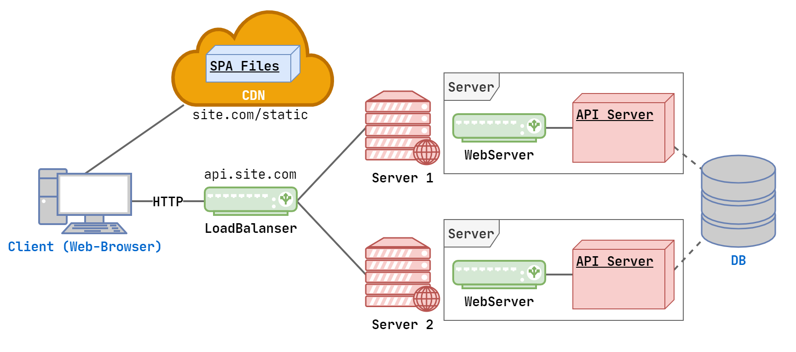

---

# Распределённое приложение

- Большое монолитное приложение может быть сложно разрабатывать и сложно масштабировать
- Возможно, большая нагрузка идёт лишь на некоторую часть приложения
- Возможно, есть отдельные тяжёлые операции, которые можно выполнять не сразу
- Решение - распределённое приложение, **сервис-ориентированная архитектура**
- Сервисы могут общаться не только по HTTP
- Сервисы можно масштабировать независимо

---

# Очередь задач

- Некоторые задачи не нужно выполнять сразу, например, задачи по расписанию, почтовая рассылка, тяжелые долгие задачи
- Можно выполнять такие задачи в отдельном сервисе (сервисах), складывая их в очередь
- Здесь помогут Очереди Сообщений (Message Queue)
- Например, RabbitMQ или разные реализации протокола AMQP

---

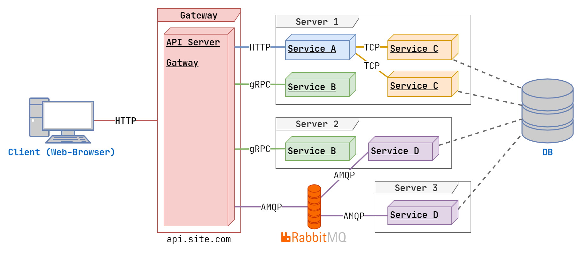

---

# Микросервисы

- Вместо одного распределённого приложения можно иметь много маленьких независимых микросервисов
- Каждый микросервис максимально самодостаточный в решении задач, и имеет свои сервисы (БД и тд), чтобы не нагружать общие
- Микросервисы могут переиспользоваться разными приложениями

---

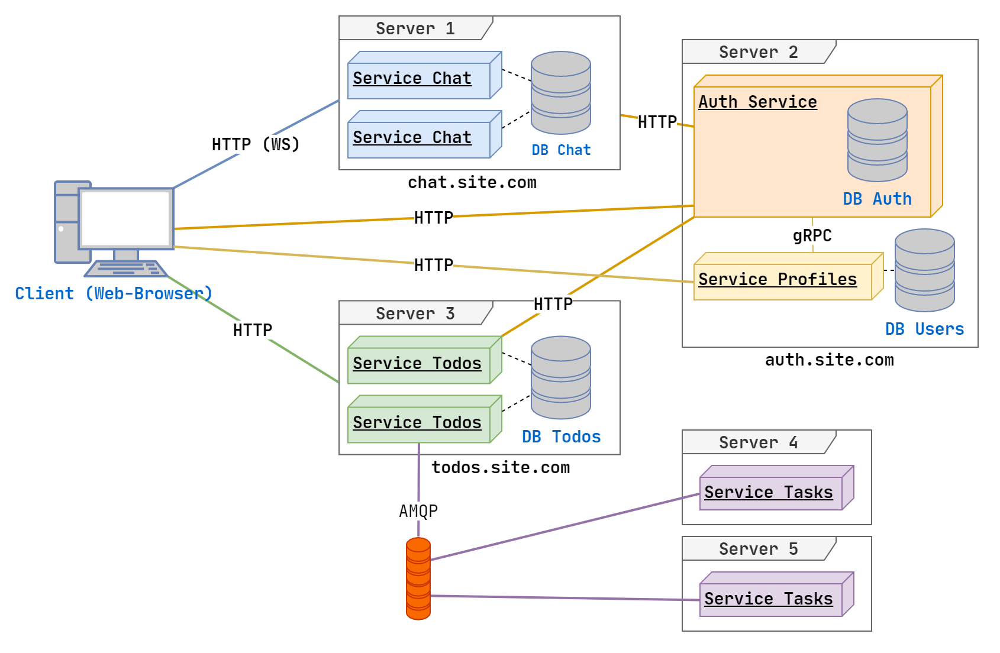

---

# Цена сервис-ориентированной и микросервисной архитектур

- Сложное развёртывание
- Сложное логирование (запрос проходит через множество сервисов)
- Сложная отладка
- Сложная разработка (каждый (микро) сервис требуется проектировать, продумывать транспорт)

---

# Хранение данных

* Основное хранилище - БД на Сервере СУБД (реляционное, документ-ориентированное и т.д.)
* Проблемы:
    * Часто забираются одни и те же данные
    * Медленный полнотекстовый поиск
    * Сложно масштабировать (распределённая СУБД - БОЛЬ). Есть неизменяемые данные, которые просто накапливаются, но их требуется обрабатывать
* Решение - больше баз данных на разных СУБД

---

# Кэширование данных

- Простые key-value БД, работающие в in memory
- Redis, Memcached
- Используются для кэширования данных и "общей памяти" разных сервисов

---

# Сервер полнотекстового поиска

- БД, хранящая проиндексированные данные (например, словарь по словам)
- Пример: Elasticsearch

---

# Много-много данных

- Кроме основных изменяемых данных, есть данные, которые только добавляются, но приходят большим потоком и требуют обработки
- Логирование приложения 
- Логирование действий пользователя
- Задачи:
    - Real-time аналитика и простой мониторинг
    - BigData, сложная аналитика и машинное обучение
    - Хранение исторических данных

---

# Хранилище данных

Хранилище данных (warehouse) - система хранение больших объёмов неизменяемых данных.

---

# Базы данных временных рядов

- Time series database (TSDB)
- БД, где эффективно хранятся последовательности данных, привязанных к временной метке
- Оптимизированы на быстрый приём данных, независимо от общего объёма
- Автоматическое удаление старых данных
- Далее данные уходят потребителю (Grafana, Datadog...)
- Примеры: Prometheus, InfluxDB 

---

# Потоковая обработка данных

- Распределённое хранение большого объёма данных
- Потоковая обработка данных, анализ данных
- Примеры: Hadoop, Apache Spark

---

# Пользовательские файлы

- Хранить файлы в ФС сервера - плохо
- Simple Storage Service (s3) - файловый хостинг
- Служба, предоставляющая возможность хранения и получения данных (файлов); распределённая, масштабируемая
- Изначально сервис в Amazon AWS (AWS s3), далее протокол, реализованный многими сервисами
- Google Cloud s3, Azure s3
- self-hosted - min.io

---

---

# Аутентификация

- HTTP Basic Auth: браузер сам делает форму, хранит данные и отправляет их в заголовке
- Session: данные аутентификации и другие данные хранятся в сессии
    - client-side session - зашифровано в cookie (не безопасно)
    - server-side session - данные на сервере в хранилище, а в cookie только SID
- Аутентификация по токенам - с запросом как-то отправляется токен аутентификации. Токен выдаётся сервисом аутентификации.
    
--- 

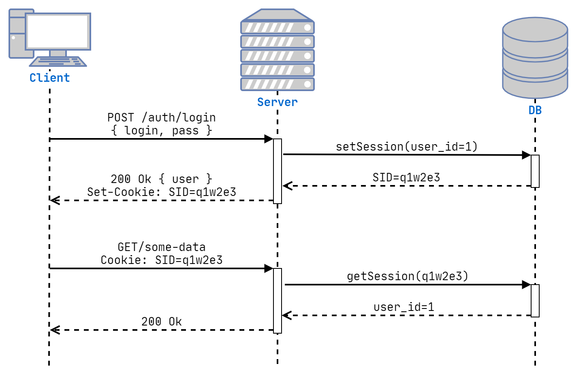

---

# Аутентификация с SID в SPA

- При старте приложения запрашиваем данные текущего пользователя (`/api/auth/me`)
- Если данные пришли успешно - пользователь есть
- Иначе - нет
- Можно при успешной аутентификации сохраняем данные пользователя в LocalStorage 

---

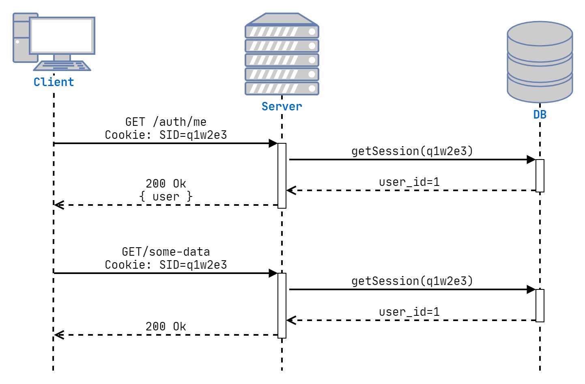

---
# OAuth 

- OAuth 1.0 и OAuth 2.0 - протоколы аутентификации в сторонних приложениях
- Описывают разные схемы аутентификации в сторонних приложениях
- Аутентификация через социальные сети
- Аутентификация приложения для использования API других приложений

---

---

# Проблемы с аутентификацией

* Проблема 1: требуется сохранять аутентификацию для разных сервисов на разных доменах
* Проблема 2: stateful  аутентификация - это затраты. Требуется из каждого сервиса либо всегда обращаться в сервис аутентификации, либо иметь доступ к хранилищу (сессиям)

---

# Проблема с кросс-доменными запросами

- Cookie отправляются на тот домен, с которого они были установлены
- Значит информацию об аутентификации надо отправлять не в Cookie, а как-то в запросе из клиента
- Наиболее правильно - заголовок `Authorization`

---

# Stateless авторизация

- Вместо идентификатора сессии используем токен с подписью (или зашифрованный)
- В токене сохраняем данные авторизации
- Сервисы могут верить токену, потому что он подписан
- Подпись - просто хэш, симметричное шифрование, асимметричное шифрование  

---

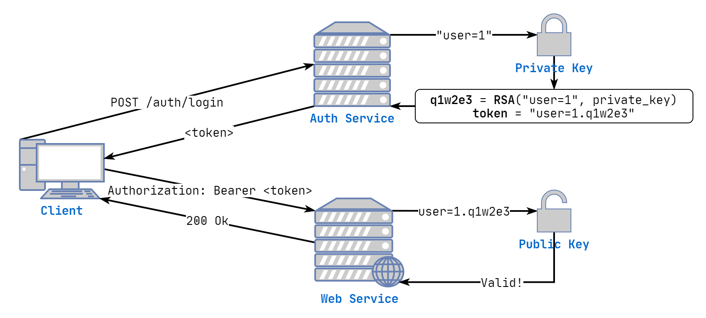

---

# JWT

* **JSON Web Token** - компактное, безопасное для URL средство представления заявок, передаваемых между двумя сторонами (RFC 7519)
* Строка в формате `header.payload.signature`
  `Header` – Информация об алгоритме вычисления подписи
   `header = { "alg": "RS256", "typ": "JWT"}`
  `Payload` – собственно полезная нагрузка
  `payload = { "userId": "1", "name": "Petya", "isAdmin": true }`
  `Signature` – цифровая подпись
* `JWT = base64(header) + '.' base64(payload) + '.' + base64(signature)`

---

---

# JWT для аутентификации

* JWT - подписанные данные. Мы знаем, что данные там достоверны и можем ему верить
* Можно делать **Stateless** аутентификации
* Проблема - инвалидация...
    - Инвалидация по истечении времени
    - Инвалидация в случае, если токен скомпрометирован

---

# JWT с ограниченным временем жизни

Первая часть решения простая - ограничивать время жизни JWT, передавая в нём метку времени, когда он истечёт.

---

# Refreshing an Expired Access Token Flow

* Единственный надёжный способ инвалидировать токен - иметь базу инвалидированных токенов. Это делает использование JWT (stateless) бесполезным.
* Сделаем токен **короткоживущим** (~1-5 минут)
* Чтобы пользователя не разлогинило, добавим ещё один токен - одноразовый долгоживущий **refresh_token**, который используется для получения нового JWT

---

# JWT + refresh_token

- JWT (access_token):
     - Stateless, подписанный
     - Короткоживущий (~1-5 мин.)
     - Используется для авторизации в сервисах приложения
- refresh_token (любой токен, например, UUID):
    - Statefull
    - Живёт долго, одноразовый
    - Используется для получения новой пары JWT + refresh_token на сервисе аутентификации

---

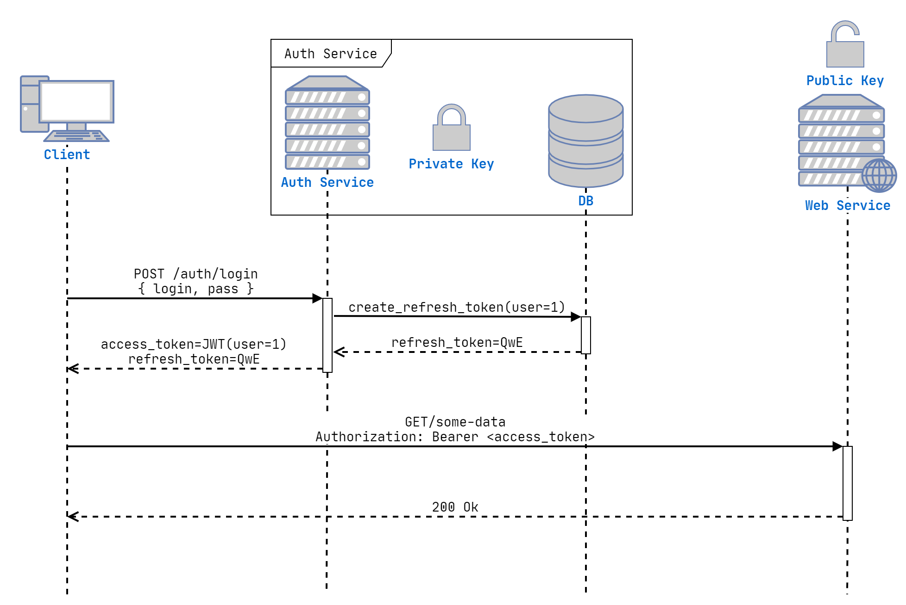

---

---

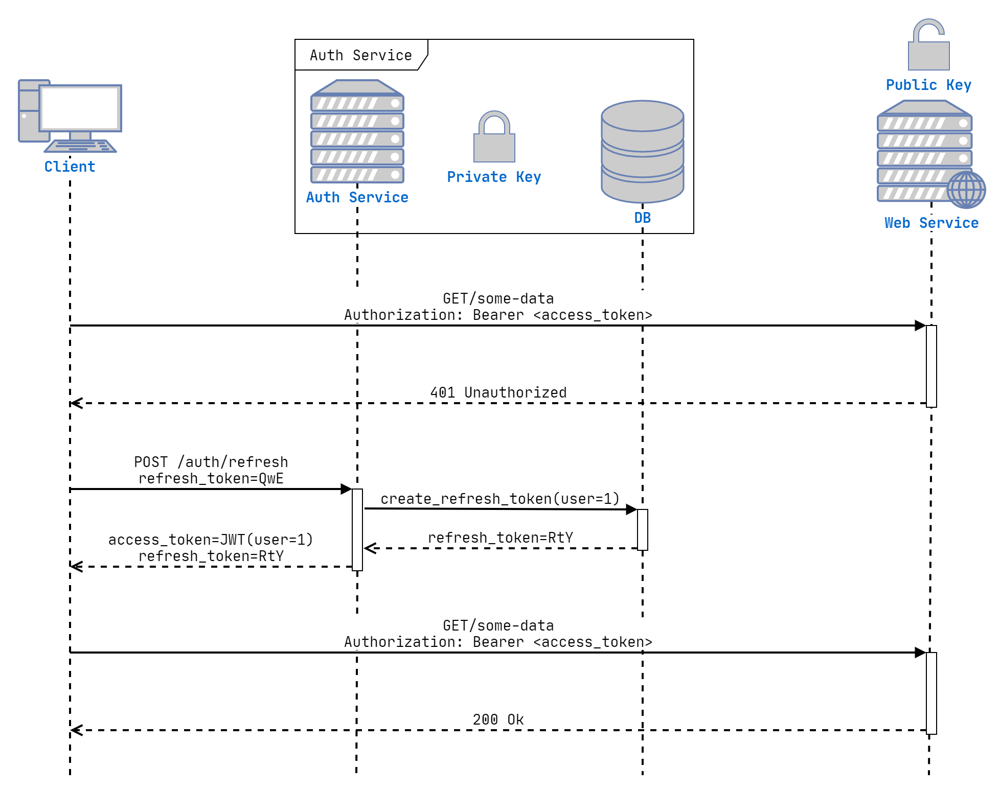

---

# Как защититься от кражи токенов

* Использовать HTTPS (иначе об авторизации вообще не может быть и речи!)
* Хранить в токене идентификатор устройства (отпечаток, ip адрес и т.д.)
* Основная потенциальная причина кражи - XSS
* `refresh-token` можно хранить в `httpOnly` `Cookie`
* `access_token` хранить как можно безопаснее
    - LocalStorage или простой Cookie - самое не безопасное
    - В локальной переменной - лучше
    - Service Worker - идеально
 
---

# Аутентификация в SPA с JWT

1) Авторизуемся на **Сервисе аутентификации**
2) Получаем 2 токена:
    `JWT (access_token)` сохраняется в памяти приложения
    `refresh_token` пришёл вместе с `httpOnly` `Cookie`
3) Со всеми запросами SPA прикрепляет токен к заголовку запроса
4) По таймеру (или, когда сервер отвергнет JWT), отправляется запрос на получение новой пары токенов
5) При старте приложения в начале отправляется запрос на получение новой пары токенов

---

# Когда использовать JWT

- Требуется stateless авторизация:
    - Микросервисная архитектура без единого gateway
    - Большая нагрузка, при которой лишний запрос в сервис аутентификации или хранилище сессий - это дорого 
- Нет возможности использовать Cookie (вытекает из stateless авторизации)

---

# Ссылки

- Эффективные надежные микросервисы: [https://habr.com/ru/company/odnoklassniki/blog/499316/](https://habr.com/ru/company/odnoklassniki/blog/499316/)
- HolyJS 2018 Moscow | Дмитрий Пацура — Микросервисная архитектура: [https://www.youtube.com/watch?v=wXaoKroEnp4](https://www.youtube.com/watch?v=wXaoKroEnp4)
- IBM | SOA vs. Microservices: What’s the Difference?: [https://www.ibm.com/cloud/blog/soa-vs-microservices](https://www.ibm.com/cloud/blog/soa-vs-microservices) 
- Wikipedia OAuth: [https://ru.wikipedia.org/wiki/OAuth](https://ru.wikipedia.org/wiki/OAuth)
- JWT: [https://jwt.io](https://jwt.io)
- Хорошая статья про JWT: [https://hasura.io/blog/best-practices-of-using-jwt-with-graphql/](https://hasura.io/blog/best-practices-of-using-jwt-with-graphql/)
