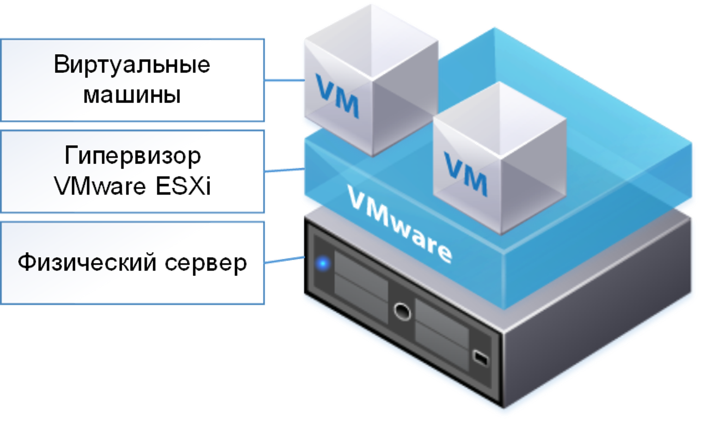
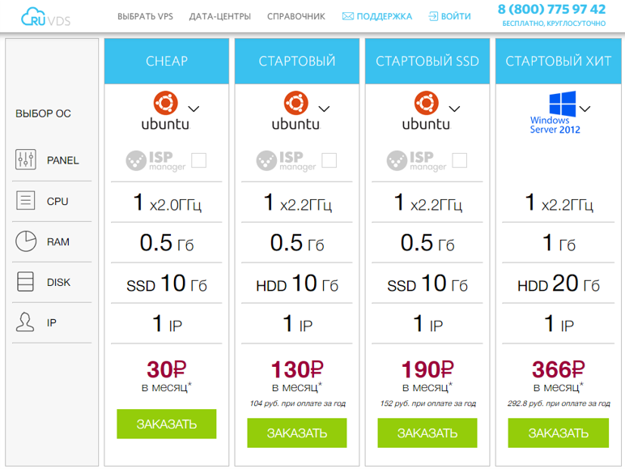
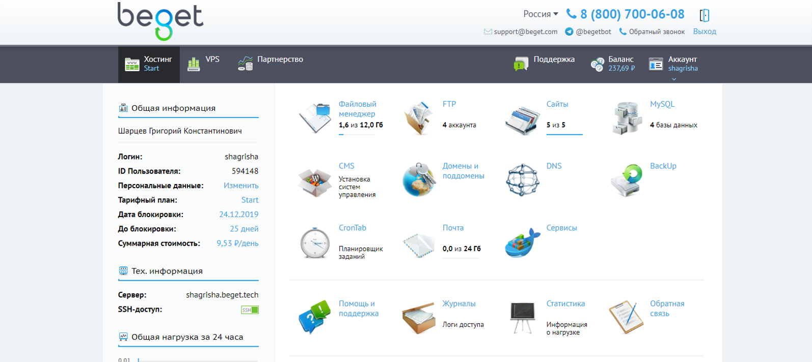
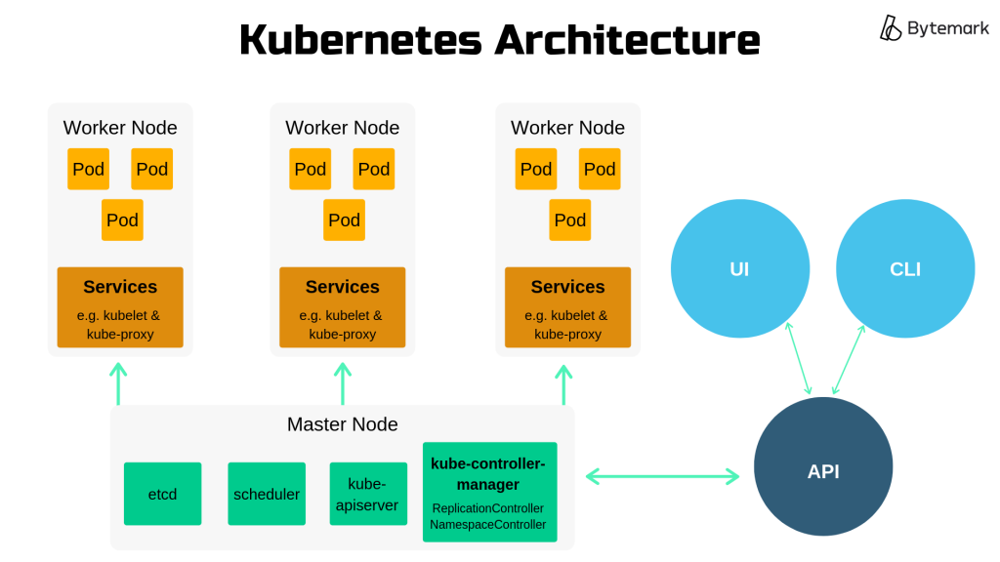
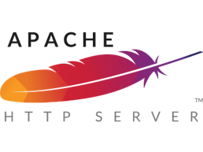

<!-- _class: lead -->

# **Лекция 13: Развертывание**

Web-программирование / ПГНИУ

---

# Развёртывание (Deployment)

* Все действия, которые делают программную систему готовой к использованию (Wikipedia)
* Основная задача: сделать приложение общедоступным
* В общем и целом, требуется:
    - выполнить все этапы сборки под production
    - выложить приложение на некоторый доступный по сети сервер
    - возможно, настроить сервер (например, веб-сервер)
    - возможно, настроить DNS

---

# Вариант 0. Компьютер разработчика

- Если компьютер разработчика доступен в локальной (внешней) сети, то уже можно переходить на него
- Подходит для простого тестирования или демонстраций в локальной сети

---

# Вариант 0.2: сетевой туннель

- Сетевое соединение между двумя компьютерами через некоторого посредника (прокси-сервером)
- Для демо-развёртывания:
    - Пользователь обращается к серверу
    - Сервер перенаправляет запросы на компьютер разработчика
    - Компьютер разработчика отправляет ответ
- Подходит для быстрой демонстрации
- https://ngrok.com 
- http://serveo.net 

---


---


---

# 1. On-Premise (self-hosted)

- **On-Premise** – развёртывание на **своей** инфраструктуре
- Имеем свои сервера и развёртываем на них
    - Ноутбук под столом
    - Сервера в своей организации
    - Аренда места в дата-центре
    - Аренда сервера в дата-центре

---

# 1. On-Premise: затраты и требования

- Сами занимаемся: 
  сетью, хранением, резервным копированием, безопасностью, виртуализацией, обновлением оборудования, администрированием, отказоустойчивостью и т.д.
- Затраты: 
  оборудование + сеть, электричество, помещение + системное администрирование

---

# 2. IaaS, VPS, VDS

- **Infrastructure as a Service** – инфраструктура как сервис
- **VPS** – Virtual Private Server
  **VDS** – Virtual Dedicated Server
- **Виртуальная машина** – изолированный контейнер ПО, содержащий операционную систему и приложения
- Простой вариант: VM определённой конфигурации
- Сложный вариант: VMs + Networking + Storages + Scaling (more VMs) + Load Balancer

---

# 2. IaaS: затраты и требования

- Сами занимаемся: 
  настройкой сервера и простой настройкой сети, безопасностью ОС
- Затраты: 
  оплата за компонент / время
  +
  "простое" администрирование

---



---



---


---

# 2.1. Dedicated server

- Выделенный сервер, аренда сервера
- Гарантированные __честные__ выделенные ресурсы
- Но также на чужой инфраструктуре

---


---

# 3. Shared hosting

- **Виртуальные хостинги** – ограниченное пользование **частью** (виртуального) сервера, **разделяемого** с другими пользователями
- Сервис, предоставляющий услугу по размещению веб-сайта / веб-приложения **определённого** типа
- Веб-сервер + БД + Почтовый сервер + DNS
- Остаётся только закинуть файлы и настроить хостинг
- Оплата от размеров ресурсов, числа сайтов и услуг
- Минимум администрирования
- Особая популярность **PHP хостинги**
 
---


---



---

# 4. PaaS, облачные платформы

- **Platform as a Service** - cреда разработки, тестирования и деплоя
- Инфраструктура и среда для определённого типа приложения 
- Решают большую часть нефункциональных проблем в создании приложений. Развертывание, доступность, масштабирование, отказоустойчивость, репликация и т.п. + сервисы
- Различные схемы оплаты, преимущественно за потребляемые ресурсы
- Возможно, зависимость от определённой PaaS...
- Пример: Heroku.com, now.sh (vercel)

---

# 5. Serverless, FaaS

- **Functions as a Service**
- "Бессерверные вычисления" (выполняются на сервере)
- Среда выполнения (runtime) определенного языка
- Функция – основная единица логики и управления
- Вход - запрос, выход - ответ на запрос
- Вместо большого приложения или сложной микросервисной архитектуры - функции
- Оплата за время выполнения функций
- "Неограниченное" масштабирование

---

# 6. SaaS

- **Software as a Service**
- Используем для решения некоторой задачи полностью стороннее приложение, работающее на инфраструктуре поставщика;
- Оплата по подписке / за операции;
- Техническая поддержка приложения включена в оплату;
- Приложение "всегда обновлено"

---

# 7. Облачные платформы

- Большое число различных облачных платформ, предоставляющих широкий спектр услуг:
    - Облачные вычисления
    - Хранение данных
    - Serverless
    - IaaS, PaaS, SaaS, различные узкоспециализированные сервисы
- Неограниченные ресурсы с оплатой непосредственно за используемые ресурсы

---


---


---


---


---


---


---



---


---


---

# Веб-сервер

- HTTP-сервер
- Маршрутизация
- Хостинг статики (html, js, css, и т.п. файлов)
- Обратный прокси (reverse proxy) к другим приложениям
- Балансировка нагрузки
- HTTPS и работа с SSL, HTTP/2 и т.д.
- Кэширование, сжатие
- Ограничение нагрузки (трафик, запросы в секунду)
- Nginx, Apache, IIS, Traefik

---


---




---


---

```nginx
server {
    listen      [::]:80;
    server_name web.shgk.me;
    root        /var/www/web.shgk.me;

    rewrite ^(.*)(\.md)$ $1.html break;

    location / {
        try_files $uri /README.html;
    }

    location /materials {
        autoindex on;
    }
    location /labs {
        autoindex on;
    }
}
```

---

```nginx
server {
        listen 80;
        listen [::]:80;

        server_name magic-ontologies.shgk.me;

        location / {
                proxy_pass http://127.0.0.1:8282;
                include nginxconfig.io/proxy.conf;
        }
}
```

---

```nginx
server {
    listen                  [::]:443;# ssl http2;
    server_name             typoteka.shgk.me;

    ssl_certificate         /etc/letsencrypt/live/typoteka.shgk.me/fullchain.pem;
    ssl_certificate_key     /etc/letsencrypt/live/typoteka.shgk.me/privkey.pem;
    ssl_trusted_certificate /etc/letsencrypt/live/typoteka.shgk.me/chain.pem;

    include                 nginxconfig.io/security.conf;

    location / {
        proxy_pass http://127.0.0.1:8087;
        include    nginxconfig.io/proxy.conf;
    }

    include nginxconfig.io/general.conf;
}

server {
    listen      [::]:80;
    server_name typoteka.shgk.me;
    include     nginxconfig.io/letsencrypt.conf;

    location / {
        return 301 https://typoteka.shgk.me$request_uri;
    }
}
```

---

# Ссылки

- HTTP Tunnel:
    - https://ngrok.com
    - http://servio.net 
- Хостинг (от PHP хостинга до VPS и выделенного сервера): https://beget.com
- Простой VPS: https: https://firstbyte.ru 
- Виртуальные сервера с масштабированием и сервисами:
    - https://scaleway.com  
    - https://www.digitalocean.com
    
---

# Ссылки

- PaaS и др.:
    - https://heroku.com 
    - https://now.sh
    - https://www.netlify.com
- Облачные платформы:
    - https://aws.amazon.com/ru/
    - https://cloud.google.com/
    - https://portal.azure.com/
    - https://www.digitalocean.com/ 

---

# Ссылки

- OpenFaaS (self-hosted FaaS): https://www.openfaas.com
- Dokku (aka self-hosted Heroku): http://dokku.viewdocs.io/dokku/
- CapRover (self-hosted PaaS): https://caprover.com 
- Безболезненная конфигурация Nginx: https://nginxconfig.io
- Что такое виртуализация: https://guides.hexlet.io/virtualization/ 
- Как и для чего использовать Docker: https://guides.hexlet.io/docker/ 
