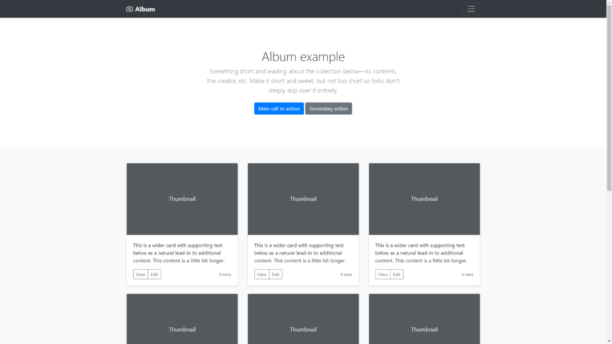
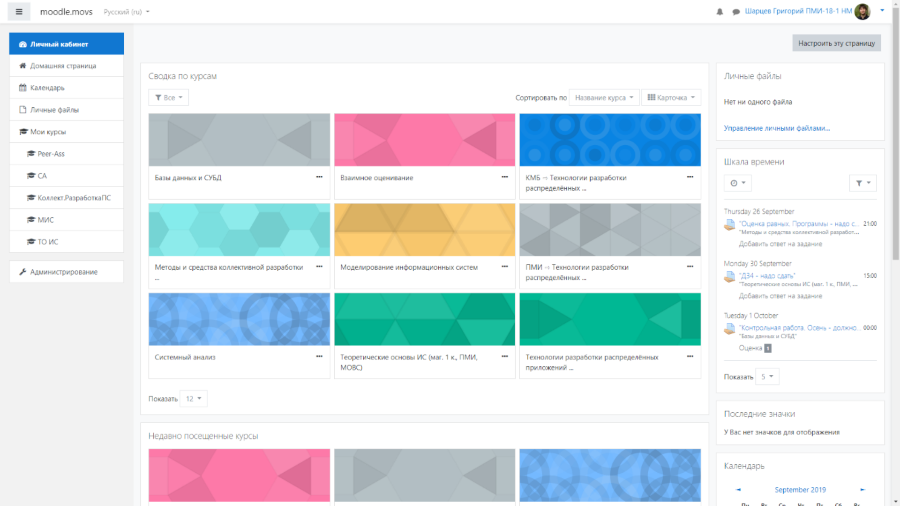
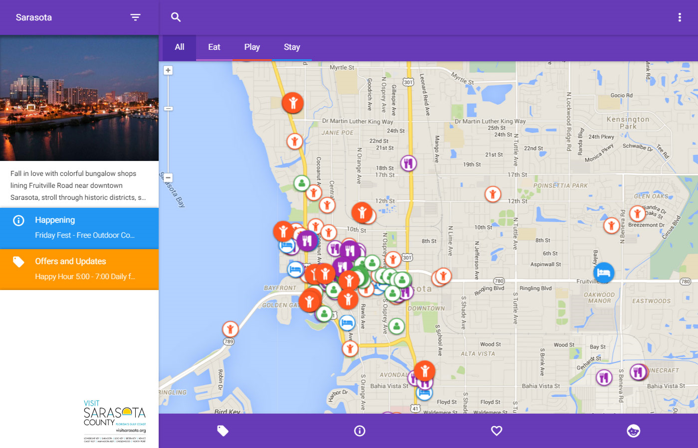
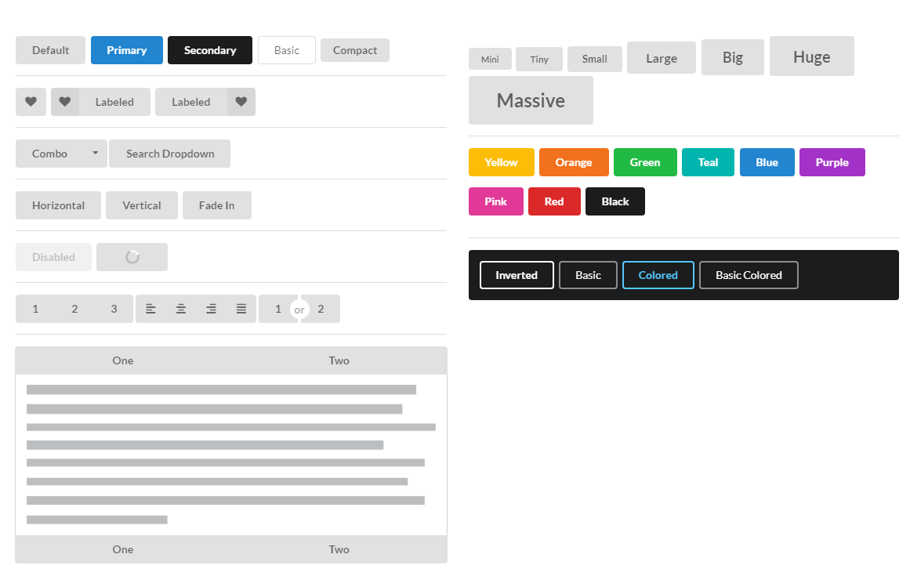

<!-- _class: lead -->

# **Практика №4: UI-Фреймворки**

Web-программирование / ПГНИУ

---

## Верстать сложно


Блочная модель, Flex, адаптивность, кросс-браузерность, доступность... 

Бывает, что:
- Не требуется уникальный дизайн
- Интерфейс состоит из стандартных элементов
- Прототипирование, MVP

---

# UI Фреймворки

- UI Фреймворк (UI kit, **CSS фреймворк**) - библиотека для быстрой вёрстки веб-страниц, готовые CSS стили и компоненты
- CSS файлы и иногда JS скрипты для интерактивных компонентов 
- Иногда следуют дизайн системе
- Часто имеет возможности конфигурирования, расширения и создания тем
    
---

# Примеры

- UI-фреймворки:
    - Twitter Bootstrap
    - Material, MaterializeCSS
    - Zurb Foundation
    - Bulma
    - Semantic UI
    - UIKit
- Микро-фреймворки: Yahoo PureCSS, Milligram
- CSS Utility: Tailwind CSS 

---

# Основные концепции

- Подключаются CSS и JS файлы библиотеки
- Предустановлены стили "типографии": шрифт, текст, ссылки и др.
- Стили макета: сетка, контейнер, колонки
- Стили различных **компонентов**, их частей и их модификаторов
- Утилитные классы - классы отвечающие за определённые свойства, а не компоненты:
  `.text-center`, `.d-block`, `.p-absolute`, `.bg-dark`
- Конфигурация через CSS переменные, препроцессоры или системы сборки

---

#  Twitter Bootstrap 

```html
<div class="container">
    <div class="row">
        <div class="col"></div>
        <div class="col"></div>    
    </div>
</div>

<a class="btn btn-danger btn-lg"></a>
```

---


---




---


---


---


---




---

##  MaterializeCSS 

Реализует **дизайн систему** Material Design


---




---


---

#  UIKit

```html
<div uk-alert>
    <a class="uk-alert-close" uk-close></a>
    <h3>Notice</h3>
    <p>Lorem ipsum...</p>
</div>
```


---

#  Semantic UI / Fomatic UI

```html
<div class="ui three buttons">
    <a class="ui active button"></a>
    <a class="ui button"></a>
    <a class="ui button"></a>
</div>
```


---




---


---
)
##  Utility-first CSS framework


---

# 

- 1500+ бесплатных иконок (svg, font)
- Эффект, комбинации, модификаторы

```html
<i class="far fa-user"></i>
<span class="fa-stack fa-2x">
    <i class="fas fa-camera fa-stack-1x"></i>
    <i class="fas fa-ban fa-stack-2x" style="color: Tomato"></i>
</span>
```

 

---


---

# Ссылки

- https://purecss.io, https://milligram.io
- https://getbootstrap.com
- https://materializecss.com 
- https://getuikit.com 
- https://semantic-ui.com
- https://foundation.zurb.com
- https://bulma.io
- https://fontawesome.com 
- https://tailwindcss.com 
