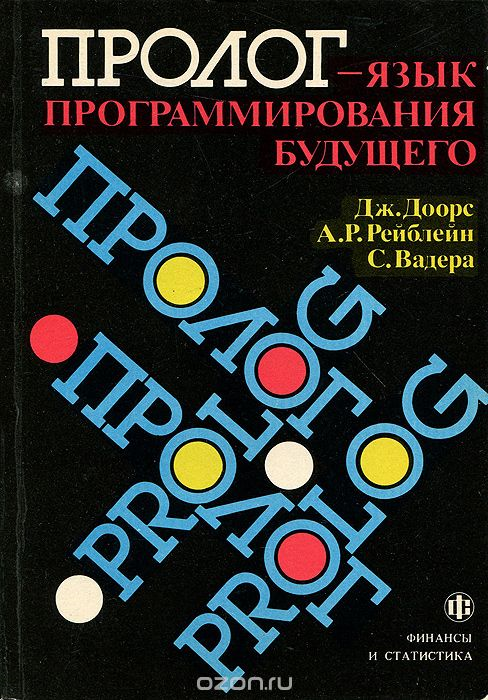
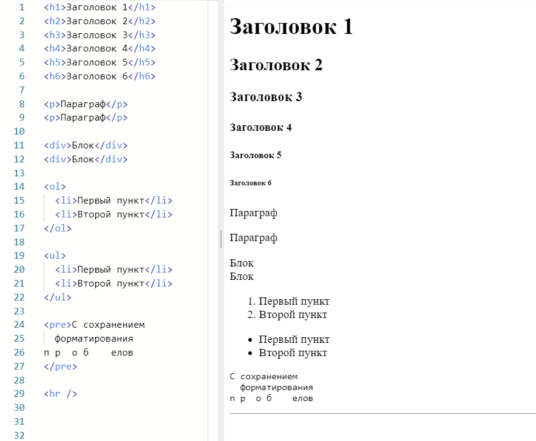
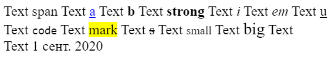
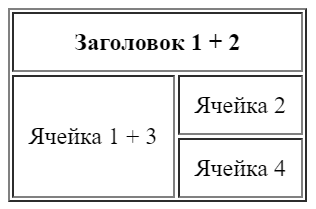
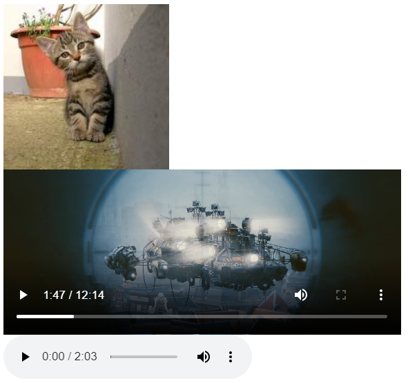
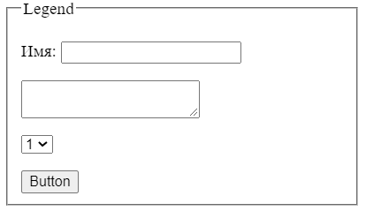
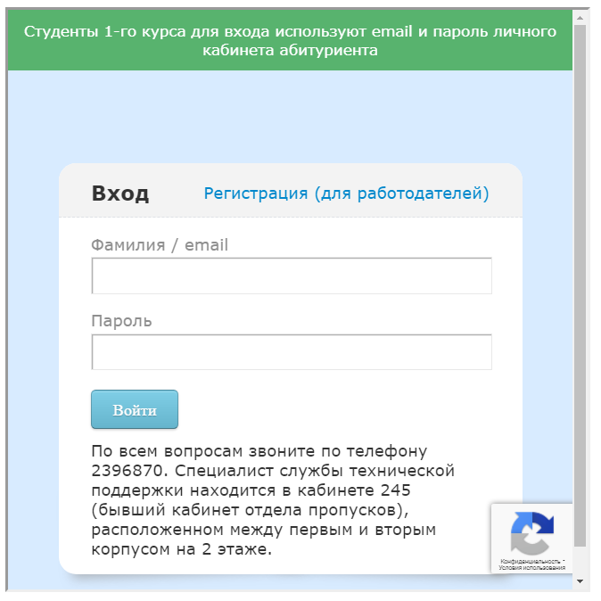
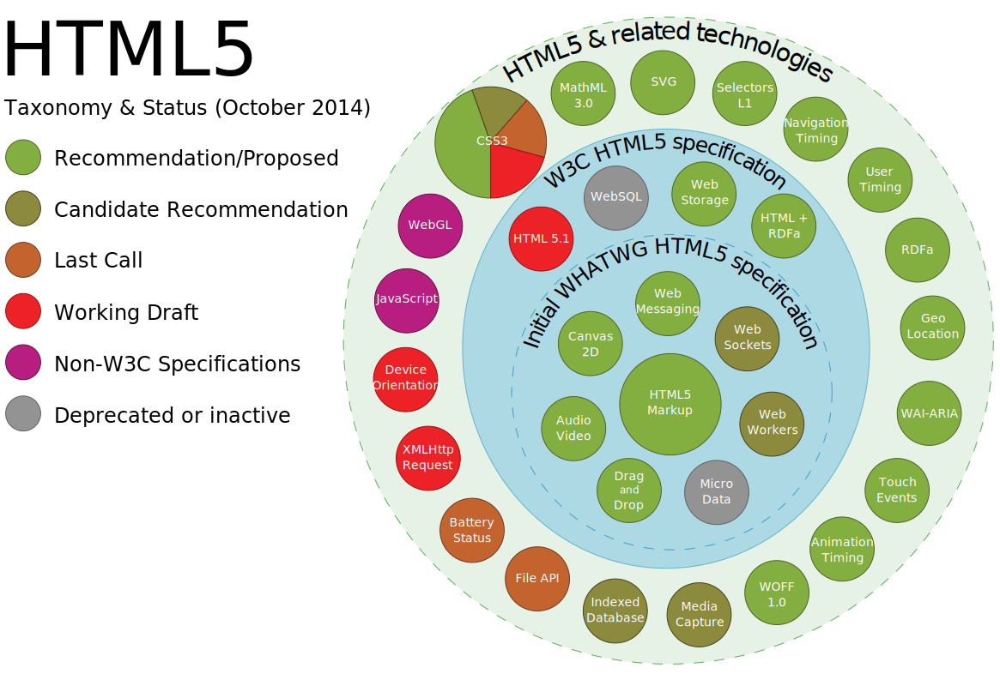

<!--  -->
<!-- _class: lead -->

# **Практика №1: HTML**

Web-программирование / ПГНИУ

---

# Языки разметки 

- **GML** - **Generalized Markup Language** - обобщённый язык разметки
- Разработан в IBM в 1969 г. для создания машиночитаемых текстов (документов) с помощью специальной разметки
- **SGML** - **Standard Generalized Markup Language** — стандартный обобщённый язык разметки (1989г.)
- На основе **SGML** появились такие языки, как **XML** и **HTML** 

---

# XML

- **eXtensible Markup Language** - расширяемый язык разметки
- Язык разметки – язык, состоящий из текста и дополнительных конструкций для передачи дополнительной информации
- Определён только синтаксис, грамматика
- Разметка не фиксирована, нет семантики
- Расширение XML — это конкретная грамматика на базе XML и правила её интерпретации

---

# Структура документа

- С физической т.з. документ состоит из сущностей и их связей. Каждая сущность имеет содержимое.
- С логической т.з. документ состоит из: комментариев, объявлений, элементов, ссылок на сущности и инструкций обработки.
- `document ::= prolog element Misc*`

---



# Prolog

---

# Prolog

- Пролог – конструкция, описывающая версию языка и тип документа
- Версия XML
  `<?xml version="1.1" encoding="UTF-8" ?>`
- Тип документа, определяет типы всех сущностей
  `<!DOCTYPE greeting SYSTEM "hello.dtd">`
- DTD = document type definition

---

# Element

- `element ::= EmptyElemTag | STag content Etag`
- Элемент – либо пустой элемент, либо элемент с контентом
- Имя элемента = имя тега
- `EmptyElemTag ::= '<' Name (S Attribute)* S? '/>'`
- `STag ::= '<' Name (S Attribute)* S? '>'`
- `ETag ::= '</' Name S? '>'`
- `Attribute ::= Name Eq AttValue`
- `<person id="1" name="Ivan" />`
- Контент – элементы, текстовые данные, комментарии и др.

---

```xml
<!DOCTYPE recipe>
<recipe name="хлеб" preptime="5min" cooktime="180min">
   <title>
      Простой хлеб
   </title>
   <composition>
      <ingredient amount="3" unit="стакан">Мука</ingredient>
      <ingredient amount="0.25" unit="грамм">Дрожжи</ingredient>
      <ingredient amount="1.5" unit="стакан">Тёплая вода</ingredient>
   </composition>
   <instructions>
     <step>
        Смешать все ингредиенты и тщательно замесить. 
     </step>
     <step>
        Закрыть тканью и оставить на один час в тёплом помещении. 
     </step>
     <!-- 
        <step>
           Почитать вчерашнюю газету. 
        </step>
         - это сомнительный шаг...
      -->
     <step>
        Замесить ещё раз, положить на противень и поставить в духовку.
     </step>
   </instructions>
</recipe>
```

---

# HTML

- **HyperText Markup Language** - Язык Гипертекстовой Разметки
- Гипертекст - текст, содержащий перекрёстные ссылки
- Стандартизированный язык разметки документов во Всемирной паутине
- **XHTML** более строгий вариант HTML, подмножество XML
- HTML менее строгий, чем XML, и позволяет делать ошибки

--- 

# История версий

- HTML 1, 1991, CERN - создан, но стандарта ещё нет
- HTML 2.0, 1995, IEFT - первый стандарт
- HTML 3.2, 1997, W3C
- HTML 4, 1999 (!) - основной живой стандарт долгие годы
- **HTML 5**, 2014 (!), W3C + WHATWG - HTML

---

# Структура

- `<!doctype html>` - тип документа
- `<html>…</html>` - корневой элемент
- Корневой элемент содержит два элемента: `head`, `body`
- `<head>…</head>` – описание страницы, машиночитаемая информация
- `<body>…</body>` – контент, содержимое страницы

---

<!-- _class: lead -->

```html
<!doctype html>
<html lang="en">
  <head>
    <meta charset="UTF-8">        
    <title>Document</title>
  </head>

  <body>
    <p>Paragraph</p>  
  </body>
</html>
```

---

# Содержимое `<head>`

- Заголовок страницы `<title>`
- Скрипты `<script>`
- Стили `<styles>`
- Подключение ресурсов `<link>`
- Мета-теги `<meta>`

---

# Контент

- HTML элементы
- Текст
- Комментарии `<!-- Some comment -->`

---
 
# Основные HTML элементы

- Блоки с разделами документа (Content sectioning)  
- Блоки текстового контента (Text content)
- Внутритекстовые элементы (Inline text semantics)
- Таблица и её элементы
- Изображения и мультимедиа
- Элементы форм
- Встроенное содержимое (Embedded content)

---

# Content Sectioning

- Разделяют содержимое документа на логические части
- Не имеют оформления


---

# Text Content

Организация блоков с текстом; Задают структуру текста и оформление



---

# Inline Text Semantics

Определяют смысл, структуру и стиль внутри текста.

```html
Text <span>span</span> 
Text <a href="https://movs.psu.ru">a</a>
Text <b>b</b> Text <strong>strong</strong>
Text <i>i</i> Text <em>em</em> Text  
<u>u</u> Text <code>code</code> Text
<mark>mark</mark> Text <s>s</s> Text
<small>small</small> Text <big>big</big>
Text <br /> Text
<time datetime="2020-09-01">1 сент. 2020</data>
```



---

# Tables

```html
<table border="1" cellpadding="10">
  <thead>
    <tr>
      <th colspan="2">Заголовок 1 + 2</th>
    </tr>
  </thead>

  <tbody>
    <tr>
      <td rowspan="2">Ячейка 1 + 3</td>
      <td>Ячейка 2</td>
    </tr>

    <tr>
      <td>Ячейка 4</td>
    </tr>
  </tbody>
</table>
```



---


# Media

```html


<video controls height="200">
  <source 
    src=".../tears_of_steel_1080p.webm" 
    type="video/webm"
  />
</video>

<audio src=".../03 The battle.mp3" controls />
```



---

# Forms

```html
<form action="#" method="GET">
  <fieldset>
    <legend>Legend</legend>
    <p>
      <label for="name">Имя: </label>
      <input id="name" />  
    </p><p>
      <textarea></textarea>
    </p><p>
      <select>
        <option>1</option>
        <option>2</option>
      </select>
    </p>
    <button>Button</button>
  </fieldset>
</form>
```



---

# Inputs

```html
<input type="text"> <br>
<input type="password"> <br>
<input type="number"> <br>
<input type="date"> <br>
<input type="time"> <br>
<input type="range"> <br>
<input type="checkbox"> Check<br>
<input type="radio"> Radio<br>
<input type="color"> <br>
<input type="file"> <br>
```

   

---

# Embedded content

```html
<iframe 
  src="https://student.psu.ru"
  height="500"
  width="500"
></iframe>
```



---

# HTML5

- Разрабатывался ~10 лет
- Больше **семантических** элементов, типов элементов форм
- **API**: Canvas, Video, Audio, SVG, Storage, Workers, API к устройству и др.

---

|До HTML 5                              |HTML5                                                        |
|---------------------------------------|-------------------------------------------------------------|
|Язык разметки                          |Язык структурирования и представления содержимого WWW        |
|Описывается как **SGML**, имеет **DTD**|Описывается в терминах **Document Object Model (DOM)**  + API|
|Дизайн                                 |Набор стандартов, интерфейс доступа к содержимому документа  |
|Для веб-страниц                        |Для веб-приложений                                           |

---



---

<!-- _class: lead -->

# На самостоятельное изучение

Выучить основные HTML теги и их основные атрибуты

(⊙_⊙;)

---

# Ссылки

- Спецификация по XML: https://www.w3.org/TR/REC-xml/ 
- Спецификация по HTML: https://html.spec.whatwg.org/
- MDN – документация от Mozilla: https://developer.mozilla.org/ru/ 
- Список HTML элементов: https://developer.cdn.mozilla.net/en-US/docs/Web/HTML/Element
- Поддержка браузерами технологий: https://caniuse.com

---

# Пример

https://repl.it/@ShGKme/Web-HTML

---
<!-- _class: lead -->
# In the next episode

CSS и вёрстка
