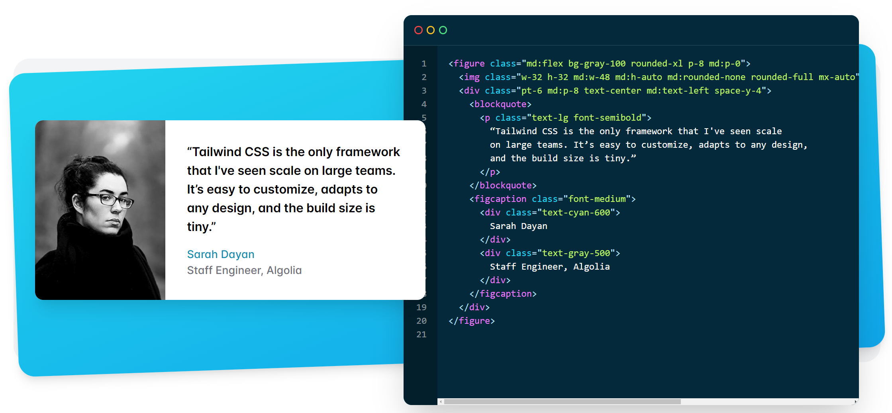

<!-- _class: lead -->

# **Практика №3: CSS и вёрстка**

Web-программирование / ПГНИУ

---

# Блочная модель

- Каждый элемент в HTML документе представлен прямоугольным блоком
- **Box = Content box + Padding box + Border box  + Margin box**
- Тип блока определяет:
    - **внешний тип отображения**, т.е. расположение блока в потоке элементов
    - **внутренний тип отображения**, т.е. расположение дочерних элементов

---

# Виды блоков

* Блочный (**block box**)
    - занимает всю доступную ширину
* Строчный (**inline box**)
    - часть текста
    - высота = высота строки текста
    - выравнивается относительно текста.
* Блочно-строчный (**inline-block**)
    - размер определяется содержимым, как у блока,
    - но обтекается окружающими элементами, как строчный

---

# Виды блоков

* Таблица и её элементы (**table**, **table-row**, **table-cell**...)
* Список (**list-item**)
* Гибкий (**flexible box**, **flex layout**) - одномерный направленный макет с растяжимыми элементами
* Сетка (**grid layout**) - макет с двумерной сеткой

---

# Flexbox Layout

- Одномерный направленный макет с растяжимыми элементами
- Элемент-контейнер располагает последовательность элементов
- Есть основна ось и поперечная
- Можно настраивать:
    - Направление основной оси
    - Выравнивание элементов относительно осей
    - Распределение контента между элементами по осям
    - Параметры гибкого изменения размеров
    - И др.

---

<!-- _class: lead -->

Изображения и примеры далее из статьи

[CSS Tricks: A Complete Guide to Flexbox](https://css-tricks.com/snippets/css/a-guide-to-flexbox/)

---

# Flexbox Basics

    
---

# Flex Container

Блок становится flexbox контейнером через свойство `display: flex;`.

---

# `flex-direction`

---

# `flex-wrap`

---

# `justify-content`

---

# `align-content`

---

# `align-items`

---

# `gap`

---

# `margin` в Flex

- Отступы **не схлапываются**
- `auto` работает во всех направлениях, в том числе по вертикали
- Можно использовать для центрирования или разделения на "левые", "правые", "верхние" и "нижние" элементы

---

# `flex`

- `flex: <flex-grow> <flex-shrink> <flex-basis>`
- `flex-grow` - во сколько раз можно растягивать элемент
- `flex-shrink` - во сколько раз можно уменьшать элемент
- `flex-basis` - что считать исходным размером

---

---

# Grid Layout 

- Двумерная сетка
- Определение количества строк и столбцов, их размеры и растяжение подобно Flex 

---

# Методология вёрстки
 
- Способ организации CSS кода, его основные принципы от именования классов до общей архитектуры вёрстки.
- Есть CSS. Но как сверстать целую страницу?
  - Как разделить её на части?
  - Какие делать классы и каких именовать?
  - Нужна поддерживаемость, гибкость, переиспользуемость

---

# Основные методологии

- **БЭМ - Блок-Элемент-Модификатор (Yandex)**
- OOCSS - Object-Oriented CSS
- Atomic CSS (Utility-first)
- SMACSS - Scalable and Modular Architecture for CSS
- AMCSS (Attribute Modules for CSS)
- И многие другие...
- Смешивание методологий в "своём стиле"

---

# БЭМ

- Компонентный подход к вёрстке
- Блок - функционально независимый компонент
  - Класс вида `block-name`
  - Блок может состоять из других блоков
- Элемент - часть блока, несуществующая без него
  - Класс вида `block-name__element-name`
- Модификатор - определяет состояние блока или элемента
  - Класс вида `block_modifier-name_modifier-2`
- Микс - сущность может быть и блоком и элементом другого блока

---

---

---

# OOCSS - Object-Oriented CSS

- Скорее "набор рекомендаций", чем методология
- Разделение стилей "структуры" и стилей "оформления"

---

# Atomic CSS

- Он же **"Атомарный CSS"**, и он же **"Utility-First CSS"** 
- **Утилитные классы** - классы отвечающие за одно свойство
- Все стили на комбинации утилитных классов
- `text-align` = `text-center`, `text-left`, `text-right`
- `display: none` = `d-none`
- margins: `m-1`, `m-2`, `mt-1`, `mx-1`
- `rounded-full` = `border-radius: 100%`
- "Фиксированное" количество классов

---

---

# SMACSS

- Scalable and Modular Architecture for CSS
- **Base rules** - базовые стили (самая основа, boody и тп)
- **Layout rules** - стили макета в целом
  - `l-class-name`, `layout-class-name`
- **Modules rules** - стили модулей (блоков)
  - `block`, `block-subblock`
- **State rules** - стили состояния (модификаторы)
  - `is-state-class`
- **Theme rules** - стили "тем"

---

# Сброс и нормализация

- В разных браузерах разные "начальные" стили
- Решения:
  - [reset.css](https://meyerweb.com/eric/tools/css/reset/) - сброс стилей
  - [normalize.css](https://necolas.github.io/normalize.css/) - "нормализация", одинаковые начальные стили
  - [reseter.css](https://github.com/resetercss/reseter.css) - альтернатива normalize.css

---

# Ссылки: flexbox, grid

- **A Complete Guide to Flexbox**: https://css-tricks.com/snippets/css/a-guide-to-flexbox/
- **Полное руководство по Flexbox**: https://habr.com/ru/post/467049/
- A Complete Guide to Grid: https://css-tricks.com/snippets/css/complete-guide-grid/
- CSS Grid Layout. Быстрый старт: https://habr.com/ru/post/325760/
- Игры:
    - https://flexboxfroggy.com
    - https://cssgridgarden.com

---
    
# Ссылки: методологии

- **БЭМ**: https://ru.bem.info
- **Статья про Atomic CSS**: https://www.smashingmagazine.com/2013/10/challenging-css-best-practices-atomic-approach/
- SMACSS: http://smacss.com
- OOCSS: http://oocss.org
- Сайт с типовыми решениями: https://csslayout.io