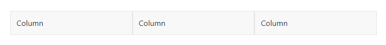
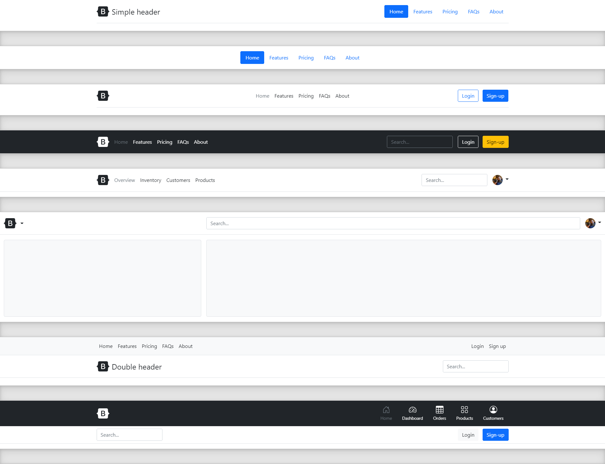
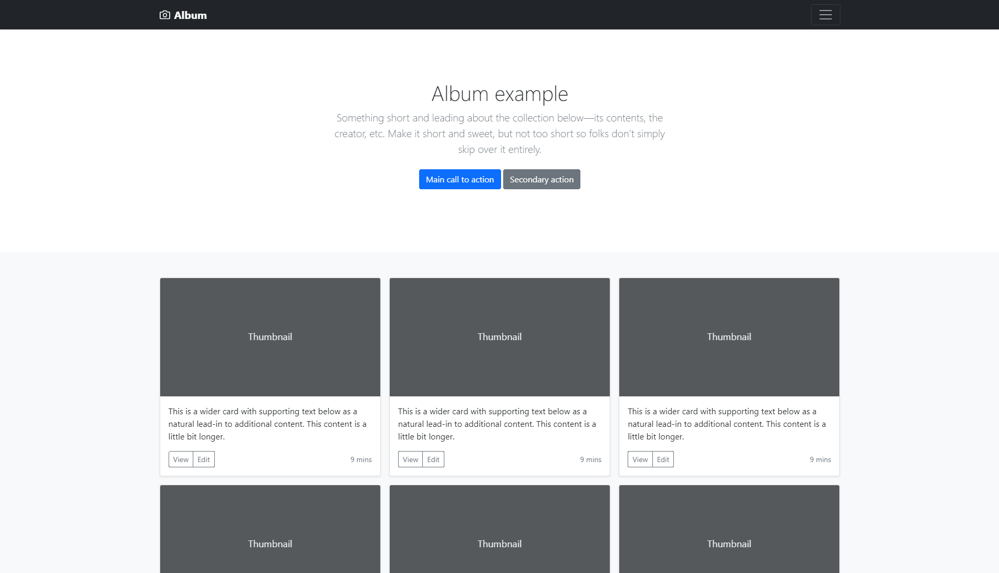
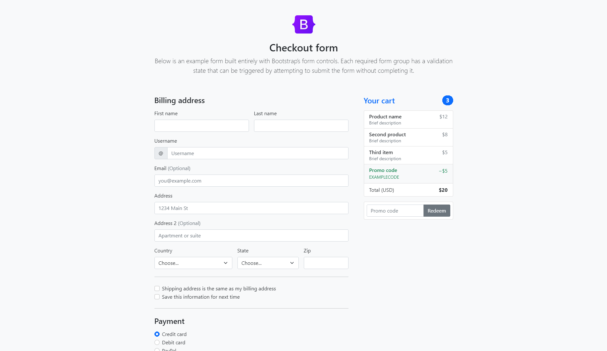
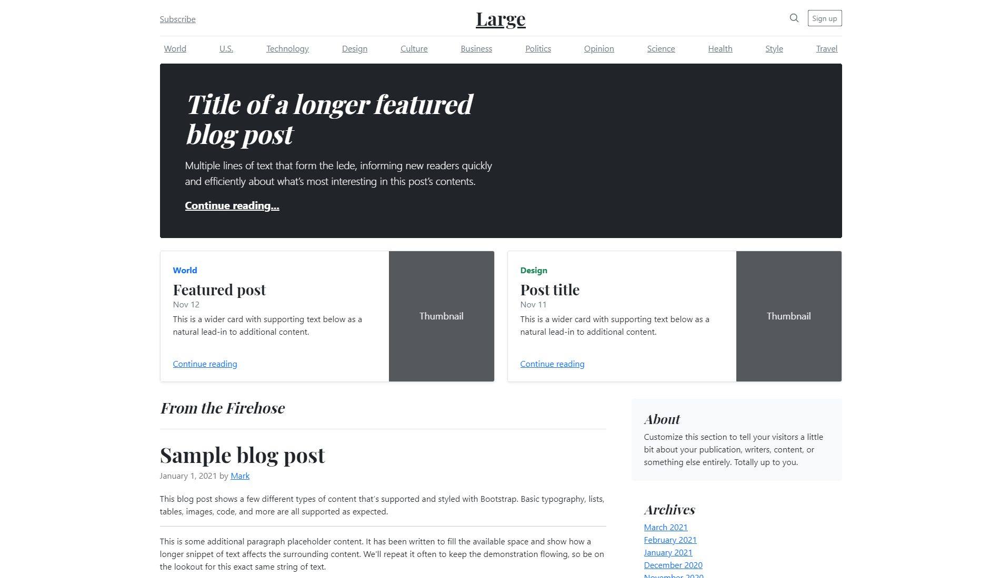
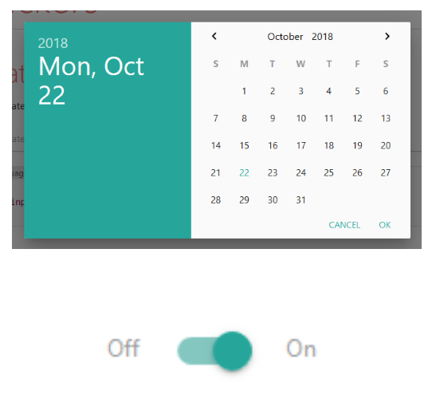
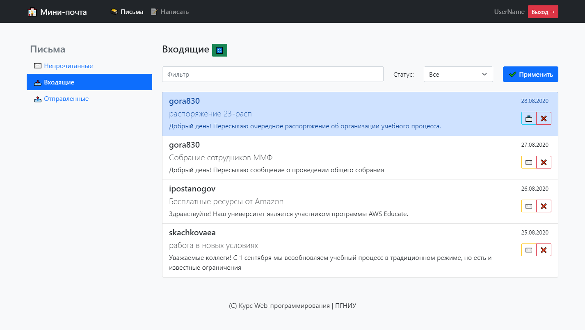

<!-- _class: lead -->

# **Практика №4: CSS-Фреймворки**

Web-программирование / ПГНИУ

---

## Верстать сложно


Flex, Grid, адаптивность, кросс-браузерность, доступность... 

Бывает, что:
- Не требуется уникальный дизайн
- Интерфейс состоит из стандартных элементов
- Прототипирование, MVP

---

# CSS-фреймворк

**CSS фреймворк** (UI kit, UI фреймворк) - библиотека для быстрой вёрстки веб-страниц
- Готовые CSS стили, часто компоненты
- CSS файлы, иногда JS скрипты для интерактивных компонентов 
- Иногда следуют дизайн системе
- Часто имеет возможности конфигурирования, расширения, создания тем

---

# Примеры

- Классические:
  -  **Bootstrap**
  -  Material Design Lite,  MaterializeCSS
  -  Zurb Foundation
  -  Bulma
  -  Semantic UI
  -  UIKit
- Микро-фреймворки:  Yahoo PureCSS,  Skeleton
- Utility-first:  **Tailwind CSS**,  Windi CSS, Tachyons

---

# Основные концепции

- Подключаются CSS и JS файлы библиотеки
- Предустановлены стили "типографии": шрифт, текст, ссылки и др.
- Стили макета: сетка, контейнер, колонки
- Стили различных **компонентов**, их частей и их модификаторов
- Утилитные классы - классы отвечающие за определённые свойства, а не компоненты:
  `.text-center`, `.d-block`, `.p-absolute`, `.bg-dark`
- Конфигурация через CSS переменные, препроцессоры или системы сборки

---

#  Bootstrap

- Самый популярный CSS фреймворк долгие годы
- Стили страницы, сетка
- Компоненты
- Интерактивные компоненты, валидация форм
- Утилитные классы
- Широкая кастомизация
- Большая экосистема тем

---



```html
<div class="container">
    <div class="row">
        <div class="col">Column</div>
        <div class="col">Column</div>
        <div class="col">Column</div>
    </div>
</div>
```

---




---




---




---




---


---

##  MaterializeCSS 

Реализует **дизайн систему** Material Design



---


---


---

#  UIKit

```html
<div uk-alert>
    <a class="uk-alert-close" uk-close></a>
    <h3>Notice</h3>
    <p>Lorem ipsum...</p>
</div>
```


---

#  Semantic UI / Fomatic UI

```html
<div class="ui three buttons">
    <a class="ui active button"></a>
    <a class="ui button"></a>
    <a class="ui button"></a>
</div>
```


---


---


---
)
##  Utility-first CSS framework


---

# 

- 1500+ бесплатных иконок (svg, font)
- Эффект, комбинации, модификаторы

```html
<i class="far fa-user"></i>
<span class="fa-stack fa-2x">
    <i class="fas fa-camera fa-stack-1x"></i>
    <i class="fas fa-ban fa-stack-2x" style="color: Tomato"></i>
</span>
```

 

---


---

# Ссылки

- https://purecss.io, http://getskeleton.com
- https://getbootstrap.com
- https://getmdl.io, https://materializecss.com 
- https://getuikit.com 
- https://semantic-ui.com
- https://get.foundation
- https://bulma.io
- https://fontawesome.com 
- https://tailwindcss.com, https://windicss.org, https://tachyons.io

---

# Пример



https://replit.com/@ShGKme/Web-Bootstrap